# 第1周

## 引言(Introduction)

### 1.1 欢迎

参考视频: 1 - 1 - Welcome (7 min).mkv

第一个视频主要讲了什么是机器学习，机器学习能做些什么事情。

机器学习是目前信息技术中最激动人心的方向之一。在这门课中，你将学习到这门技术的前沿，并可以自己实现学习机器学习的算法。

你或许每天都在不知不觉中使用了机器学习的算法每次，你打开谷歌、必应搜索到你需要的内容，正是因为他们有良好的学习算法。谷歌和微软实现了学习算法来排行网页每次，你用**Facebook**或苹果的图片分类程序他能认出你朋友的照片，这也是机器学习。每次您阅读您的电子邮件垃圾邮件筛选器，可以帮你过滤大量的垃圾邮件这也是一种学习算法。对我来说，我感到激动的原因之一是有一天做出一个和人类一样聪明的机器。实现这个想法任重而道远，许多**AI**研究者认为，实现这个目标最好的方法是通过让机器试着模仿人的大脑学习我会在这门课中介绍一点这方面的内容。

在这门课中，你还讲学习到关于机器学习的前沿状况。但事实上只了解算法、数学并不能解决你关心的实际的问题。所以，我们将花大量的时间做练习，从而你自己能实现每个这些算法，从而了解内部机理。

那么，为什么机器学习如此受欢迎呢？原因是，机器学习不只是用于人工智能领域。

我们创造智能的机器，有很多基础的知识。比如，我们可以让机器找到**A**与**B**之间的最短路径，但我们仍然不知道怎么让机器做更有趣的事情，如**web**搜索、照片标记、反垃圾邮件。我们发现，唯一方法是让机器自己学习怎么来解决问题。所以，机器学习已经成为计算机的一个能力。

现在它涉及到各个行业和基础科学中。我从事于机器学习，但我每个星期都跟直升机飞行员、生物学家、很多计算机系统程序员交流（我在斯坦福大学的同事同时也是这样）和平均每个星期会从硅谷收到两、三个电子邮件，这些联系我的人都对将学习算法应用于他们自己的问题感兴趣。这表明机器学习涉及的问题非常广泛。有机器人、计算生物学、硅谷中大量的问题都收到机器学习的影响。

这里有一些机器学习的案例。比如说，数据库挖掘。机器学习被用于数据挖掘的原因之一是网络和自动化技术的增长，这意味着，我们有史上最大的数据集比如说，大量的硅谷公司正在收集**web**上的单击数据，也称为点击流数据，并尝试使用机器学习算法来分析数据，更好的了解用户，并为用户提供更好的服务。这在硅谷有巨大的市场。再比如，医疗记录。随着自动化的出现，我们现在有了电子医疗记录。如果我们可以把医疗记录变成医学知识，我们就可以更好地理解疾病。再如，计算生物学。还是因为自动化技术，生物学家们收集的大量基因数据序列、**DNA**序列和等等，机器运行算法让我们更好地了解人类基因组，大家都知道这对人类意味着什么。再比如，工程方面，在工程的所有领域，我们有越来越大、越来越大的数据集，我们试图使用学习算法，来理解这些数据。另外，在机械应用中，有些人不能直接操作。例如，我已经在无人直升机领域工作了许多年。我们不知道如何写一段程序让直升机自己飞。我们唯一能做的就是让计算机自己学习如何驾驶直升机。

手写识别：现在我们能够非常便宜地把信寄到这个美国甚至全世界的原因之一就是当你写一个像这样的信封，一种学习算法已经学会如何读你信封，它可以自动选择路径，所以我们只需要花几个美分把这封信寄到数千英里外。

事实上，如果你看过自然语言处理或计算机视觉，这些语言理解或图像理解都是属于AI领域。大部分的自然语言处理和大部分的计算机视觉，都应用了机器学习。学习算法还广泛用于自定制程序。每次你去亚马逊或**Netflix**或**iTunes Genius**，它都会给出其他电影或产品或音乐的建议，这是一种学习算法。仔细想一想，他们有百万的用户；但他们没有办法为百万用户，编写百万个不同程序。软件能给这些自定制的建议的唯一方法是通过学习你的行为，来为你定制服务。

最后学习算法被用来理解人类的学习和了解大脑。

我们将谈论如何用这些推进我们的**AI** 梦想。几个月前，一名学生给我一篇文章关于最顶尖的12个**IT**技能。拥有了这些技能**HR**绝对不会拒绝你。这是稍显陈旧的文章，但在这个列表最顶部就是机器学习的技能。

在斯坦福大学，招聘人员联系我，让我推荐机器学习学生毕业的人远远多于机器学习的毕业生。所以我认为需求远远没有被满足现在学习“机器学习”非常好，在这门课中，我希望能告诉你们很多机器学习的知识。

在接下来的视频中，我们将开始给更正式的定义，什么是机器学习。然后我们会开始学习机器学习的主要问题和算法你会了解一些主要的机器学习的术语，并开始了解不同的算法，用哪种算法更合适。

### 1.2 机器学习是什么？

参考视频: 1 - 2 - What is Machine Learning\_ (7 min).mkv

机器学习是什么？在本视频中，我们会尝试着进行定义，同时让你懂得何时会使用机器学习。实际上，即使是在机器学习的专业人士中，也不存在一个被广泛认可的定义来准确定义机器学习是什么或不是什么，现在我将告诉你一些人们尝试定义的示例。第一个机器学习的定义来自于**Arthur Samuel**。他定义机器学习为，在进行特定编程的情况下，给予计算机学习能力的领域。**Samuel**的定义可以回溯到50年代，他编写了一个西洋棋程序。这程序神奇之处在于，编程者自己并不是个下棋高手。但因为他太菜了，于是就通过编程，让西洋棋程序自己跟自己下了上万盘棋。通过观察哪种布局（棋盘位置）会赢，哪种布局会输，久而久之，这西洋棋程序明白了什么是好的布局，什么样是坏的布局。然后就牛逼大发了，程序通过学习后，玩西洋棋的水平超过了**Samuel**。这绝对是令人注目的成果。

尽管编写者自己是个菜鸟，但因为计算机有着足够的耐心，去下上万盘的棋，没有人有这耐心去下这么多盘棋。通过这些练习，计算机获得无比丰富的经验，于是渐渐成为了比**Samuel**更厉害的西洋棋手。上述是个有点不正式的定义，也比较古老。另一个年代近一点的定义，由**Tom Mitchell**提出，来自卡内基梅隆大学，**Tom**定义的机器学习是，一个好的学习问题定义如下，他说，一个程序被认为能从经验**E**中学习，解决任务**T**，达到性能度量值**P**，当且仅当，有了经验**E**后，经过**P**评判，程序在处理T时的性能有所提升。我认为经验**E** 就是程序上万次的自我练习的经验而任务**T** 就是下棋。性能度量值**P**呢，就是它在与一些新的对手比赛时，赢得比赛的概率。

在这些视频中，除了我教你的内容以外，我偶尔会问你一个问题，确保你对内容有所理解。说曹操，曹操到，顶部是**Tom Mitchell**的机器学习的定义，我们假设您的电子邮件程序会观察收到的邮件是否被你标记为垃圾邮件。在这种**Email**客户端中，你点击“垃圾邮件”按钮，报告某些**Email**为垃圾邮件，不会影响别的邮件。基于被标记为垃圾的邮件，您的电子邮件程序能更好地学习如何过滤垃圾邮件。请问，在这个设定中，任务**T**是什么？几秒钟后，该视频将暂停。当它暂停时，您可以使用鼠标，选择这四个单选按钮中的一个，让我知道这四个，你所认为正确的选项。它可能是性能度量值**P**。所以，以性能度量值**P**为标准，这个任务的性能，也就是这个任务T的系统性能，将在学习经验E后得到提高。

本课中，我希望教你有关各种不同类型的学习算法。目前存在几种不同类型的学习算法。主要的两种类型被我们称之为监督学习和无监督学习。在接下来的几个视频中，我会给出这些术语的定义。这里简单说两句，监督学习这个想法是指，我们将教计算机如何去完成任务，而在无监督学习中，我们打算让它自己进行学习。如果对这两个术语仍一头雾水，请不要担心，在后面的两个视频中，我会具体介绍这两种学习算法。此外你将听到诸如，强化学习和推荐系统等各种术语。这些都是机器学习算法的一员，以后我们都将介绍到，但学习算法最常用两个类型就是监督学习、无监督学习。我会在接下来的两个视频中给出它们的定义。本课中，我们将花费最多的精力来讨论这两种学习算法。而另一个会花费大量时间的任务是了解应用学习算法的实用建议。

我非常注重这部分内容，实际上，就这些内容而言我不知道还有哪所大学会介绍到。给你讲授学习算法就好像给你一套工具，相比于提供工具，可能更重要的，是教你如何使用这些工具。我喜欢把这比喻成学习当木匠。想象一下，某人教你如何成为一名木匠，说这是锤子，这是螺丝刀，锯子，祝你好运，再见。这种教法不好，不是吗？你拥有这些工具，但更重要的是，你要学会如何恰当地使用这些工具。会用与不会用的人之间，存在着鸿沟。尤其是知道如何使用这些机器学习算法的，与那些不知道如何使用的人。在硅谷我住的地方，当我走访不同的公司，即使是最顶尖的公司，很多时候我都看到人们试图将机器学习算法应用于某些问题。有时他们甚至已经为此花了六个月之久。但当我看着他们所忙碌的事情时，我想说，哎呀，我本来可以在六个月前就告诉他们，他们应该采取一种学习算法，稍加修改进行使用，然后成功的机会绝对会高得多所以在本课中，我们要花很多时间来探讨，如果你真的试图开发机器学习系统，探讨如何做出最好的实践类型决策，才能决定你的方式来构建你的系统，这样做的话，当你运用学习算法时，就不太容易变成那些为寻找一个解决方案花费6个月之久的人们的中一员。他们可能已经有了大体的框架，只是没法正确的工作于是这就浪费了六个月的时间。所以我会花很多时间来教你这些机器学习、人工智能的最佳实践以及如何让它们工作，我们该如何去做，硅谷和世界各地最优秀的人是怎样做的。我希望能帮你成为最优秀的人才，通过了解如何设计和构建机器学习和人工智能系统。

这就是机器学习，这些都是我希望讲授的主题。在下一个视频里，我会定义什么是监督学习，什么是无监督学习。此外，探讨何时使用二者。

### 1.3 监督学习

参考视频: 1 - 3 - Supervised Learning (12 min).mkv

在这段视频中，我要定义可能是最常见一种机器学习问题：那就是监督学习。我将在后面正式定义监督学习。

我们用一个例子介绍什么是监督学习把正式的定义放在后面介绍。假如说你想预测房价。

前阵子，一个学生从波特兰俄勒冈州的研究所收集了一些房价的数据。你把这些数据画出来，看起来是这个样子：横轴表示房子的面积，单位是平方英尺，纵轴表示房价，单位是千美元。那基于这组数据，假如你有一个朋友，他有一套750平方英尺房子，现在他希望把房子卖掉，他想知道这房子能卖多少钱。

那么关于这个问题，机器学习算法将会怎么帮助你呢？


我们应用学习算法，可以在这组数据中画一条直线，或者换句话说，拟合一条直线，根据这条线我们可以推测出，这套房子可能卖$\$150,000$，当然这不是唯一的算法。可能还有更好的，比如我们不用直线拟合这些数据，用二次方程去拟合可能效果会更好。根据二次方程的曲线，我们可以从这个点推测出，这套房子能卖接近$\$200,000$。稍后我们将讨论如何选择学习算法，如何决定用直线还是二次方程来拟合。两个方案中有一个能让你朋友的房子出售得更合理。这些都是学习算法里面很好的例子。以上就是监督学习的例子。

可以看出，监督学习指的就是我们给学习算法一个数据集。这个数据集由“正确答案”组成。在房价的例子中，我们给了一系列房子的数据，我们给定数据集中每个样本的正确价格，即它们实际的售价然后运用学习算法，算出更多的正确答案。比如你朋友那个新房子的价格。用术语来讲，这叫做回归问题。我们试着推测出一个连续值的结果，即房子的价格。

一般房子的价格会记到美分，所以房价实际上是一系列离散的值，但是我们通常又把房价看成实数，看成是标量，所以又把它看成一个连续的数值。

回归这个词的意思是，我们在试着推测出这一系列连续值属性。

我再举另外一个监督学习的例子。我和一些朋友之前研究过这个。假设说你想通过查看病历来推测乳腺癌良性与否，假如有人检测出乳腺肿瘤，恶性肿瘤有害并且十分危险，而良性的肿瘤危害就没那么大，所以人们显然会很在意这个问题。


让我们来看一组数据：这个数据集中，横轴表示肿瘤的大小，纵轴上，我标出1和0表示是或者不是恶性肿瘤。我们之前见过的肿瘤，如果是恶性则记为1，不是恶性，或者说良性记为0。

我有5个良性肿瘤样本，在1的位置有5个恶性肿瘤样本。现在我们有一个朋友很不幸检查出乳腺肿瘤。假设说她的肿瘤大概这么大，那么机器学习的问题就在于，你能否估算出肿瘤是恶性的或是良性的概率。用术语来讲，这是一个分类问题。

分类指的是，我们试着推测出离散的输出值：0或1良性或恶性，而事实上在分类问题中，输出可能不止两个值。比如说可能有三种乳腺癌，所以你希望预测离散输出0、1、2、3。0 代表良性，1 表示第1类乳腺癌，2表示第2类癌症，3表示第3类，但这也是分类问题。

因为这几个离散的输出分别对应良性，第一类第二类或者第三类癌症，在分类问题中我们可以用另一种方式绘制这些数据点。

现在我用不同的符号来表示这些数据。既然我们把肿瘤的尺寸看做区分恶性或良性的特征，那么我可以这么画，我用不同的符号来表示良性和恶性肿瘤。或者说是负样本和正样本现在我们不全部画**X**，良性的肿瘤改成用 **O** 表示，恶性的继续用 **X** 表示。来预测肿瘤的恶性与否。

在其它一些机器学习问题中，可能会遇到不止一种特征。举个例子，我们不仅知道肿瘤的尺寸，还知道对应患者的年龄。在其他机器学习问题中，我们通常有更多的特征，我朋友研究这个问题时，通常采用这些特征，比如肿块密度，肿瘤细胞尺寸的一致性和形状的一致性等等，还有一些其他的特征。这就是我们即将学到最有趣的学习算法之一。

那种算法不仅能处理2种3种或5种特征，即使有无限多种特征都可以处理。


上图中，我列举了总共5种不同的特征，坐标轴上的两种和右边的3种，但是在一些学习问题中，你希望不只用3种或5种特征。相反，你想用无限多种特征，好让你的算法可以利用大量的特征，或者说线索来做推测。那你怎么处理无限多个特征，甚至怎么存储这些特征都存在问题，你电脑的内存肯定不够用。**我们以后会讲一个算法，叫支持向量机，里面有一个巧妙的数学技巧，能让计算机处理无限多个特征。**想象一下，我没有写下这两种和右边的三种特征，而是在一个无限长的列表里面，一直写一直写不停的写，写下无限多个特征，事实上，我们能用算法来处理它们。

现在来回顾一下，这节课我们介绍了监督学习。其基本思想是，我们数据集中的每个样本都有相应的“正确答案”。再根据这些样本作出预测，就像房子和肿瘤的例子中做的那样。我们还介绍了回归问题，即通过回归来推出一个连续的输出，之后我们介绍了分类问题，其目标是推出一组离散的结果。

现在来个小测验：假设你经营着一家公司，你想开发学习算法来处理这两个问题：

1. 你有一大批同样的货物，想象一下，你有上千件一模一样的货物等待出售，这时你想预测接下来的三个月能卖多少件？
2. 你有许多客户，这时你想写一个软件来检验每一个用户的账户。对于每一个账户，你要判断它们是否曾经被盗过？

那这两个问题，它们属于分类问题、还是回归问题?

问题一是一个回归问题，因为你知道，如果我有数千件货物，我会把它看成一个实数，一个连续的值。因此卖出的物品数，也是一个连续的值。

问题二是一个分类问题，因为我会把预测的值，用 0 来表示账户未被盗，用 1 表示账户曾经被盗过。所以我们根据账号是否被盗过，把它们定为0 或 1，然后用算法推测一个账号是 0 还是 1，因为只有少数的离散值，所以我把它归为分类问题。

以上就是监督学习的内容。

### 1.4 无监督学习

参考视频: 1 - 4 - Unsupervised Learning (14 min).mkv

本次视频中，我们将介绍第二种主要的机器学习问题。叫做无监督学习。


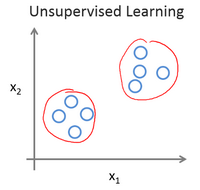

上个视频中，已经介绍了监督学习。回想当时的数据集，如图表所示，这个数据集中每条数据都已经标明是阴性或阳性，即是良性或恶性肿瘤。所以，对于监督学习里的每条数据，我们已经清楚地知道，训练集对应的正确答案，是良性或恶性了。

在无监督学习中，我们已知的数据。看上去有点不一样，不同于监督学习的数据的样子，即无监督学习中没有任何的标签或者是有相同的标签或者就是没标签。所以我们已知数据集，却不知如何处理，也未告知每个数据点是什么。别的都不知道，就是一个数据集。你能从数据中找到某种结构吗？针对数据集，无监督学习就能判断出数据有两个不同的聚集簇。这是一个，那是另一个，二者不同。是的，无监督学习算法可能会把这些数据分成两个不同的簇。所以叫做聚类算法。事实证明，它能被用在很多地方。

聚类应用的一个例子就是在谷歌新闻中。如果你以前从来没见过它，你可以到这个URL网址news.google.com去看看。谷歌新闻每天都在，收集非常多，非常多的网络的新闻内容。它再将这些新闻分组，组成有关联的新闻。所以谷歌新闻做的就是搜索非常多的新闻事件，自动地把它们聚类到一起。所以，这些新闻事件全是同一主题的，所以显示到一起。

事实证明，聚类算法和无监督学习算法同样还用在很多其它的问题上。


其中就有基因学的理解应用。一个**DNA**微观数据的例子。基本思想是输入一组不同个体，对其中的每个个体，你要分析出它们是否有一个特定的基因。技术上，你要分析多少特定基因已经表达。所以这些颜色，红，绿，灰等等颜色，这些颜色展示了相应的程度，即不同的个体是否有着一个特定的基因。你能做的就是运行一个聚类算法，把个体聚类到不同的类或不同类型的组（人）……

所以这个就是无监督学习，因为我们没有提前告知算法一些信息，比如，这是第一类的人，那些是第二类的人，还有第三类，等等。我们只是说，是的，这是有一堆数据。我不知道数据里面有什么。我不知道谁是什么类型。我甚至不知道人们有哪些不同的类型，这些类型又是什么。但你能自动地找到数据中的结构吗？就是说你要自动地聚类那些个体到各个类，我没法提前知道哪些是哪些。因为我们没有给算法正确答案来回应数据集中的数据，所以这就是无监督学习。

无监督学习或聚集有着大量的应用。它用于组织大型计算机集群。我有些朋友在大数据中心工作，那里有大型的计算机集群，他们想解决什么样的机器易于协同地工作，如果你能够让那些机器协同工作，你就能让你的数据中心工作得更高效。第二种应用就是社交网络的分析。所以已知你朋友的信息，比如你经常发**email**的，或是你**Facebook**的朋友、**谷歌+**圈子的朋友，我们能否自动地给出朋友的分组呢？即每组里的人们彼此都熟识，认识组里的所有人？还有市场分割。许多公司有大型的数据库，存储消费者信息。所以，你能检索这些顾客数据集，自动地发现市场分类，并自动地把顾客划分到不同的细分市场中，你才能自动并更有效地销售或不同的细分市场一起进行销售。这也是无监督学习，因为我们拥有所有的顾客数据，但我们没有提前知道是什么的细分市场，以及分别有哪些我们数据集中的顾客。我们不知道谁是在一号细分市场，谁在二号市场，等等。那我们就必须让算法从数据中发现这一切。最后，无监督学习也可用于天文数据分析，这些聚类算法给出了令人惊讶、有趣、有用的理论，解释了星系是如何诞生的。这些都是聚类的例子，聚类只是无监督学习中的一种。

我现在告诉你们另一种。我先来介绍鸡尾酒宴问题。嗯，你参加过鸡尾酒宴吧？你可以想像下，有个宴会房间里满是人，全部坐着，都在聊天，这么多人同时在聊天，声音彼此重叠，因为每个人都在说话，同一时间都在说话，你几乎听不到你面前那人的声音。所以，可能在一个这样的鸡尾酒宴中的两个人，他俩同时都在说话，假设现在是在个有些小的鸡尾酒宴中。我们放两个麦克风在房间中，因为这些麦克风在两个地方，离说话人的距离不同每个麦克风记录下不同的声音，虽然是同样的两个说话人。听起来像是两份录音被叠加到一起，或是被归结到一起，产生了我们现在的这些录音。另外，这个算法还会区分出两个音频资源，这两个可以合成或合并成之前的录音，实际上，鸡尾酒算法的第一个输出结果是：

1，2，3，4，5，6，7，8，9，10,

所以，已经把英语的声音从录音中分离出来了。

第二个输出是这样：

1，2，3，4，5，6，7，8，9，10。


看看这个无监督学习算法，实现这个得要多么的复杂，是吧？它似乎是这样，为了构建这个应用，完成这个音频处理似乎需要你去写大量的代码或链接到一堆的合成器**JAVA**库，处理音频的库，看上去绝对是个复杂的程序，去完成这个从音频中分离出音频。事实上，这个算法对应你刚才知道的那个问题的算法可以就用一行代码来完成。

就是这里展示的代码：`[W,s,v] = svd((repmat(sum(x.*x,1),size(x,1),1).*x)*x');`

研究人员花费了大量时间才最终实现这行代码。我不是说这个是简单的问题，但它证明了，当你使用正确的编程环境，许多学习算法是相当短的程序。所以，这也是为什么在本课中，我们打算使用**Octave**编程环境。**Octave**,是免费的开源软件，使用一个像**Octave**或**Matlab**的工具，许多学习算法变得只有几行代码就可实现。

后面，我会教你们一点关于如何使用**Octave**的知识，你就可以用**Octave**来实现一些算法了。或者，如果你有**Matlab**（盗版？），你也可以用**Matlab**。事实上，在硅谷里，对大量机器学习算法，我们第一步就是建原型，在**Octave**建软件原型，因为软件在**Octave**中可以令人难以置信地、快速地实现这些学习算法。这里的这些函数比如**SVM**（**支持向量机**）函数，**奇异值分解**，**Octave**里已经建好了。如果你试图完成这个工作，但借助**C++**或**JAVA**的话，你会需要很多很多行的代码，并链接复杂的**C++**或**Java**库。所以，你可以实现这些算法，借助**C++**或**Java**或**Python**，它只是用这些语言来实现会更加复杂。(编者注：这个是当时的情况，现在**Python**变主流了)

我已经见到，在我教机器学习将近十年后的现在，发现，学习可以更加高速，如果使用**Octave**作为编程环境，如果使用**Octave**作为学习工具，以及作为原型工具，它会让你对学习算法的学习和建原型快上许多。

事实上，许多人在大硅谷的公司里做的其实就是，使用一种工具像**Octave**来做第一步的学习算法的原型搭建，只有在你已经让它工作后，你才移植它到**C++**或**Java**或别的语言。事实证明，这样做通常可以让你的算法运行得比直接用**C++**实现更快，所以，我知道，作为一名指导者，我必须说“相信我”，但对你们中从未使用过**Octave**这种编程环境的人，我还是要告诉你们这一点一定要相信我，我想，对你们而言，我认为你们的时间，你们的开发时间是最有价值的资源。我已经见过很多人这样做了，我把你看作是机器学习研究员，或机器学习开发人员，想更加高产的话，你要学会使用这个原型工具，开始使用**Octave**。

最后，总结下本视频内容，我有个简短的复习题给你们。

我们介绍了无监督学习，它是学习策略，交给算法大量的数据，并让算法为我们从数据中找出某种结构。

好的，希望你们还记得**垃圾邮件问题**。如果你有标记好的数据，区别好是垃圾还是非垃圾邮件，我们把这个当作**监督学习问题**。

**新闻事件分类**的例子，就是那个谷歌新闻的例子，我们在本视频中有见到了，我们看到，可以用一个聚类算法来聚类这些文章到一起，所以是**无监督学习**。

**细分市场**的例子，我在更早一点的时间讲过，你可以当作**无监督学习**问题，因为我只是拿到算法数据，再让算法去自动地发现细分市场。

最后一个例子，**糖尿病**，这个其实就像是我们的乳腺癌，上个视频里的。只是替换了好、坏肿瘤，良性、恶性肿瘤，我们改用糖尿病或没病。所以我们把这个当作**监督学习**，我们能够解决它，作为一个监督学习问题，就像我们在乳腺癌数据中做的一样。

好了，以上就是无监督学习的视频内容，在下一个视频中，我们将深入探究特定的学习算法，开始介绍这些算法是如何工作的，和我们还有你如何来实现它们。

## 二、单变量线性回归(Linear Regression with One Variable)

### 2.1 模型表示

参考视频: 2 - 1 - Model Representation (8 min).mkv

我们的第一个学习算法是线性回归算法。在这段视频中，你会看到这个算法的概况，更重要的是你将会了解监督学习过程完整的流程。

让我们通过一个例子来开始：这个例子是预测住房价格的，我们要使用一个数据集，数据集包含俄勒冈州波特兰市的住房价格。在这里，我要根据不同房屋尺寸所售出的价格，画出我的数据集。比方说，如果你朋友的房子是1250平方尺大小，你要告诉他们这房子能卖多少钱。那么，你可以做的一件事就是构建一个模型，也许是条直线，从这个数据模型上来看，也许你可以告诉你的朋友，他能以大约220000(美元)左右的价格卖掉这个房子。这就是监督学习算法的一个例子。


它被称作监督学习是因为对于每个数据来说，我们给出了“正确的答案”，即告诉我们：根据我们的数据来说，房子实际的价格是多少，而且，更具体来说，这是一个回归问题。回归一词指的是，我们根据之前的数据预测出一个准确的输出值，对于这个例子就是价格，同时，还有另一种最常见的监督学习方式，叫做分类问题，当我们想要预测离散的输出值，例如，我们正在寻找癌症肿瘤，并想要确定肿瘤是良性的还是恶性的，这就是0/1离散输出的问题。更进一步来说，在监督学习中我们有一个数据集，这个数据集被称训练集。

**我将在整个课程中用小写的$m$来表示训练样本的数目。**

以之前的房屋交易问题为例，假使我们回归问题的训练集（**Training Set**）如下表所示：


我们将要用来描述这个回归问题的标记如下:

$m$ 代表训练集中实例的数量

$x$  代表特征/输入变量

$y$ 代表目标变量/输出变量

$\left( x,y \right)$ 代表训练集中的实例

$({{x}^{(i)}},{{y}^{(i)}})$ 代表第$i$ 个观察实例

$h$  代表学习算法的解决方案或函数也称为假设（**hypothesis**）

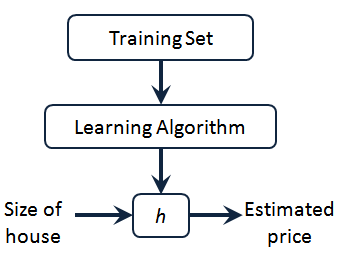

这就是一个监督学习算法的工作方式，我们可以看到这里有我们的训练集里房屋价格
我们把它喂给我们的学习算法，学习算法的工作了，然后输出一个函数，通常表示为小写 $h$  表示。$h$  代表**hypothesis**(**假设**)，$h$表示一个函数，输入是房屋尺寸大小，就像你朋友想出售的房屋，因此 $h$ 根据输入的 $x$值来得出 $y$ 值，$y$ 值对应房子的价格 因此，$h$ 是一个从$x$ 到 $y$ 的函数映射。

我将选择最初的使用规则$h$代表**hypothesis**，因而，要解决房价预测问题，我们实际上是要将训练集“喂”给我们的学习算法，进而学习得到一个假设$h$，然后将我们要预测的房屋的尺寸作为输入变量输入给$h$，预测出该房屋的交易价格作为输出变量输出为结果。那么，对于我们的房价预测问题，我们该如何表达 $h$？

一种可能的表达方式为：$h_\theta \left( x \right)=\theta_{0} + \theta_{1}x$，因为只含有一个特征/输入变量，因此这样的问题叫作单变量线性回归问题。

### 2.2 代价函数

参考视频: 2 - 2 - Cost Function (8 min).mkv

在这段视频中我们将定义代价函数的概念，这有助于我们弄清楚如何把最有可能的直线与我们的数据相拟合。如图：


在线性回归中我们有一个像这样的训练集，$m$代表了训练样本的数量，比如 $m = 47$。而我们的假设函数，也就是用来进行预测的函数，是这样的线性函数形式：$h_\theta \left( x \right)=\theta_{0}+\theta_{1}x$。

接下来我们会引入一些术语我们现在要做的便是为我们的模型选择合适的**参数**（**parameters**）$\theta_{0}$ 和 $\theta_{1}$，在房价问题这个例子中便是直线的斜率和在$y$ 轴上的截距。

我们选择的参数决定了我们得到的直线相对于我们的训练集的准确程度，模型所预测的值与训练集中实际值之间的差距（下图中蓝线所指）就是**建模误差**（**modeling error**）。


我们的目标便是选择出可以使得建模误差的平方和能够最小的模型参数。 即使得代价函数 $J \left( \theta_0, \theta_1 \right) = \frac{1}{2m}\sum\limits_{i=1}^m \left( h_{\theta}(x^{(i)})-y^{(i)} \right)^{2}$最小。

- 加入 $\frac{1}{2}$ 是为了求导更方便

我们绘制一个等高线图，三个坐标分别为$\theta_{0}$和$\theta_{1}$ 和$J(\theta_{0}, \theta_{1})$：


则可以看出在三维空间中存在一个使得$J(\theta_{0}, \theta_{1})$最小的点。

代价函数也被称作平方误差函数，有时也被称为平方误差代价函数。我们之所以要求出误差的平方和，是因为误差平方代价函数，对于大多数问题，特别是回归问题，都是一个合理的选择。还有其他的代价函数也能很好地发挥作用，但是平方误差代价函数可能是解决回归问题最常用的手段了。

在后续课程中，我们还会谈论其他的代价函数，但我们刚刚讲的选择是对于大多数线性回归问题非常合理的。

也许这个函数$J(\theta_{0}, \theta_{1})$有点抽象，可能你仍然不知道它的内涵，在接下来的几个视频里，我们要更进一步解释代价函数J的工作原理，并尝试更直观地解释它在计算什么，以及我们使用它的目的。

### 2.3 代价函数的直观理解I

参考视频: 2 - 3 - Cost Function - Intuition I (11 min).mkv

在上一个视频中，我们给了代价函数一个数学上的定义。在这个视频里，让我们通过一些例子来获取一些直观的感受，看看代价函数到底是在干什么。


- 我们希望找到一条和数据拟合的直线，所以我们构造了假设函数$h_{\theta}$，拥有两个参数$\theta_0 $和$\theta_1$

- 为了方便我们更直观的理解，我们使用一个更简单的假设函数，暂时先不考虑$\theta_0$，即假设其为0

  

  ------


- 对每一个$\theta_1$我们都能在左侧找到一条直线，同时在右侧找到一个点与其对应
- 我们的目标是通过找到最小的$J \left( \theta_1\right)$来使找到最符合数据的线

### 2.4 代价函数的直观理解II

参考视频: 2 - 4 - Cost Function - Intuition II (9 min).mkv

这节课中，我们将更深入地学习代价函数的作用，这段视频的内容假设你已经认识等高线图，如果你对等高线图不太熟悉的话，这段视频中的某些内容你可能会听不懂，但不要紧，如果你跳过这段视频的话，也没什么关系，不听这节课对后续课程理解影响不大。

当我们的假设函数参数只考虑 $\theta_1$时，得到的$J \left( \theta_1 \right)$ 函数是一个二元函数，现在我们同时考虑$\theta_0$，得到下面所示


代价函数的样子；类似于一个碗，则可以看出在三维空间中存在一个使得$J(\theta_{0}, \theta_{1})$最小的点，也就是碗底

我们使用等高线图（如下所示右图）来展示，同一个椭圆上的点虽然有不同的$\theta_0,\theta_1$，但具有相同的$J (\theta_0,\theta_1)$，同心椭圆的圆心处即为要求的最小值


通过这些图形，我希望你能更好地理解这些代价函数$ J$所表达的值是什么样的，它们对应的假设是什么样的，以及什么样的假设对应的点，更接近于代价函数$J$的最小值。

当然，我们真正需要的是一种有效的算法，能够自动地找出这些使代价函数$J$取最小值的参数$\theta_{0}$和$\theta_{1}$来。

我们也不希望编个程序把这些点画出来，然后人工的方法来读出这些点的数值，这很明显不是一个好办法。我们会遇到更复杂、更高维度、更多参数的情况，而这些情况是很难画出图的，因此更无法将其可视化，因此我们真正需要的是编写程序来找出这些最小化代价函数的$\theta_{0}$和$\theta_{1}$的值，在下一节视频中，我们将介绍一种算法，能够自动地找出能使代价函数$J$最小化的参数$\theta_{0}$和$\theta_{1}$的值。

### 2.5 梯度下降

参考视频: 2 - 5 - Gradient Descent (11 min).mkv

梯度下降是一个用来求``函数最小值``的算法，我们将使用梯度下降算法来求出代价函数$J(\theta_{0}, \theta_{1})$ 的最小值。

梯度下降背后的思想是：开始时我们随机选择一个参数的组合$\left( {\theta_{0}},{\theta_{1}},......,{\theta_{n}} \right)$，计算代价函数，然后我们寻找下一个能让代价函数值下降最多的参数组合。我们持续这么做直到找到一个局部最小值（**local minimum**），因为我们并没有尝试完所有的参数组合，所以不能确定我们得到的局部最小值是否便是全局最小值（**global minimum**），选择不同的初始参数组合，可能会找到不同的局部最小值。


假设把我们的$J$函数想象为上图所示的一座 “山”。

想象一下你正站立在山的某一点上，站立在你想象的公园这座红色山上，在梯度下降算法中，我们要做的就是旋转360度，看看我们的周围，并问自己要在某个方向上，用小碎步尽快下山。这些小碎步需要朝什么方向？如果我们站在山坡上的这一点，你看一下周围，你会发现最佳的下山方向，你再看看周围，然后再一次想想，我应该从什么方向迈着小碎步下山？然后你按照自己的判断又迈出一步，重复上面的步骤，从这个新的点，你环顾四周，并决定从什么方向将会最快下山，然后又迈进了一小步，并依此类推，直到你接近局部最低点的位置。

我们来看一下背后的数学原理，这是梯度下降算法的定义：

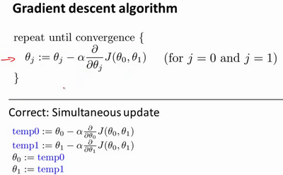


我们将不断地重复直至收敛。批量梯度下降（**batch gradient descent**）算法的公式为：

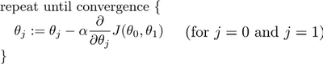

- $: =​$  我们称之为赋值，例如$a : = b​$就是把 $b​$ 赋值给 $a​$
- $=$   我们称之为判断，例如 $a = b$就是判断 $a$ 是否和 $b$ 相等
- 其中$a$是学习率（learning rate），它决定了我们沿着能让代价函数下降程度最大的方向向下迈出的步子有多大，在批量梯度下降中，我们每一次都同时让所有的参数减去学习速率乘以代价函数的导数。
- 我们需要对 $\theta_0$ 和 $\theta_1$ 做同步更新


在梯度下降算法中，还有一个更微妙的问题，梯度下降中，我们要更新${\theta_{0}}$和${\theta_{1}}$ ，当 $j=0$ 和$j=1$时，会产生更新，所以你将更新$J\left( {\theta_{0}} \right)$和$J\left( {\theta_{1}} \right)$。实现梯度下降算法的微妙之处是，在这个表达式中，如果你要更新这个等式，你需要同时更新${\theta_{0}}$和${\theta_{1}}$，我的意思是在这个等式中，我们要这样更新：

- ${\theta_{0}}$:= ${\theta_{0}}$ ，并同时更新${\theta_{1}}$:= ${\theta_{1}}$。

实现方法是：你应该先计算两个公式右边的部分，通过那一部分计算出${\theta_{0}}$和${\theta_{1}}$的值，然后**同时更新**${\theta_{0}}$和${\theta_{1}}$。

让我进一步阐述这个过程：


- 在左下角的计算中，我们同步更新了 $\theta_0 $ 和 $ \theta_1$
- 但在右下角的计算是错误的！！！

在梯度下降算法中，这是正确实现同时更新的方法。我不打算解释为什么你需要同时更新，同时更新是梯度下降中的一种常用方法。我们之后会讲到，同步更新是更自然的实现方法。当人们谈到梯度下降时，他们的意思就是同步更新。 

在接下来的视频中，我们要进入这个微分项的细节之中。我已经写了出来但没有真正定义，如果你已经修过微积分课程，如果你熟悉偏导数和导数，这其实就是这个微分项：

-  $\alpha \frac{\partial }{\partial {{\theta }_{0}}}J({{\theta }_{0}},{{\theta }_{1}})$，$\alpha  \frac{\partial }{\partial {{\theta }_{1}}}J({{\theta }_{0}},{{\theta }_{1}})$。

如果你不熟悉微积分，不用担心，即使你之前没有看过微积分，或者没有接触过偏导数，在接下来的视频中，你会得到一切你需要知道，如何计算这个微分项的知识。

下一个视频中，希望我们能够给出实现梯度下降算法的所有知识 。

### 2.6 梯度下降的直观理解

参考视频: 2 - 6 - Gradient Descent Intuition (12 min).mkv

在之前的视频中，我们给出了一个数学上关于梯度下降的定义，本次视频我们更深入研究一下，更直观地感受一下这个算法是做什么的，以及梯度下降算法的更新过程有什么意义。梯度下降算法如下：

- ${\theta_{j}}:={\theta_{j}}-\alpha \frac{\partial }{\partial {\theta_{j}}}J\left(\theta \right)$

  描述：对$\theta $赋值，使得 $J\left( \theta  \right)$ 按梯度下降最快方向进行，一直迭代下去，最终得到局部最小值。其中$a$是学习率（learning rate），它决定了我们沿着能让代价函数下降程度最大的方向向下迈出的步子有多大。

我们分两种情况讨论。

- 假设我们现在位于下图的红点处。
  - 
  - 对于这个问题，求导的目的，基本上可以说取这个红点的切线，就是这样一条红色的直线，刚好与函数相切于这一点，让我们看看这条红色直线的斜率，就是这条刚好与函数曲线相切的这条直线，这条直线的斜率正好是这个三角形的高度除以这个水平长度，现在，这条线有一个正斜率，也就是说它有正导数，因此，我得到的新的${\theta_{1}}$，
  - ${\theta_{1}}$更新后等于${\theta_{1}}$减去一个正数乘以$a$ ，$\theta_1$ 减小，更靠近最低点
- 那么现在我们换一种方向。我们现在位于下图所示的 $\theta_1$ 处
  - 
  - 该点的斜率是个负数，那也就是说它有负倒数。
  - ${\theta_{1}}$更新后等于${\theta_{1}}$减去一个负数乘以$a$ ，$\theta_1$ 增大，更靠近最低点
- 这就是我梯度下降法的更新规则：
  - ${\theta_{j}}:={\theta_{j}}-\alpha \frac{\partial }{\partial {\theta_{j}}}J\left( \theta  \right)$

让我们来看看**如果 $a$ 太小或 $a$ 太大会出**现什么情况：

如果$a$太小了，即我的学习速率太小，结果就是只能这样像小宝宝一样一点点地挪动，去努力接近最低点，这样就需要很多步才能到达最低点，所以如果$a$太小的话，可能会很慢，因为它会一点点挪动，它会需要很多步才能到达全局最低点。

如果$a$太大，那么梯度下 降法可能会越过最低点，甚至可能无法收敛，下一次迭代又移动了一大步，越过一次，又越过一次，一次次越过最低点，直到你发现实际上离最低点越来越远，所以，如果$a$太大，它会导致无法收敛，甚至发散。


现在，我还有一个问题，当我第一次学习这个地方时，我花了很长一段时间才理解这个问题，如果我们预先把${\theta_{1}}$放在一个局部的最低点，你认为下一步梯度下降法会怎样工作？


假设你将${\theta_{1}}$初始化在局部最低点，在这儿，它已经在一个局部的最优处或局部最低点。结果是局部最优点的导数将等于零，因为它是那条切线的斜率。这意味着你已经在局部最优点，它使得${\theta_{1}}$不再改变，也就是新的${\theta_{1}}$等于原来的${\theta_{1}}$，因此，如果你的参数已经处于局部最低点，那么梯度下降法更新其实什么都没做，它不会改变参数的值。这也解释了为什么即使学习速率$a$保持不变时，梯度下降也可以收敛到局部最低点。

我们来看一个例子，这是代价函数$J\left( \theta  \right)$。


我想找到它的最小值，首先初始化我的梯度下降算法，在那个品红色的点初始化

如果我更新一步梯度下降，也许它会带我到这个绿色的点，因为这个点的导数是相当陡的。现在，在这个绿色的点，如果我再更新一步，你会发现我的导数，也即斜率，是没那么陡的。随着我接近最低点，我的导数越来越接近零，所以，梯度下降一步后，新的导数会变小一点点。然后我想再梯度下降一步，在这个绿点，我自然会用一个稍微跟刚才在那个品红点时比，再小一点的一步，到了新的红色点，更接近全局最低点了，因此这点的导数会比在绿点时更小。所以，我再进行一步梯度下降时，我的导数项是更小的，${\theta_{1}}$更新的幅度就会更小。所以随着梯度下降法的运行，你移动的幅度会自动变得越来越小，直到最终移动幅度非常小，你会发现，已经收敛到局部极小值。

回顾一下，在梯度下降法中，当我们接近局部最低点时，梯度下降法会自动采取更小的幅度，这是因为当我们接近局部最低点时，很显然在局部最低时导数等于零，所以当我们接近局部最低时，导数值会自动变得越来越小，所以梯度下降将自动采取较小的幅度，这就是梯度下降的做法。所以实际上没有必要再另外减小$a$。

这就是梯度下降算法，你可以用它来最小化任何代价函数$J$，不只是线性回归中的代价函数$J$。

在接下来的视频中，我们要用代价函数$J$，回到它的本质，线性回归中的代价函数。也就是我们前面得出的平方误差函数，结合梯度下降法，以及平方代价函数，我们会得出第一个机器学习算法，即线性回归算法。

### 2.7 梯度下降的线性回归

参考视频: 2 - 7 - GradientDescentForLinearRegression (6 min).mkv

在以前的视频中我们谈到关于梯度下降算法，梯度下降是很常用的算法，它不仅被用在线性回归上和线性回归模型、平方误差代价函数。在这段视频中，我们要将梯度下降和代价函数结合。我们将用到此算法，并将其应用于具体的拟合直线的线性回归算法里。

梯度下降算法和线性回归算法比较如图：

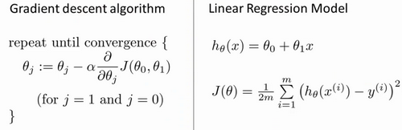

对我们之前的线性回归问题运用梯度下降法，关键在于求出代价函数的导数，即：

$\frac{\partial }{\partial {{\theta }_{j}}}J({{\theta }_{0}},{{\theta }_{1}})=\frac{\partial }{\partial {{\theta }_{j}}}\frac{1}{2m}{{\sum\limits_{i=1}^{m}{\left( {{h}_{\theta }}({{x}^{(i)}})-{{y}^{(i)}} \right)}}^{2}}$

$j=0$  时：$\frac{\partial }{\partial {{\theta }_{0}}}J({{\theta }_{0}},{{\theta }_{1}})=\frac{1}{m}{{\sum\limits_{i=1}^{m}{\left( {{h}_{\theta }}({{x}^{(i)}})-{{y}^{(i)}} \right)}}}$

$j=1$  时：$\frac{\partial }{\partial {{\theta }_{1}}}J({{\theta }_{0}},{{\theta }_{1}})=\frac{1}{m}\sum\limits_{i=1}^{m}{\left( \left( {{h}_{\theta }}({{x}^{(i)}})-{{y}^{(i)}} \right)\cdot {{x}^{(i)}} \right)}$ 这里对 $\theta_1$ 求导，$x$ 看作常数

则梯度下降算法改写成：

**Repeat  until convergence{**

​                ${\theta_{0}}:={\theta_{0}}-a\frac{1}{m}\sum\limits_{i=1}^{m}{ \left({{h}_{\theta }}({{x}^{(i)}})-{{y}^{(i)}} \right)}$

​                ${\theta_{1}}:={\theta_{1}}-a\frac{1}{m}\sum\limits_{i=1}^{m}{\left( \left({{h}_{\theta }}({{x}^{(i)}})-{{y}^{(i)}} \right)\cdot {{x}^{(i)}} \right)}$

​               **}**

我们刚刚使用的算法，有时也称为批量梯度下降。实际上，在机器学习中，通常不太会给算法起名字，但这个名字”**批量梯度下降**”，指的是在梯度下降的每一步中，我们都用到了所有的训练样本，在梯度下降中，在计算微分求导项时，我们需要进行求和运算，所以，在每一个单独的梯度下降中，我们最终都要计算这样一个东西，这个项需要对所有$m$个训练样本求和。因此，批量梯度下降法这个名字说明了我们需要考虑所有这一"批"训练样本，而事实上，有时也有其他类型的梯度下降法，不是这种"批量"型的，不考虑整个的训练集，而是每次只关注训练集中的一些小的子集。在后面的课程中，我们也将介绍这些方法。

但就目前而言，应用刚刚学到的算法，你应该已经掌握了批量梯度算法，并且能把它应用到线性回归中了，这就是用于线性回归的梯度下降法。

如果你之前学过线性代数，有些同学之前可能已经学过高等线性代数，你应该知道有一种计算代价函数$J$最小值的数值解法，不需要梯度下降这种迭代算法。在后面的课程中，我们也会谈到这个方法，它可以在不需要多步梯度下降的情况下，也能解出代价函数$J$的最小值，这是另一种称为正规方程(**normal equations**)的方法。实际上在数据量较大的情况下，梯度下降法比正规方程要更适用一些。

现在我们已经掌握了梯度下降，我们可以在不同的环境中使用梯度下降法，我们还将在不同的机器学习问题中大量地使用它。所以，祝贺大家成功学会你的第一个机器学习算法。

在下一段视频中，告诉你泛化的梯度下降算法，这将使梯度下降更加强大。

### 2.8 接下来的内容

参考视频: 2 - 8 - What_'s Next (6 min).mkv

在接下来的一组视频中，我会对线性代数进行一个快速的复习回顾。如果你从来没有接触过向量和矩阵，那么这课件上所有的一切对你来说都是新知识，或者你之前对线性代数有所了解，但由于隔得久了，对其有所遗忘，那就请学习接下来的一组视频，我会快速地回顾你将用到的线性代数知识。

通过它们，你可以实现和使用更强大的线性回归模型。事实上，线性代数不仅仅在线性回归中应用广泛，它其中的矩阵和向量将有助于帮助我们实现之后更多的机器学习模型，并在计算上更有效率。正是因为这些矩阵和向量提供了一种有效的方式来组织大量的数据，特别是当我们处理巨大的训练集时，如果你不熟悉线性代数，如果你觉得线性代数看上去是一个复杂、可怕的概念，特别是对于之前从未接触过它的人，不必担心，事实上，为了实现机器学习算法，我们只需要一些非常非常基础的线性代数知识。通过接下来几个视频，你可以很快地学会所有你需要了解的线性代数知识。具体来说，为了帮助你判断是否有需要学习接下来的一组视频，我会讨论什么是矩阵和向量，谈谈如何加、减 、乘矩阵和向量，讨论逆矩阵和转置矩阵的概念。

如果你十分熟悉这些概念，那么你完全可以跳过这组关于线性代数的选修视频，但是如果你对这些概念仍有些许的不确定，不确定这些数字或这些矩阵的意思，那么请看一看下一组的视频，它会很快地教你一些你需要知道的线性代数的知识，便于之后编写机器学习算法和处理大量数据。

## 三、线性代数回顾(Linear Algebra Review)

### 3.1 矩阵和向量

参考视频: 3 - 1 - Matrices and Vectors (9 min).mkv

如图：这个是4×2矩阵，即4行2列，如$m$为行，$n$为列，那么$m×n$即4×2


矩阵的维数即行数×列数

矩阵元素（矩阵项）：$A=\left[ \begin{matrix}   1402 & 191  \\   1371 & 821  \\   949 & 1437  \\   147 & 1448  \\\end{matrix} \right]$

$A_{ij}$ 指第$i$行，第 $j$ 列的元素。

向量是一种特殊的矩阵，讲义中的向量一般都是列向量，如：
$y=\left[ \begin{matrix}   {460}  \\   {232}  \\   {315}  \\   {178}  \\\end{matrix} \right]$

为四维列向量（4×1）。

如下图为1索引向量和0索引向量，左图为1索引向量，右图为0索引向量，一般我们用1索引向量。

$y=\left[ \begin{matrix}   {{y}_{1}}  \\   {{y}_{2}}  \\   {{y}_{3}}  \\   {{y}_{4}}  \\\end{matrix} \right]$，$y=\left[ \begin{matrix}   {{y}_{0}}  \\   {{y}_{1}}  \\   {{y}_{2}}  \\   {{y}_{3}}  \\\end{matrix} \right]$

### 3.2 加法和标量乘法

参考视频: 3 - 2 - Addition and Scalar Multiplication (7 min).mkv

矩阵的加法：行列数相等的可以加。

例：


矩阵的乘法：每个元素都要乘

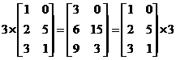

组合算法也类似。

### 3.3 矩阵向量乘法

参考视频: 3 - 3 - Matrix Vector Multiplication (14 min).mkv

矩阵和向量的乘法如图：$m×n$的矩阵乘以$n×1$的向量，得到的是$m×1$的向量


算法举例：


### 3.4 矩阵乘法

参考视频: 3 - 4 - Matrix Matrix Multiplication (11 min).mkv

矩阵乘法：

$m×n$矩阵乘以$n×o$矩阵，变成$m×o$矩阵。

如果这样说不好理解的话就举一个例子来说明一下，比如说现在有两个矩阵$A$和$B$，那么它们的乘积就可以表示为图中所示的形式。

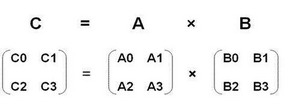
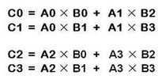

### 3.5 矩阵乘法的性质

参考视频: 3 - 5 - Matrix Multiplication Properties (9 min).mkv

矩阵乘法的性质：

矩阵的乘法不满足交换律：$A×B≠B×A$

矩阵的乘法满足结合律。即：$A×(B×C)=(A×B)×C$

单位矩阵：在矩阵的乘法中，有一种矩阵起着特殊的作用，如同数的乘法中的1,我们称这种矩阵为单位矩阵．它是个方阵，一般用 $I$ 或者 $E$ 表示，本讲义都用 $I$ 代表单位矩阵，从左上角到右下角的对角线（称为主对角线）上的元素均为1以外全都为0。如：

$A{{A}^{-1}}={{A}^{-1}}A=I$

对于单位矩阵，有$AI=IA=A$

### 3.6 逆、转置

参考视频: 3 - 6 - Inverse and Transpose (11 min).mkv

矩阵的逆：如矩阵$A$是一个$m×m$矩阵（方阵），如果有逆矩阵，则：$A{{A}^{-1}}={{A}^{-1}}A=I$

我们一般在**OCTAVE**或者**MATLAB**中进行计算矩阵的逆矩阵。

矩阵的转置：设$A$为$m×n$阶矩阵（即$m$行$n$列），第$i $行$j $列的元素是$a(i,j)$，即：$A=a(i,j)$

定义$A$的转置为这样一个$n×m$阶矩阵$B$，满足$B=a(j,i)$，即 $b (i,j)=a(j,i)$（$B$的第$i$行第$j$列元素是$A$的第$j$行第$i$列元素），记${{A}^{T}}=B$。(有些书记为A'=B）

直观来看，将$A$的所有元素绕着一条从第1行第1列元素出发的右下方45度的射线作镜面反转，即得到$A$的转置。

例：

${{\left| \begin{matrix}   a& b  \\   c& d  \\   e& f  \\\end{matrix} \right|}^{T}}=\left|\begin{matrix}   a& c & e  \\   b& d & f  \\\end{matrix} \right|$

矩阵的转置基本性质:

$ {{\left( A\pm B \right)}^{T}}={{A}^{T}}\pm {{B}^{T}} $
${{\left( A\times B \right)}^{T}}={{B}^{T}}\times {{A}^{T}}$
${{\left( {{A}^{T}} \right)}^{T}}=A $
${{\left( KA \right)}^{T}}=K{{A}^{T}} $

**matlab**中矩阵转置：直接打一撇，`x=y'`。


# 第2周


## 四、多变量线性回归(Linear Regression with Multiple Variables)

### 4.1 多维特征

参考视频: 4 - 1 - Multiple Features (8 min).mkv

目前为止，我们探讨了单变量/特征的回归模型，现在我们对房价模型增加更多的特征，例如房间数楼层等，构成一个含有多个变量的模型，模型中的特征为$\left( {x_{1}},{x_{2}},...,{x_{n}} \right)$。


增添更多特征后，我们引入一系列新的注释：

-  $n$ 代表特征的数量

-  ${x^{\left( i \right)}}$代表第 $i$ 个训练实例，是特征矩阵中的第$i$行，是一个**向量**（**vector**）。

  比方说，上图的

  ${x}^{(2)}\text{=}\begin{bmatrix} 1416\\\ 3\\\ 2\\\ 40 \end{bmatrix}$，

- ${x}_{j}^{\left( i \right)}$代表特征矩阵中第 $i$ 行的第 $j$ 个特征，也就是第 $i$ 个训练实例的第 $j$ 个特征。

  - 如上图的$x_{2}^{\left( 2 \right)}=3,x_{3}^{\left( 2 \right)}=2$，

- 支持多变量的假设 $h$ 表示为：$h_{\theta}\left( x \right)={\theta_{0}}+{\theta_{1}}{x_{1}}+{\theta_{2}}{x_{2}}+...+{\theta_{n}}{x_{n}}$，

  - 这个公式中有$n+1$个参数和$n$个变量，为了表示方便，引入$x_{0}=1$，则公式转化为：$h_{\theta} \left( x \right)={\theta_{0}}{x_{0}}+{\theta_{1}}{x_{1}}+{\theta_{2}}{x_{2}}+...+{\theta_{n}}{x_{n}}$

此时模型中的参数是一个$n+1$维的向量，任何一个训练实例也都是$n+1$维的向量，特征矩阵$X$的维度是 $m*(n+1)$。 因此公式可以简化为：$h_{\theta} \left( x \right)={\theta^{T}}X$，其中上标$T$代表矩阵转置。


### 4.2 多变量梯度下降

参考视频: 4 - 2 - Gradient Descent for Multiple Variables (5 min).mkv

在多变量线性回归中，我们也构建一个代价函数，这个代价函数是所有建模误差的平方和，即：

- $J\left( {\theta_{0}},{\theta_{1}}...{\theta_{n}} \right)=\frac{1}{2m}\sum\limits_{i=1}^{m}{{{\left( h_{\theta} \left({x}^{\left( i \right)} \right)-{y}^{\left( i \right)} \right)}^{2}}}$ ，

其中：$h_{\theta}\left( x \right)=\theta^{T}X={\theta_{0}}+{\theta_{1}}{x_{1}}+{\theta_{2}}{x_{2}}+...+{\theta_{n}}{x_{n}}$ ，

我们的目标和单变量线性回归问题中一样，是要找出使得代价函数最小的一系列参数。
多变量线性回归的批量梯度下降算法为：


即：


求导数后得到：


当$n>=1$时，
${{\theta }_{0}}:={{\theta }_{0}}-a\frac{1}{m}\sum\limits_{i=1}^{m}{({{h}_{\theta }}({{x}^{(i)}})-{{y}^{(i)}})}x_{0}^{(i)}$

${{\theta }_{1}}:={{\theta }_{1}}-a\frac{1}{m}\sum\limits_{i=1}^{m}{({{h}_{\theta }}({{x}^{(i)}})-{{y}^{(i)}})}x_{1}^{(i)}$

${{\theta }_{2}}:={{\theta }_{2}}-a\frac{1}{m}\sum\limits_{i=1}^{m}{({{h}_{\theta }}({{x}^{(i)}})-{{y}^{(i)}})}x_{2}^{(i)}$


如上图所示，我们可以发现当 $n=1$ 时和 $n>1$ 时的求解是类似的

我们开始随机选择一系列的参数值，计算所有的预测结果后，再给所有的参数一个新的值，如此循环直到收敛。

代码示例：

计算代价函数
$J\left( \theta  \right)=\frac{1}{2m}\sum\limits_{i=1}^{m}{{{\left( {h_{\theta}}\left( {x^{(i)}} \right)-{y^{(i)}} \right)}^{2}}}$
其中：${h_{\theta}}\left( x \right)={\theta^{T}}X={\theta_{0}}{x_{0}}+{\theta_{1}}{x_{1}}+{\theta_{2}}{x_{2}}+...+{\theta_{n}}{x_{n}}$

**Python** 代码：

```python
def computeCost(X, y, theta):
    inner = np.power(((X * theta.T) - y), 2)
    return np.sum(inner) / (2 * len(X))
```

### 4.3 梯度下降法实践1-特征缩放

参考视频: 4 - 3 - Gradient Descent in Practice I - Feature Scaling (9 min).mkv

在我们面对多维特征问题的时候，我们要保证这些特征都具有相近的尺度，这将帮助梯度下降算法更快地收敛。

以房价问题为例，假设我们使用两个特征，房屋的尺寸和房间的数量，尺寸的值为 0-2000平方英尺，而房间数量的值则是0-5，以两个参数分别为横纵坐标，绘制代价函数的等高线图能，看出图像会显得很扁，梯度下降算法需要非常多次的迭代才能收敛。


解决的方法是尝试将所有特征的尺度都尽量缩放到-1到1之间。如图：


最简单的方法是令：${{x}_{n}}=\frac{{{x}_{n}}-{{\mu}_{n}}}{{{s}_{n}}}$，其中 ${\mu_{n}}$是平均值，${s_{n}}$是标准差。

### 4.4 梯度下降法实践2-学习率

参考视频: 4 - 4 - Gradient Descent in Practice II - Learning Rate (9 min).mkv

梯度下降算法收敛所需要的迭代次数根据模型的不同而不同，我们不能提前预知，我们可以绘制迭代次数和代价函数的图表来观测算法在何时趋于收敛。


也有一些自动测试是否收敛的方法，例如将代价函数的变化值与某个阀值（例如0.001）进行比较，但通常看上面这样的图表更好。

梯度下降算法的每次迭代受到学习率的影响，如果学习率$a$过小，则达到收敛所需的迭代次数会非常高；如果学习率$a$过大，每次迭代可能不会减小代价函数，可能会越过局部最小值导致无法收敛。

通常可以考虑尝试些学习率：

$\alpha=0.01，0.03，0.1，0.3，1，3，10$

### 4.5 特征和多项式回归

参考视频: 4 - 5 - Features and Polynomial Regression (8 min).mkv

如房价预测问题，


$h_{\theta}\left( x \right)={\theta_{0}}+{\theta_{1}}\times{frontage}+{\theta_{2}}\times{depth}$ 

${x_{1}}=frontage$（临街宽度），${x_{2}}=depth$（纵向深度），$x=frontage*depth=area$（面积），则：${h_{\theta}}\left( x \right)={\theta_{0}}+{\theta_{1}}x$。
线性回归并不适用于所有数据，有时我们需要曲线来适应我们的数据，比如一个二次方模型：$h_{\theta}\left( x \right)={\theta_{0}}+{\theta_{1}}{x_{1}}+{\theta_{2}}{x_{2}^2}$
 或者三次方模型： $h_{\theta}\left( x \right)={\theta_{0}}+{\theta_{1}}{x_{1}}+{\theta_{2}}{x_{2}^2}+{\theta_{3}}{x_{3}^3}$ 


通常我们需要先观察数据然后再决定准备尝试怎样的模型。 另外，我们可以令：

${{x}_{2}}=x_{2}^{2},{{x}_{3}}=x_{3}^{3}$，从而将模型转化为线性回归模型。

根据函数图形特性，我们还可以使：

${{{h}}_{\theta}}(x)={{\theta }_{0}}\text{+}{{\theta }_{1}}(size)+{{\theta}_{2}}{{(size)}^{2}}$

或者:

${{{h}}_{\theta}}(x)={{\theta }_{0}}\text{+}{{\theta }_{1}}(size)+{{\theta }_{2}}\sqrt{size}$

注：如果我们采用多项式回归模型，在运行梯度下降算法前，特征缩放非常有必要。

### 4.6 正规方程

参考视频: 4 - 6 - Normal Equation (16 min).mkv

到目前为止，我们都在使用梯度下降算法，但是对于某些线性回归问题，正规方程方法是更好的解决方案。如：


正规方程是通过求解下面的方程来找出使得代价函数最小的参数的：$\frac{\partial}{\partial{\theta_{j}}}J\left( {\theta_{j}} \right)=0$ 。
 假设我们的训练集特征矩阵为 $X$（包含了 ${{x}_{0}}=1$）并且我们的训练集结果为向量 $y$，则利用正规方程解出向量 $\theta ={{\left( {X^T}X \right)}^{-1}}{X^{T}}y$ 。
上标**T**代表矩阵转置，上标-1 代表矩阵的逆。设矩阵$A={X^{T}}X$，则：${{\left( {X^T}X \right)}^{-1}}={A^{-1}}$
以下表示数据为例：


即：


运用正规方程方法求解参数：


在 **Octave** 中，正规方程写作：

```
pinv(X'*X)*X'*y
```

注：对于那些不可逆的矩阵（通常是因为特征之间不独立，如同时包含英尺为单位的尺寸和米为单位的尺寸两个特征，也有可能是特征数量大于训练集的数量），正规方程方法是不能用的。

梯度下降与正规方程的比较：

| 梯度下降                      | 正规方程                                                     |
| ----------------------------- | ------------------------------------------------------------ |
| 需要选择学习率$\alpha$        | 不需要                                                       |
| 需要多次迭代                  | 一次运算得出                                                 |
| 当特征数量$n$大时也能较好适用 | 需要计算${{\left( {{X}^{T}}X \right)}^{-1}}$ 如果特征数量n较大则运算代价大，因为矩阵逆的计算时间复杂度为$O\left( {{n}^{3}} \right)$，通常来说当$n$小于10000 时还是可以接受的 |
| 适用于各种类型的模型          | 只适用于线性模型，不适合逻辑回归模型等其他模型               |

总结一下，只要特征变量的数目并不大，标准方程是一个很好的计算参数$\theta $的替代方法。具体地说，只要特征变量数量小于一万，我通常使用标准方程法，而不使用梯度下降法。

随着我们要讲的学习算法越来越复杂，例如，当我们讲到分类算法，像逻辑回归算法，我们会看到，实际上对于那些算法，并不能使用标准方程法。对于那些更复杂的学习算法，我们将不得不仍然使用梯度下降法。因此，梯度下降法是一个非常有用的算法，可以用在有大量特征变量的线性回归问题。或者我们以后在课程中，会讲到的一些其他的算法，因为标准方程法不适合或者不能用在它们上。但对于这个特定的线性回归模型，标准方程法是一个比梯度下降法更快的替代算法。所以，根据具体的问题，以及你的特征变量的数量，这两种算法都是值得学习的。

正规方程的**python**实现：

```python
import numpy as np
    
 def normalEqn(X, y):
    
   theta = np.linalg.inv(X.T@X)@X.T@y #X.T@X等价于X.T.dot(X)
    
   return theta
```


### 4.7 正规方程及不可逆性（可选）

参考视频: 4 - 7 - Normal Equation Noninvertibility (Optional) (6 min).mkv

在这段视频中谈谈正规方程 ( **normal equation** )，以及它们的不可逆性。
由于这是一种较为深入的概念，并且总有人问我有关这方面的问题，因此，我想在这里来讨论它，由于概念较为深入，所以对这段可选材料大家放轻松吧，也许你可能会深入地探索下去，并且会觉得理解以后会非常有用。但即使你没有理解正规方程和线性回归的关系，也没有关系。

我们要讲的问题如下：$\theta ={{\left( {X^{T}}X \right)}^{-1}}{X^{T}}y$ 

备注：本节最后我把推导过程写下。

有些同学曾经问过我，当计算 $\theta$=`inv(X'X ) X'y` ，那对于矩阵$X'X$的结果是不可逆的情况咋办呢?
如果你懂一点线性代数的知识，你或许会知道，有些矩阵可逆，而有些矩阵不可逆。我们称那些不可逆矩阵为奇异或退化矩阵。
问题的重点在于$X'X$的不可逆的问题很少发生，在**Octave**里，如果你用它来实现$\theta$的计算，你将会得到一个正常的解。在**Octave**里，有两个函数可以求解矩阵的逆，一个被称为`pinv()`，另一个是`inv()`，这两者之间的差异是些许计算过程上的，一个是所谓的伪逆，另一个被称为逆。使用`pinv()` 函数可以展现数学上的过程，这将计算出$\theta$的值，即便矩阵$X'X$是不可逆的。

在`pinv()` 和 `inv()` 之间，又有哪些具体区别呢 ?

其中`inv()` 引入了先进的数值计算的概念。例如，在预测住房价格时，如果${x_{1}}$是以英尺为尺寸规格计算的房子，${x_{2}}$是以平方米为尺寸规格计算的房子，同时，你也知道1米等于3.28英尺 ( 四舍五入到两位小数 )，这样，你的这两个特征值将始终满足约束：${x_{1}}={x_{2}}*{{\left( 3.28 \right)}^{2}}$。
实际上，你可以用这样的一个线性方程，来展示那两个相关联的特征值，矩阵$X'X$将是不可逆的。

第二个原因是，在你想用大量的特征值，尝试实践你的学习算法的时候，可能会导致矩阵$X'X$的结果是不可逆的。
具体地说，在$m$小于或等于n的时候，例如，有$m$等于10个的训练样本也有$n$等于100的特征数量。要找到适合的$(n +1)$ 维参数矢量$\theta$，这将会变成一个101维的矢量，尝试从10个训练样本中找到满足101个参数的值，这工作可能会让你花上一阵子时间，但这并不总是一个好主意。因为，正如我们所看到你只有10个样本，以适应这100或101个参数，数据还是有些少。

稍后我们将看到，如何使用小数据样本以得到这100或101个参数，通常，我们会使用一种叫做正则化的线性代数方法，通过删除某些特征或者是使用某些技术，来解决当$m$比$n$小的时候的问题。即使你有一个相对较小的训练集，也可使用很多的特征来找到很多合适的参数。
总之当你发现的矩阵$X'X$的结果是奇异矩阵，或者找到的其它矩阵是不可逆的，我会建议你这么做。

首先，看特征值里是否有一些多余的特征，像这些${x_{1}}$和${x_{2}}$是线性相关的，互为线性函数。同时，当有一些多余的特征时，可以删除这两个重复特征里的其中一个，无须两个特征同时保留，将解决不可逆性的问题。因此，首先应该通过观察所有特征检查是否有多余的特征，如果有多余的就删除掉，直到他们不再是多余的为止，如果特征数量实在太多，我会删除些 用较少的特征来反映尽可能多内容，否则我会考虑使用正规化方法。
如果矩阵$X'X$是不可逆的，（通常来说，不会出现这种情况），如果在**Octave**里，可以用伪逆函数`pinv()` 来实现。这种使用不同的线性代数库的方法被称为伪逆。即使$X'X$的结果是不可逆的，但算法执行的流程是正确的。总之，出现不可逆矩阵的情况极少发生，所以在大多数实现线性回归中，出现不可逆的问题不应该过多的关注${X^{T}}X$是不可逆的。

**增加内容：**

$\theta ={{\left( {X^{T}}X \right)}^{-1}}{X^{T}}y$ 的推导过程：

$J\left( \theta  \right)=\frac{1}{2m}\sum\limits_{i=1}^{m}{{{\left( {h_{\theta}}\left( {x^{(i)}} \right)-{y^{(i)}} \right)}^{2}}}$
其中：${h_{\theta}}\left( x \right)={\theta^{T}}X={\theta_{0}}{x_{0}}+{\theta_{1}}{x_{1}}+{\theta_{2}}{x_{2}}+...+{\theta_{n}}{x_{n}}$

将向量表达形式转为矩阵表达形式，则有$J(\theta )=\frac{1}{2}{{\left( X\theta -y\right)}^{2}}$ ，其中$X$为$m$行$n$列的矩阵（$m$为样本个数，$n$为特征个数），$\theta$为$n$行1列的矩阵，$y$为$m$行1列的矩阵，对$J(\theta )$进行如下变换

$J(\theta )=\frac{1}{2}{{\left( X\theta -y\right)}^{T}}\left( X\theta -y \right)$

​     $=\frac{1}{2}\left( {{\theta }^{T}}{{X}^{T}}-{{y}^{T}} \right)\left(X\theta -y \right)$

​     $=\frac{1}{2}\left( {{\theta }^{T}}{{X}^{T}}X\theta -{{\theta}^{T}}{{X}^{T}}y-{{y}^{T}}X\theta -{{y}^{T}}y \right)$

接下来对$J(\theta )$偏导，需要用到以下几个矩阵的求导法则:

$\frac{dAB}{dB}={{A}^{T}}$ 

$\frac{d{{X}^{T}}AX}{dX}=2AX$                            

所以有:

$\frac{\partial J\left( \theta  \right)}{\partial \theta }=\frac{1}{2}\left(2{{X}^{T}}X\theta -{{X}^{T}}y -{}({{y}^{T}}X )^{T}-0 \right)$

$=\frac{1}{2}\left(2{{X}^{T}}X\theta -{{X}^{T}}y -{{X}^{T}}y -0 \right)$

​           $={{X}^{T}}X\theta -{{X}^{T}}y$

令$\frac{\partial J\left( \theta  \right)}{\partial \theta }=0$,

则有$\theta ={{\left( {X^{T}}X \right)}^{-1}}{X^{T}}y$


## 五、Octave教程(Octave Tutorial)

### 5.1 基本操作

参考视频: 5 - 1 - Basic Operations (14 min).mkv

在这段视频中，我将教你一种编程语言：**Octave**语言。你能够用它来非常迅速地实现这门课中我们已经学过的，或者将要学的机器学习算法。

过去我一直尝试用不同的编程语言来教授机器学习，包括**C++**、**Java**、**Python**、**Numpy**和**Octave**。我发现当使用像**Octave**这样的高级语言时，学生能够更快更好地学习并掌握这些算法。事实上，在硅谷，我经常看到进行大规模的机器学习项目的人，通常使用的程序语言就是**Octave**。(编者注：这是当时的情况，现在主要是用**Python**)

**Octave**是一种很好的原始语言(**prototyping language**)，使用**Octave**你能快速地实现你的算法，剩下的事情，你只需要进行大规模的资源配置，你只用再花时间用**C++**或**Java**这些语言把算法重新实现就行了。开发项目的时间是很宝贵的，机器学习的时间也是很宝贵的。所以，如果你能让你的学习算法在**Octave**上快速的实现，基本的想法实现以后，再用**C++**或者**Java**去改写，这样你就能节省出大量的时间。

据我所见，人们使用最多的用于机器学习的原始语言是**Octave**、**MATLAB**、**Python**、**NumPy** 和**R**。

**Octave**很好，因为它是开源的。当然**MATLAB**也很好，但它不是每个人都买得起的。(貌似国内学生喜欢用收费的**matlab**，**matlab**功能要比**Octave**强大的多，网上有各种**D**版可以下载)。这次机器学习课的作业也是用**matlab**的。如果你能够使用**matlab**，你也可以在这门课里面使用。

如果你会**Python**、**NumPy**或者**R**语言，我也见过有人用 **R**的，据我所知，这些人不得不中途放弃了，因为这些语言在开发上比较慢，而且，因为这些语言如：**Python**、**NumPy**的语法相较于**Octave**来说，还是更麻烦一点。正因为这样，所以我强烈建议不要用**NumPy**或者**R**来完整这门课的作业，我建议在这门课中用**Octave**来写程序。

本视频将快速地介绍一系列的命令，目标是迅速地展示，通过这一系列**Octave**的命令，让你知道**Octave**能用来做什么。

启动**Octave**：

现在打开**Octave**，这是**Octave**命令行。


现在让我示范最基本的**Octave**代码：

输入5 + 6，然后得到11。

输入3 – 2、5×8、1/2、2^6等等，得到相应答案。


这些都是基本的数学运算。


你也可以做逻辑运算，例如 1==2，计算结果为 **false** (**假**)，这里的百分号命令表示注释，1==2 计算结果为假，这里用0表示。

请注意，不等于符号的写法是这个波浪线加上等于符号 ( \~= )，而不是等于感叹号加等号( != )，这是和其他一些编程语言中不太一样的地方。

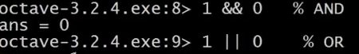

让我们看看逻辑运算 1 && 0，使用双&符号表示逻辑与，1 && 0判断为假，1和0的或运算 1 \|\| 0，其计算结果为真。


还有异或运算 如`XOR ( 1, 0 )`，其返回值为1

从左向右写着 **Octave 324.x**版本，是默认的**Octave**提示，它显示了当前**Octave**的版本，以及相关的其它信息。

如果你不想看到那个提示，这里有一个隐藏的命令：

输入命令


现在命令提示已经变得简化了。

接下来，我们将谈到**Octave**的变量。

现在写一个变量，对变量$A$赋值为3，并按下回车键，显示变量$A$等于3。


如果你想分配一个变量，但不希望在屏幕上显示结果，你可以在命令后加一个分号，可以抑制打印输出，敲入回车后，不打印任何东西。

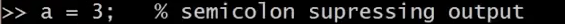

其中这句命令不打印任何东西。

现在举一个字符串的例子：变量$b$等于"**hi**"。


$c$等于3大于等于1，所以，现在$c$变量的值是真。


如果你想打印出变量，或显示一个变量，你可以像下面这么做：

设置$a$等于圆周率$π$，如果我要打印该值，那么只需键入`a`像这样 就打印出来了。


对于更复杂的屏幕输出，也可以用**DISP**命令显示：

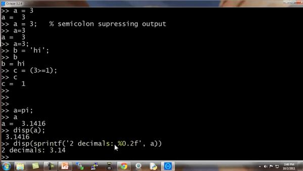

这是一种，旧风格的**C语言**语法，对于之前就学过**C语言**的同学来说，你可以使用这种基本的语法来将结果打印到屏幕。

例如 ^{T}命令的六个小数：0.6%f ,a，这应该打印$π$的6位小数形式。

也有一些控制输出长短格式的快捷命令：


下面，让我们来看看向量和矩阵：

比方说 建立一个矩阵$A$：


对$A$矩阵进行赋值，考虑到这是一个三行两列的矩阵，你同样可以用向量。

建立向量$V$并赋值1 2 3，$V$是一个行向量，或者说是一个3 ( 列 )×1 ( 行 )的向量，或者说，一行三列的矩阵。

如果我想，分配一个列向量，我可以写“1;2;3”，现在便有了一个3 行 1 列的向量，同时这是一个列向量。

下面是一些更为有用的符号，如：

```matlab
V=1：0.1：2
```

这个该如何理解呢：这个集合$v$是一组值，从数值1开始，增量或说是步长为0.1，直到增加到2，按照这样的方法对向量$V$操作，可以得到一个行向量，这是一个1行11列的矩阵，其矩阵的元素是1
1.1 1.2 1.3，依此类推，直到数值2。

我也可以建立一个集合$v$并用命令“1:6”进行赋值，这样$V$就被赋值了1至6的六个整数。


这里还有一些其他的方法来生成矩阵

例如“`ones(2, 3)`”，也可以用来生成矩阵：

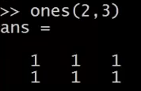

元素都为2，两行三列的矩阵，就可以使用这个命令：


你可以把这个方法当成一个生成矩阵的快速方法。

$w$为一个一行三列的零矩阵，一行三列的$A$矩阵里的元素全部是零：


还有很多的方式来生成矩阵。

如果我对$W$进行赋值，用**Rand**命令建立一个一行三列的矩阵，因为使用了**Rand**命令，则其一行三列的元素均为随机值，如“`rand(3,3)`”命令，这就生成了一个3×3的矩阵，并且其所有元素均为随机。


数值介于0和1之间，所以，正是因为这一点，我们可以得到数值均匀介于0和1之间的元素。

如果，你知道什么是高斯随机变量，或者，你知道什么是正态分布的随机变量，你可以设置集合$W$，使其等于一个一行三列的$N$矩阵，并且，来自三个值，一个平均值为0的高斯分布，方差或者等于1的标准偏差。


还可以设置地更复杂：

并用**hist**命令绘制直方图。


绘制单位矩阵：

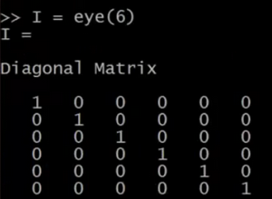

如果对命令不清楚，建议用**help**命令：

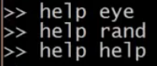

以上讲解的内容都是**Octave**的基本操作。希望你能通过上面的讲解，自己练习一些矩阵、乘、加等操作，将这些操作在**Octave**中熟练运用。

在接下来的视频中，将会涉及更多复杂的命令，并使用它们在**Octave**中对数据进行更多的操作。

### 5.2 移动数据

参考视频: 5 - 2 - Moving Data Around (16 min).mkv

在这段关于 **Octave**的辅导课视频中，我将开始介绍如何在 **Octave** 中移动数据。

如果你有一个机器学习问题，你怎样把数据加载到 **Octave** 中？

怎样把数据存入一个矩阵？

如何对矩阵进行相乘？

如何保存计算结果？

如何移动这些数据并用数据进行操作？

进入我的 **Octave** 窗口，

我键入$A$，得到我们之前构建的矩阵 $A$，也就是用这个命令生成的：

`A = [1 2; 3 4; 5 6]`

这是一个3行2列的矩阵，**Octave** 中的 `size()` 命令返回矩阵的尺寸。

所以 `size(A)` 命令返回3 2


实际上，`size()` 命令返回的是一个 1×2 的矩阵，我们可以用 $sz$ 来存放。

设置 `sz = size(A)`

因此 $sz$ 就是一个1×2的矩阵，第一个元素是3，第二个元素是2。

所以如果键入 `size(sz)` 看看 $sz$ 的尺寸，返回的是1 2，表示是一个1×2的矩阵，1 和 2分别表示矩阵$sz$的维度 。

你也可以键入 `size(A, 1)`，将返回3，这个命令会返回$A$矩阵的第一个元素，$A$矩阵的第一个维度的尺寸，也就是 $A$ 矩阵的行数。

同样，命令 `size(A, 2)`，将返回2，也就是 $A$ 矩阵的列数。

如果你有一个向量 $v$，假如 `v = [1 2 3 4]`，然后键入`length(v)`，这个命令将返回最大维度的大小，返回4。

你也可以键入`length(A)`，由于矩阵$A$是一个3×2的矩阵，因此最大的维度应该是3，因此该命令会返回3。

但通常我们还是对向量使用 $length$ 命令，而不是对矩阵使用 `length` 命令，比如
`length([1;2;3;4;5])`，返回5。

如何在系统中加载数据和寻找数据：

当我们打开 **Octave** 时，我们通常已经在一个默认路径中，这个路径是 **Octave**的安装位置，`pwd` 命令可以显示出**Octave** 当前所处路径。

`cd`命令，意思是改变路径，我可以把路径改为**C:\\Users\\ang\\Desktop**，这样当前目录就变为了桌面。

如果键入 `ls`，**ls** 来自于一个 **Unix** 或者 **Linux** 命令，**ls**命令将列出我桌面上的所有路径。


事实上，我的桌面上有两个文件：**featuresX.dat** 和**priceY.dat**，是两个我想解决的机器学习问题。

**featuresX**文件如这个窗口所示，是一个含有两列数据的文件，其实就是我的房屋价格数据，数据集中有47行，第一个房子样本，面积是2104平方英尺，有3个卧室，第二套房子面积为1600，有3个卧室等等。


**priceY**这个文件就是训练集中的价格数据，所以 **featuresX** 和**priceY**就是两个存放数据的文档，那么应该怎样把数据读入 **Octave** 呢？我们只需要键入`featuresX.dat`，这样我将加载了 **featuresX** 文件。同样地我可以加载`priceY.dat`。其实有好多种办法可以完成，如果你把命令写成字符串的形式`load('featureX.dat')`，也是可以的，这跟刚才的命令效果是相同的，只不过是把文件名写成了一个字符串的形式，现在文件名被存在一个字符串中。**Octave**中使用引号来表示字符串。

另外 `who` 命令，能显示出 在我的 **Octave**工作空间中的所有变量


所以我可以键入`featuresX` 回车，来显示 **featuresX**


这些就是存在里面的数据。

还可以键入 `size(featuresX)`，得出的结果是 47 2，代表这是一个47×2的矩阵。

类似地，输入 `size(priceY)`，结果是 47
1，表示这是一个47维的向量，是一个列矩阵，存放的是训练集中的所有价格$Y$ 的值。

`who` 函数能让你看到当前工作空间中的所有变量，同样还有另一个 `whos`命令，能更详细地进行查看。


同样也列出我所有的变量，不仅如此，还列出了变量的维度。

**double** 意思是双精度浮点型，这也就是说，这些数都是实数，是浮点数。

如果你想删除某个变量，你可以使用 `clear` 命令，我们键入 `clear featuresX`，然后再输入 `whos` 命令，你会发现 **featuresX** 消失了。

另外，我们怎么储存数据呢？

我们设变量 `V= priceY(1:10)`

这表示的是将向量 $Y $的前10个元素存入 $V$中。


假如我们想把它存入硬盘，那么用 `save hello.mat v` 命令，这个命令会将变量$V$存成一个叫 **hello.mat** 的文件，让我们回车，现在我的桌面上就出现了一个新文件，名为**hello.mat**。

由于我的电脑里同时安装了 **MATLAB**，所以这个图标上面有 **MATLAB**的标识，因为操作系统把文件识别为 **MATLAB**文件。如果在你的电脑上图标显示的不一样的话，也没有关系。

现在我们清除所有变量，直接键入`clear`，这样将删除工作空间中的所有变量，所以现在工作空间中啥都没了。

但如果我载入 **hello.mat** 文件，我又重新读取了变量 $v$，因为我之前把变量$v$存入了**hello.mat** 文件中，所以我们刚才用 `save`命令做了什么。这个命令把数据按照二进制形式储存，或者说是更压缩的二进制形式，因此，如果$v$是很大的数据，那么压缩幅度也更大，占用空间也更小。如果你想把数据存成一个人能看懂的形式，那么可以键入：

`save hello.txt v -ascii`

这样就会把数据存成一个文本文档，或者将数据的 **ascii 码**存成文本文档。

我键入了这个命令以后，我的桌面上就有了 **hello.txt**文件。如果打开它，我们可以发现这个文本文档存放着我们的数据。

这就是读取和储存数据的方法。

接下来我们再来讲讲操作数据的方法：

假如 $A$ 还是那个矩阵


跟刚才一样还是那个 3×2 的矩阵，现在我们加上索引值，比如键入 `A(3,2)`

这将索引到$A$ 矩阵的 (3,2) 元素。这就是我们通常书写矩阵的形式，写成 $A$ 32，3和2分别表示矩阵的第三行和第二列对应的元素，因此也就对应 6。

我也可以键入`A(2,:)` 来返回第二行的所有元素，冒号表示该行或该列的所有元素。

类似地，如果我键入 `A(:,2)`，这将返回 $A$ 矩阵第二列的所有元素，这将得到 2 4 6。

这表示返回$A$ 矩阵的第二列的所有元素。

你也可以在运算中使用这些较为复杂的索引。

我再给你展示几个例子，可能你也不会经常使用，但我还是输入给你看 `A([1 3],:)`，这个命令意思是取 $A$ 矩阵第一个索引值为1或3的元素，也就是说我取的是A矩阵的第一行和第三行的每一列，冒号表示的是取这两行的每一列元素，即：


可能这些比较复杂一点的索引操作你会经常用到。

我们还能做什么呢？依然是 $A$ 矩阵，`A(:,2)` 命令返回第二列。

你也可以为它赋值，我可以取 $A$ 矩阵的第二列，然后将它赋值为10 11 12，我实际上是取出了 $A$ 的第二列，然后把一个列向量[10;11;12]赋给了它，因此现在 $A$ 矩阵的第一列还是 1 3 5，第二列就被替换为 10 11 12。


接下来一个操作，让我们把 $A $设为`A = [A, [100, 101,102]]`，这样做的结果是在原矩阵的右边附加了一个新的列矩阵，就是把 $A$矩阵设置为原来的 $A$ 矩阵再在右边附上一个新添加的列矩阵。

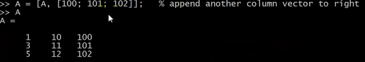

最后，还有一个小技巧，如果你就输入 `A(:)`，这是一个很特别的语法结构，意思是把 $A$中的所有元素放入一个单独的列向量，这样我们就得到了一个 9×1 的向量，这些元素都是$A$ 中的元素排列起来的。

再来几个例子：

我还是把 A 重新设为 [1 2; 3 4; 5 6]，我再设一个 $B$为[11 12; 13 14; 15 16]，我可以新建一个矩阵 $C$，`C = [A B]`，这个意思就是把这两个矩阵直接连在一起，矩阵$A$ 在左边，矩阵$B$ 在右边，这样组成了 $C$矩阵，就是直接把$A$和 $B$ 合起来。


我还可以设`C = [A; B]`，这里的分号表示把分号后面的东西放到下面。所以，`[A;B]`的作用依然还是把两个矩阵放在一起，只不过现在是上下排列，所以现在 $A$ 在上面 $B$在下面，$C$ 就是一个 6×2 矩阵。


简单地说，分号的意思就是换到下一行，所以 C 就包括上面的A，然后换行到下面，然后在下面放上一个 $B$。

另外顺便说一下，这个`[A B]`命令跟 `[A, B]` 是一样的，这两种写法的结果是相同的。

通过以上这些操作，希望你现在掌握了怎样构建矩阵，也希望我展示的这些命令能让你很快地学会怎样把矩阵放到一起，怎样取出矩阵，并且把它们放到一起，组成更大的矩阵。

通过几句简单的代码，**Octave**能够很方便地很快速地帮助我们组合复杂的矩阵以及对数据进行移动。这就是移动数据这一节课。

我认为对你来讲，最好的学习方法是，下课后复习一下我键入的这些代码好好地看一看，从课程的网上把代码的副本下载下来，重新好好看看这些副本，然后自己在**Octave** 中把这些命令重新输一遍，慢慢开始学会使用这些命令。

当然，没有必要把这些命令都记住，你也不可能记得住。你要做的就是，了解一下你可以用哪些命令，做哪些事。这样在你今后需要编写学习算法时，如果你要找到某个**Octave**中的命令，你可能回想起你之前在这里学到过，然后你就可以查找课程中提供的程序副本，这样就能很轻松地找到你想使用的命令了。

### 5.3 计算数据

参考视频: 5 - 3 - Computing on Data (13 min).mkv

现在，你已经学会了在**Octave**中如何加载或存储数据，如何把数据存入矩阵等等。在这段视频中，我将介绍如何对数据进行运算，稍后我们将使用这些运算操作来实现我们的学习算法。

这是我的 **Octave**窗口，我现在快速地初始化一些变量。比如设置$A$为一个3×2的矩阵，设置$B$为一个3 ×2矩阵，设置$C$为2 × 2矩阵。

我想算两个矩阵的乘积，比如说 $A × C$，我只需键入`A×C`，这是一个 3×2 矩阵乘以 2×2矩阵，得到这样一个3×2矩阵。

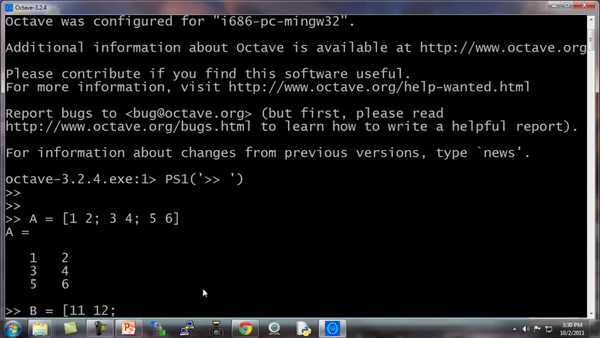


你也可以对每一个元素，做运算 方法是做点乘运算`A.*B`，这么做Octave将矩阵 $A$中的每一个元素与矩阵 $B$ 中的对应元素相乘:`A.*B`

这里第一个元素1乘以11得到11，第二个元素2乘以12得到24，这就是两个矩阵的元素位运算。通常来说，在**Octave**中点号一般用来表示元素位运算。


这里是一个矩阵$A$，这里我输入`A.^2`，这将对矩阵$A$中每一个元素平方。

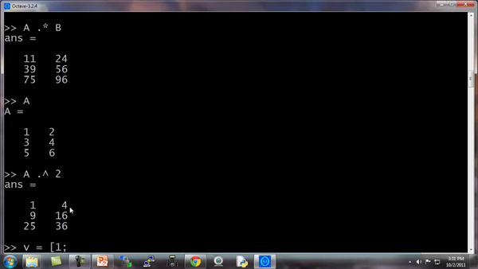

我们设$V$为 [1; 2; 3] 是列向量，你也可以输入`1./V`，得到每一个元素的倒数，所以这样一来，就会分别算出 1/1 1/2 1/3。

矩阵也可以这样操作，`1./A` 得到$A$中每一个元素的倒数。

同样地，这里的点号还是表示对每一个元素进行操作。

我们还可以进行求对数运算，也就是对每个元素进行求对数运算。

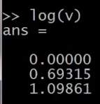

还有自然数$e$的幂次运算，就是以$e$为底，以这些元素为幂的运算。

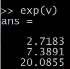

我还可以用 **abs**来对 $v$ 的每一个元素求绝对值，当然这里 $v$都是正数。我们换成另一个这样对每个元素求绝对值，得到的结果就是这些非负的元素。还有$–v$，给出$v$中每个元素的相反数，这等价于 -1 乘以 $v$，一般就直接用 $-v$
就好了，其实就等于 $-1*v$。

还有一个技巧，比如说我们想对$v$中的每个元素都加1，那么我们可以这么做，首先构造一个3行1列的1向量，然后把这个1向量跟原来的向量相加，因此$v$向量从[1 2 3] 增至 [2 3 4]。我用了一个，`length(v)`命令，因此这样一来，`ones(length(v) ,1)` 就相当于`ones(3,1)`，然后我做的是`v +ones(3,1)`，也就是将 $v$ 的各元素都加上这些1，这样就将$v$ 的每个元素增加了1。

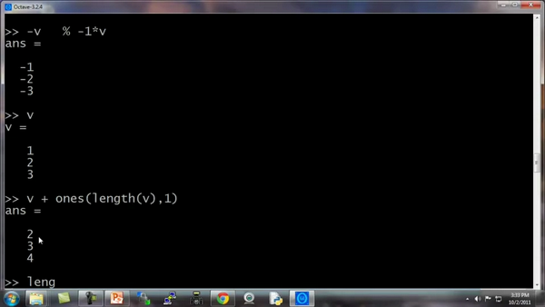

另一种更简单的方法是直接用 `v+1`，`v + 1` 也就等于把 $v$ 中的每一个元素都加上1。

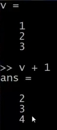

现在，让我们来谈谈更多的操作。

矩阵$A$ 如果你想要求它的转置，那么方法是用A’,将得出 A 的转置矩阵。当然，如果我写`(A')'`，也就是 $A$ 转置两次，那么我又重新得到矩阵 $A$。

还有一些有用的函数，比如： `a=[1 15 2 0.5]`，这是一个1行4列矩阵，`val=max(a)`，这将返回$A$矩阵中的最大值15。

我还可以写 `[val, ind] =max(a)`，这将返回$A$矩阵中的最大值存入$val$，以及该值对应的索引，元素15对应的索引值为2,存入$ind$，所以 $ind =2$。

特别注意一下，如果你用命令 `max(A)`，$A$是一个矩阵的话，这样做就是对每一列求最大值。

我们还是用这个例子，这个 $a$ 矩阵`a=[1 15 2 0.5]`，如果输入`a<3`，这将进行逐元素的运算，所以元素小于3的返回1，否则返回0。


因此，返回[1 1 0 1]。也就是说，对$a$矩阵的每一个元素与3进行比较，然后根据每一个元素与3的大小关系，返回1和0表示真与假。

如果我写 `find(a<3)`，这将告诉我$a$ 中的哪些元素是小于3的。


设`A = magic(3)`，**magic 函数**将返回一个矩阵，称为魔方阵或幻方 (**magic squares**)，它们具有以下这样的数学性质：它们所有的行和列和对角线加起来都等于相同的值。

当然据我所知，这在机器学习里基本用不上，但我可以用这个方法很方便地生成一个3行3列的矩阵，而这个魔方矩阵这神奇的方形屏幕。每一行、每一列、每一个对角线三个数字加起来都是等于同一个数。


在其他有用的机器学习应用中，这个矩阵其实没多大作用。

如果我输入 `[r,c] = find(A>=7)`，这将找出所有$A$矩阵中大于等于7的元素，因此，$r$ 和$c$分别表示行和列，这就表示，第一行第一列的元素大于等于7，第三行第二列的元素大于等于7，第二行第三列的元素大于等于7。


顺便说一句，其实我从来都不去刻意记住这个 **find 函数**，到底是怎么用的，我只需要会用**help函数**就可以了，每当我在使用这个函数，忘记怎么用的时候，我就可以用 **help函数**，键入 `help find` 来找到帮助文档。

最后再讲两个内容，一个是求和函数，这是 $a$ 矩阵：


键入 `sum(a)`，就把 a 中所有元素加起来了。

如果我想把它们都乘起来，键入 `prod(a)`，**prod** 意思是**product(乘积)**，它将返回这四个元素的乘积。

`floor(a)` 是向下四舍五入，因此对于 $a$ 中的元素0.5将被下舍入变成0。

还有 `ceil(a)`，表示向上四舍五入，所以0.5将上舍入变为最接近的整数，也就是1。

键入 `type(3)`，这通常得到一个3×3的矩阵，如果键入 `max(rand(3),rand(3))`，这样做的结果是返回两个3×3的随机矩阵，并且逐元素比较取最大值。

假如我输入`max(A,[],1)`，这样做会得到每一列的最大值。

所以第一列的最大值就是8，第二列是9，第三列的最大值是7，这里的1表示取A矩阵第一个维度的最大值。

相对地，如果我键入`max(A,[],2)`，这将得到每一行的最大值，所以，第一行的最大值是等于8，第二行最大值是7，第三行是9。


所以你可以用这个方法来求得每一行或每一列的最值，另外，你要知道，默认情况下`max(A)`返回的是每一列的最大值，如果你想要找出整个矩阵A的最大值，你可以输入`max(max(A))`，或者你可以将$A$ 矩阵转成一个向量，然后键入 `max(A(:))`，这样做就是把 $A$ 当做一个向量，并返回 $A$向量中的最大值。

最后，让我们把 $A$设为一个9行9列的魔方阵，魔方阵具有的特性是每行每列和对角线的求和都是相等的。

这是一个9×9的魔方阵，我们来求一个 `sum(A,1)`，这样就得到每一列的总和，这也验证了一个9×9的魔方阵确实每一列加起来都相等，都为369。


现在我们来求每一行的和，键入`sum(A,2)`，这样就得到了$A$ 中每一行的和加起来还是369。

现在我们来算$A $的对角线元素的和。我们现在构造一个9×9 的单位矩阵，键入 `eye(9)`,

然后我们要用 $A$逐点乘以这个单位矩阵，除了对角线元素外，其他元素都会得到0。

键入`sum(sum(A.*eye(9))`

这实际上是求得了，这个矩阵对角线元素的和确实是369。

你也可以求另一条对角线的和也是是369。

**flipup/flipud** 表示向上/向下翻转。

同样地，如果你想求这个矩阵的逆矩阵，键入`pinv(A)`，通常称为伪逆矩阵，你就把它看成是矩阵 $A$ 求逆，因此这就是 $A$矩阵的逆矩阵。

设 `temp = pinv(A)`，然后再用$temp$ 乘以$A$，这实际上得到的就是单位矩阵，对角线为1，其他元素为0。

如何对矩阵中的数字进行各种操作，在运行完某个学习算法之后，通常一件最有用的事情是看看你的结果，或者说让你的结果可视化，在接下来的视频中，我会非常迅速地告诉你，如何很快地画图，如何只用一两行代码，你就可以快速地可视化你的数据，这样你就能更好地理解你使用的学习算法。

### 5.4 绘图数据

参考视频: 5 - 4 - Plotting Data (10 min).mkv

当开发学习算法时，往往几个简单的图，可以让你更好地理解算法的内容，并且可以完整地检查下算法是否正常运行，是否达到了算法的目的。

例如在之前的视频中，我谈到了绘制成本函数$J(\theta)$，可以帮助确认梯度下降算法是否收敛。通常情况下，绘制数据或学习算法所有输出，也会启发你如何改进你的学习算法。幸运的是，**Octave**有非常简单的工具用来生成大量不同的图。当我用学习算法时，我发现绘制数据、绘制学习算法等，往往是我获得想法来改进算法的重要部分。在这段视频中，我想告诉你一些**Octave**的工具来绘制和可视化你的数据。

我们先来快速生成一些数据用来绘图。


如果我想绘制正弦函数，这是很容易的，我只需要输入`plot(t,y1)`，并回车，就出现了这个图：


横轴是$t$变量，纵轴是$y1$，也就是我们刚刚所输出的正弦函数。

让我们设置$y2$

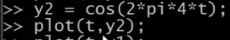

**Octave**将会消除之前的正弦图，并且用这个余弦图来代替它，这里纵轴$cos(x)$从1开始，


如果我要同时表示正弦和余弦曲线。

我要做的就是，输入：`plot(t, y1)`，得到正弦函数，我使用函数**hold on**，**hold on**函数的功能是将新的图像绘制在旧的之上。

我现在绘制$y2$，输入：`plot(t, y2)`。

我要以不同的颜色绘制余弦函数，所以我在这里输入带引号的r绘制余弦函数，$r$表示所使用的颜色：`plot(t,y2,’r’)`，再加上命令`xlabel('time')`，
来标记X轴即水平轴，输入`ylabel('value')`，来标记垂直轴的值。


同时我也可以来标记我的两条函数曲线，用这个命令 `legend('sin','cos')`将这个图例放在右上方，表示这两条曲线表示的内容。最后输入`title('myplot')`，在图像的顶部显示这幅图的标题。

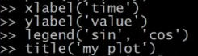


如果你想保存这幅图像，你输入`print –dpng 'myplot.png'`，**png**是一个图像文件格式，如果你这样做了，它可以让你保存为一个文件。

**Octave**也可以保存为很多其他的格式，你可以键入`help plot`。

最后如果你想，删掉这个图像，用命令**close**会让这个图像关掉。

**Octave**也可以让你为图像标号

你键入`figure(1); plot(t, y1);`将显示第一张图，绘制了变量$t$ $y1$。

键入`figure(2); plot(t, y2);` 将显示第一张图，绘制了变量$t$ $y2$。

**subplot**命令，我们要使用`subplot(1,2,1)`，它将图像分为一个1\*2的格子，也就是前两个参数，然后它使用第一个格子，也就是最后一个参数1的意思。

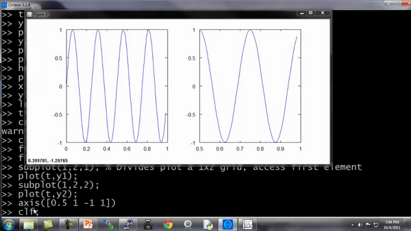

我现在使用第一个格子，如果键入`plot(t,y1)`，现在这个图显示在第一个格子。如果我键入`subplot(1,2,2)`，那么我就要使用第二个格子，键入`plot(t,y2)`；现在y2显示在右边，也就是第二个格子。

最后一个命令，你可以改变轴的刻度，比如改成[0.5 1 -1 1]，输入命令：`axis([0.5 1 -1 1])`也就是设置了右边图的$x$轴和$y$轴的范围。具体而言，它将右图中的横轴的范围调整至0.5到1，竖轴的范围为-1到1。


你不需要记住所有这些命令，如果你需要改变坐标轴，或者需要知道**axis**命令，你可以用**Octave**中用**help**命令了解细节。

最后，还有几个命令。

`Clf`（清除一幅图像）。

让我们设置A等于一个5×5的**magic**方阵：


我有时用一个巧妙的方法来可视化矩阵，也就是`imagesc(A`)命令，它将会绘制一个5\*5的矩阵，一个5\*5的彩色格图，不同的颜色对应A矩阵中的不同值。

我还可以使用函数**colorbar**，让我用一个更复杂的命令 `imagesc(A)，colorbar，colormap gray`。这实际上是在同一时间运行三个命令：运行`imagesc`，然后运行，`colorbar`，然后运行`colormap gray`。

它生成了一个颜色图像，一个灰度分布图，并在右边也加入一个颜色条。所以这个颜色条显示不同深浅的颜色所对应的值。

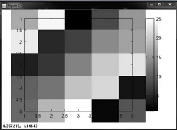

你可以看到在不同的方格，它对应于一个不同的灰度。

输入`imagesc(magic(15))，colorbar，colormap gray`


这将会是一幅15\*15的**magic**方阵值的图。

最后，总结一下这段视频。你看到我所做的是使用逗号连接函数调用。如果我键入$a=1$,$b=2$,$c=3$然后按**Enter**键，其实这是将这三个命令同时执行，或者是将三个命令一个接一个执行，它将输出所有这三个结果。

这很像$a=1$; $b=2$;$c=3$;如果我用分号来代替逗号，则没有输出出任何东西。

这里我们称之为逗号连接的命令或函数调用。


用逗号连接是另一种**Octave**中更便捷的方式，将多条命令例如`imagesc colorbar colormap`，将这多条命令写在同一行中。

现在你知道如何绘制**Octave**中不同的图像，在下面的视频中，我将告诉你怎样在Octave中，写控制语句，比如**if while for**语句，并且定义和使用函数。

### 5.5 控制语句：for，while，if语句

参考视频: 5 - 5 - Control Statements\_ for, while, if statements (13 min).mkv

在这段视频中，我想告诉你怎样为你的 **Octave** 程序写控制语句。诸如："**for**" "**while**" "**if**" 这些语句，并且如何定义和使用方程。

我先告诉你如何使用 “**for**” 循环。

首先，我要将 $v$ 值设为一个10行1列的零向量。


接着我要写一个 “**for**" 循环，让 $i$ 等于 1 到 10，写出来就是 `i = 1:10`。我要设$ v(i)$的值等于 2 的 $i$ 次方，循环最后写上“**end**”。

向量$v$ 的值就是这样一个集合 2的一次方、2的二次方，依此类推。这就是我的 $i$ 等于 1 到 10的语句结构，让 $i$ 遍历 1 到 10的值。


另外，你还可以通过设置你的 indices (索引) 等于 1一直到10，来做到这一点。这时**indices** 就是一个从1到10的序列。

你也可以写 `i = indices`，这实际上和我直接把 i 写到 1 到 10 是一样。你可以写 `disp(i)`，也能得到一样的结果。所以 这就是一个 “**for**” 循环。


如果你对 “**break**” 和 “**continue**” 语句比较熟悉，**Octave**里也有 “**break**” 和 “**continue**”语句，你也可以在 **Octave**环境里使用那些循环语句。

但是首先让我告诉你一个 **while** 循环是如何工作的：


这是什么意思呢：我让 $i$ 取值从 1 开始，然后我要让 $v(i)$ 等于 100，再让 $i$ 递增 1，直到$i$ 大于 5停止。

现在来看一下结果，我现在已经取出了向量的前五个元素，把他们用100覆盖掉，这就是一个**while**循环的句法结构。

现在我们来分析另外一个例子：

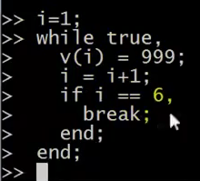

这里我将向你展示如何使用**break**语句。比方说 `v(i) = 999`，然后让 `i = i+1`，当 $i$ 等于6的时候 **break** (停止循环)，结束 (**end**)。

当然这也是我们第一次使用一个 **if** 语句，所以我希望你们可以理解这个逻辑，让 $i$ 等于1 然后开始下面的增量循环，**while**语句重复设置 $v(i)$ 等于999，不断让$i$增加，然后当 $i$ 达到6，做一个中止循环的命令，尽管有**while**循环，语句也就此中止。所以最后的结果是取出向量 $v$ 的前5个元素，并且把它们设置为999。

所以，这就是**if** 语句和 **while** 语句的句法结构。并且要注意要有**end**，上面的例子里第一个 **end** 结束的是 **if**
语句，第二个 **end** 结束的是 **while** 语句。

现在让我告诉你使用 **if-else** 语句：

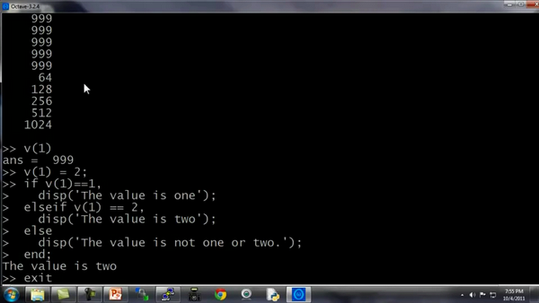

最后，提醒一件事：如果你需要退出 **Octave**，你可以键入`exit`命令然后回车就会退出 **Octave**，或者命令`quit`也可以。

最后，让我们来说说函数 (**functions**)，如何定义和调用函数。

我在桌面上存了一个预先定义的文件名为 “**squarethisnumber.m**”，这就是在 **Octave** 环境下定义的函数。

让我们打开这个文件。请注意，我使用的是微软的写字板程序来打开这个文件，我只是想建议你，如果你也使用微软的**Windows**系统，那么可以使用写字板程序，而不是记事本来打开这些文件。如果你有别的什么文本编辑器也可以，记事本有时会把代码的间距弄得很乱。如果你只有记事本程序，那也能用。我建议你用写字板或者其他可以编辑函数的文本编辑器。

现在我们来说如何在 **Octave** 里定义函数：

这个文件只有三行：


第一行写着 `function y = squareThisNumber(x)`，这就告诉 **Octave**，我想返回一个 y值，我想返回一个值，并且返回的这个值将被存放于变量 $y$ 里。另外，它告诉了**Octave**这个函数有一个参数，就是参数 $x$，还有定义的函数体，也就是 $y$ 等于 $x$ 的平方。

还有一种更高级的功能，这只是对那些知道“**search path** (**搜索路径**)”这个术语的人使用的。所以如果你想要修改
**Octave**的搜索路径，你可以把下面这部分作为一个进阶知识，或者选学材料，仅适用于那些熟悉编程语言中搜索路径概念的同学。

你可以使用**addpath** 命令添加路径，添加路径“**C:\\Users\\ang\\desktop**”将该目录添加到**Octav**e的搜索路径，这样即使你跑到其他路径底下，**Octave**依然知道会在 **Users\\ang\\desktop**目录下寻找函数。这样，即使我现在在不同的目录下，它仍然知道在哪里可以找到“**SquareThisNumber**” 这个函数。

但是，如果你不熟悉搜索路径的概念，不用担心，只要确保在执行函数之前，先用 `cd`命令设置到你函数所在的目录下，实际上也是一样的效果。

**Octave**还有一个其他许多编程语言都没有的概念，那就是它可以允许你定义一个函数，使得返回值是多个值或多个参数。这里就是一个例子，定义一个函数叫：

“`SquareAndCubeThisNumber(x)`” ($x$的平方以及$x$的立方)

这说的就是函数返回值是两个： $y1$ 和 $y2$，接下来就是$y1$是被平方后的结果，$y2$是被立方后的结果，这就是说，函数会真的返回2个值。

有些同学可能会根据你使用的编程语言，比如你们可能熟悉的**C**或**C++**，通常情况下，认为作为函数返回值只能是一个值，但**Octave** 的语法结构就不一样，可以返回多个值。

如果我键入 `[a,b] = SquareAndCubeThisNumber(5)`，然后，$a$就等于25，$b$ 就等于5的立方125。

所以说如果你需要定义一个函数并且返回多个值，这一点常常会带来很多方便。

最后，我来给大家演示一下一个更复杂一点的函数的例子。

比方说，我有一个数据集，像这样，数据点为[1,1], [2,2],[3,3]，我想做的事是定义一个 **Octave** 函数来计算代价函数 $J(\theta)$，就是计算不同 $\theta$值所对应的代价函数值$J$。

首先让我们把数据放到 **Octave** 里，我把我的矩阵设置为`X = [1 1; 1 2; 1 3];`


请仔细看一下这个函数的定义，确保你明白了定义中的每一步。


现在当我在 **Octave** 里运行时，我键入 `J = costFunctionJ (X, y, theta)`，它就计算出 $J$等于0，这是因为如果我的数据集$x$ 为 [1;2;3]， $y$ 也为 [1;2;3] 然后设置 $\theta_0$ 等于0，$\theta_1$等于1，这给了我恰好45度的斜线，这条线是可以完美拟合我的数据集的。

而相反地，如果我设置$\theta$ 等于[0;0]，那么这个假设就是0是所有的预测值，和刚才一样，设置$\theta_0$ = 0，$\theta_1$也等于0，然后我计算的代价函数，结果是2.333。实际上，他就等于1的平方，也就是第一个样本的平方误差，加上2的平方，加上3的平方，然后除以$2m$，也就是训练样本数的两倍，这就是2.33。


因此这也反过来验证了我们这里的函数，计算出了正确的代价函数。这些就是我们用简单的训练样本尝试的几次试验，这也可以作为我们对定义的代价函数$J$进行了完整性检查。确实是可以计算出正确的代价函数的。至少基于这里的 $x$和 $y$是成立的。也就是我们这几个简单的训练集，至少是成立的。

现在你知道如何在 **Octave** 环境下写出正确的控制语句，比如 **for 循环**、**while 循环**和 **if语句**，以及如何定义和使用函数。

在接下来的**Octave** 教程视频里，我会讲解一下向量化，这是一种可以使你的 **Octave**程序运行非常快的思想。

### 5.6 向量化

参考视频: 5 - 6 - Vectorization (14 min).mkv

在这段视频中，我将介绍有关向量化的内容，无论你是用**Octave**，还是别的语言，比如**MATLAB**或者你正在用**Python**、**NumPy** 或 **Java C C++**，所有这些语言都具有各种线性代数库，这些库文件都是内置的，容易阅读和获取，他们通常写得很好，已经经过高度优化，通常是数值计算方面的博士或者专业人士开发的。

而当你实现机器学习算法时，如果你能好好利用这些线性代数库，或者数值线性代数库，并联合调用它们，而不是自己去做那些函数库可以做的事情。如果是这样的话，那么通常你会发现：首先，这样更有效，也就是说运行速度更快，并且更好地利用你的计算机里可能有的一些并行硬件系统等等；其次，这也意味着你可以用更少的代码来实现你需要的功能。因此，实现的方式更简单，代码出现问题的有可能性也就越小。

举个具体的例子：与其自己写代码做矩阵乘法。如果你只在**Octave**中输入$a$乘以$b$就是一个非常有效的两个矩阵相乘的程序。有很多例子可以说明，如果你用合适的向量化方法来实现，你就会有一个简单得多，也有效得多的代码。

让我们来看一些例子：这是一个常见的线性回归假设函数：${{h}_{\theta }}(x)=\sum\limits_{j=0}^{n}{{{\theta }_{j}}{{x}_{j}}}$

如果你想要计算$h_\theta(x)$ ，注意到右边是求和，那么你可以自己计算$j = 0$ 到$ j = n$ 的和。但换另一种方式来想想，把 $h_\theta(x)$ 看作$\theta^Tx$，那么你就可以写成两个向量的内积，其中$\theta$就是$\theta_0$、$\theta_1$、$\theta_2$，如果你有两个特征量，如果 $n = 2$，并且如果你把 $x$ 看作$x_0$、$x_1$、$x_2$，这两种思考角度，会给你两种不同的实现方式。


比如说，这是未向量化的代码实现方式：


计算$h_\theta(x)$是未向量化的，我们可能首先要初始化变量 $prediction$ 的值为0.0，而这个变量$prediction$ 的最终结果就是$h_\theta(x)$，然后我要用一个 **for** 循环，$j$ 取值 0 到$n+1$，变量$prediction$ 每次就通过自身加上$ theta(j) $乘以 $x(j)$更新值，这个就是算法的代码实现。

顺便我要提醒一下，这里的向量我用的下标是0，所以我有$\theta_0$、$\theta_1$、$\theta_2$，但因为**MATLAB**的下标从1开始，在 **MATLAB** 中$\theta_0$，我们可能会用 $theta(1)$ 来表示，这第二个元素最后就会变成，$theta(2$) 而第三个元素，最终可能就用$theta(3)$表示，因为**MATLAB**中的下标从1开始，这就是为什么这里我的 **for 循环**，$j$取值从 1 直到$n+1$，而不是从 0 到 $n$。这是一个未向量化的代码实现方式，我们用一个 **for 循环**对 $n$ 个元素进行加和。

作为比较，接下来是向量化的代码实现：


你把x和$\theta$看做向量，而你只需要令变量$prediction$等于$theta$转置乘以$x$，你就可以这样计算。与其写所有这些for循环的代码，你只需要一行代码，这行代码就是利用 **Octave** 的高度优化的数值，线性代数算法来计算两个向量$\theta$以及$x$的内积，这样向量化的实现更简单，它运行起来也将更加高效。这就是 **Octave** 所做的而向量化的方法，在其他编程语言中同样可以实现。

让我们来看一个**C++** 的例子：


与此相反，使用较好的**C++**数值线性代数库，你可以写出像右边这样的代码，因此取决于你的数值线性代数库的内容。你只需要在**C++**中将两个向量相乘，根据你所使用的数值和线性代数库的使用细节的不同，你最终使用的代码表达方式可能会有些许不同，但是通过一个库来做内积，你可以得到一段更简单、更有效的代码。

现在，让我们来看一个更为复杂的例子，这是线性回归算法梯度下降的更新规则：


我们用这条规则对$ j$ 等于 0、1、2等等的所有值，更新对象$\theta_j$，我只是用$\theta_0$、$\theta_1$、$\theta_2$来写方程，假设我们有两个特征量，所以$n$等于2，这些都是我们需要对$\theta_0$、$\theta_1$、$\theta_2$进行更新，这些都应该是同步更新，我们用一个向量化的代码实现，这里是和之前相同的三个方程，只不过写得小一点而已。

你可以想象实现这三个方程的方式之一，就是用一个 **for 循环**，就是让 $j$等于0、等于1、等于2，来更新$\theta_j$。但让我们用向量化的方式来实现，看看我们是否能够有一个更简单的方法。基本上用三行代码或者一个**for 循环**，一次实现这三个方程。让我们来看看怎样能用这三步，并将它们压缩成一行向量化的代码来实现。做法如下：

我打算把$\theta$看做一个向量，然后我用$\theta$-$\alpha$ 乘以某个别的向量$\delta$ 来更新$\theta$。

这里的 $\delta$  等于


让我解释一下是怎么回事：我要把$\theta$看作一个向量，有一个 $n+1$ 维向量，$\alpha$ 是一个实数，$\delta$在这里是一个向量。


所以这个减法运算是一个向量减法，因为 $\alpha$ 乘以 δ是一个向量，所以$\theta$就是$\theta$ - $\alpha \delta$得到的向量。

那么什么是向量 $\delta$ 呢 ?

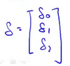

$X^{(i)}$是一个向量


你就会得到这些不同的式子，然后作加和。


实际上，在以前的一个小测验，如果你要解这个方程，我们说过为了向量化这段代码，我们会令`u = 2v +5w`因此，我们说向量$u$等于2乘以向量$v$加上5乘以向量$w$。用这个例子说明，如何对不同的向量进行相加，这里的求和是同样的道理。


这就是为什么我们能够向量化地实现线性回归。

所以，我希望步骤是有逻辑的。请务必看视频，并且保证你确实能理解它。如果你实在不能理解它们数学上等价的原因，你就直接实现这个算法，也是能得到正确答案的。所以即使你没有完全理解为何是等价的，如果只是实现这种算法，你仍然能实现线性回归算法。如果你能弄清楚为什么这两个步骤是等价的，那我希望你可以对向量化有一个更好的理解，如果你在实现线性回归的时候，使用一个或两个以上的特征量。

有时我们使用几十或几百个特征量来计算线性归回，当你使用向量化地实现线性回归，通常运行速度就会比你以前用你的**for循环**快的多，也就是自己写代码更新$\theta_0$、$\theta_1$、$\theta_2$。

因此使用向量化实现方式，你应该是能够得到一个高效得多的线性回归算法。而当你向量化我们将在之后的课程里面学到的算法，这会是一个很好的技巧，无论是对于Octave 或者一些其他的语言 如C++、Java 来让你的代码运行得更高效。

### 5.7 工作和提交的编程练习

参考视频: 5 - 7 - Working on and Submitting Programming Exercises (4 min).mkv

在这段视频中，我想很快地介绍一下这门课程做作业的流程，以及如何使用作业提交系统。这个提交系统可以即时检验你的机器学习程序答案是否正确。

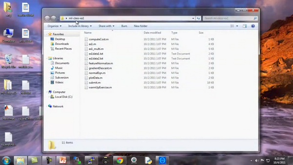

在'ml-class-ex1'目录中，我们提供了大量的文件，其中有一些需要由你自己来编辑，因此第一个文件应该符合编程练习中pdf文件的要求，其中一个我们要求你编写的文件是warmUpExercise.m这个文件，这个文件只是为了确保你熟悉提交系统。

你需要做的就是提交一个5×5的矩阵，就是`A = eye(5)`这将修改该函数以产生5×5的单位矩阵，现在`warmUpExercise()`这个方程就实现了返回5x5的单位矩阵，将它保存一下，所以我已经完成了作业的第一部分。


现在回到我的 **Octave** 窗口，现在来到我的目录**C:\\Users\\ang\\Desktop\\ml-class-ex1**如果我想确保我已经实现了程序 像这样输入`warmUpExercise()`好了它返回了我们用刚才写的代码创建的一个5x5的单位矩阵。

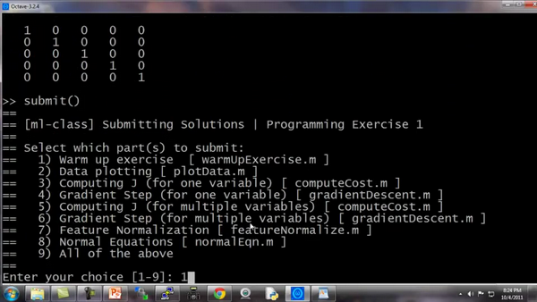

我现在可以按如下步骤提交代码，我要在这里目录下键入`submit()`。我要提交第一部分 所以我选择输入'`1`'。这时它问我的电子邮件地址，我们打开课程网站，输入用户名密码。


按下回车键，它连接到服务器，并将其提交，然后它就会立刻告诉你：恭喜您！已成功完成作业1第1部分。这就确认了你已经做对了第一部分练习，如果你提交的答案不正确，那么它会给你一条消息，说明你没有完全答对，您还可以继续使用此提交密码，也可以生成新密码。你的密码是否会显示出来取决于你使用的操作系统。
这就是提交作业的方法，你完成家庭作业的时候，我希望你都能答对。	


# 第3周

[TOC]

## 六、逻辑回归(Logistic Regression)

### 6.1 分类问题

参考文档: 6 - 1 - Classification (8 min).mkv

在这个以及接下来的几个视频中，开始介绍分类问题。

在分类问题中，你要预测的变量 $y$ 是离散的值，我们将学习一种叫做逻辑回归 (**Logistic Regression**) 的算法，这是目前最流行使用最广泛的一种学习算法。

在分类问题中，我们尝试预测的是结果是否属于某一个类（例如正确或错误）。分类问题的例子有：判断一封电子邮件是否是垃圾邮件；判断一次金融交易是否是欺诈；之前我们也谈到了肿瘤分类问题的例子，区别一个肿瘤是恶性的还是良性的。


我们从二元的分类问题开始讨论。

我们将因变量(**dependent variable**)可能属于的两个类分别称为负向类（**negative class**）和正向类（**positive class**），则因变量$y\in { 0,1 \\}$ ，其中 0 表示负向类，1 表示正向类。


如果我们要用线性回归算法来解决一个分类问题，对于分类， $y$ 取值为 0 或者1，但如果你使用的是线性回归，那么假设函数的输出值可能远大于 1，或者远小于0，即使所有训练样本的标签  $y$ 都等于 0 或 1。尽管我们知道标签应该取值0 或者1，但是如果算法得到的值远大于1或者远小于0的话，就会感觉很奇怪。所以我们在接下来的要研究的算法就叫做逻辑回归算法，这个算法的性质是：它的输出值永远在0到 1 之间。

顺便说一下，逻辑回归算法是分类算法，我们将它作为分类算法使用。有时候可能因为这个算法的名字中出现了“回归”使你感到困惑，但逻辑回归算法实际上是一种分类算法，它适用于标签  $y$ 取值离散的情况，如：1 0 0 1。

在接下来的视频中，我们将开始学习逻辑回归算法的细节。

### 6.2 假说表示

参考视频: 6 - 2 - Hypothesis Representation (7 min).mkv

在这段视频中，我要给你展示假设函数的表达式，也就是说，在分类问题中，要用什么样的函数来表示我们的假设。此前我们说过，希望我们的分类器的输出值在0和1之间，因此，我们希望想出一个满足某个性质的假设函数，这个性质是它的预测值要在0和1之间。

回顾在一开始提到的乳腺癌分类问题，我们可以用线性回归的方法求出适合数据的一条直线：


根据线性回归模型我们只能预测连续的值，然而对于分类问题，我们需要输出0或1，我们可以预测：

当${h_\theta}\left( x \right)>=0.5$时，预测 $y=1$。

当${h_\theta}\left( x \right)<0.5$时，预测 $y=0$ 。

对于上图所示的数据，这样的一个线性模型似乎能很好地完成分类任务。假使我们又观测到一个非常大尺寸的恶性肿瘤，将其作为实例加入到我们的训练集中来，这将使得我们获得一条新的直线。


这时，再使用0.5作为阀值来预测肿瘤是良性还是恶性便不合适了。可以看出，线性回归模型，因为其预测的值可以超越[0,1]的范围，并不适合解决这样的问题。

我们引入一个新的模型，逻辑回归，该模型的输出变量范围始终在0和1之间。
逻辑回归模型的假设是： $h_\theta \left( x \right)=g\left(\theta^{T}X \right)$
其中：
$X$ 代表特征向量
$g$ 代表逻辑函数（**logistic function**)是一个常用的逻辑函数为**S**形函数（**Sigmoid function**），公式为： $g\left( z \right)=\frac{1}{1+{{e}^{-z}}}$。

**python**代码实现：

```python
import numpy as np
    
def sigmoid(z):
    
   return 1 / (1 + np.exp(-z))
```

该函数的图像为：

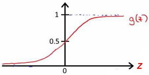

合起来，我们得到逻辑回归模型的假设：

对模型的理解： $g\left( z \right)=\frac{1}{1+{{e}^{-z}}}$。

$h_\theta \left( x \right)$的作用是，对于给定的输入变量，根据选择的参数计算输出变量=1的可能性（**estimated probablity**）即$h_\theta \left( x \right)=P\left( y=1|x;\theta \right)$
例如，如果对于给定的$x$，通过已经确定的参数计算得出$h_\theta \left( x \right)=0.7$，则表示有70%的几率$y$为正向类，相应地$y$为负向类的几率为1-0.7=0.3。

### 6.3 判定边界

参考视频: 6 - 3 - Decision Boundary (15 min).mkv

现在讲下决策边界(**decision boundary**)的概念。这个概念能更好地帮助我们理解逻辑回归的假设函数在计算什么。

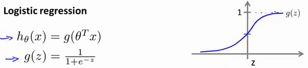

在逻辑回归中，我们预测：

当${h_\theta}\left( x \right)>=0.5$时，预测 $y=1$。

当${h_\theta}\left( x \right)<0.5$时，预测 $y=0$ 。

根据上面绘制出的 **S** 形函数图像，我们知道当

$z=0$ 时 $g(z)=0.5$

$z>0$ 时 $g(z)>0.5$

$z<0$ 时 $g(z)<0.5$

又 $z={\theta^{T}}x$ ，即：
${\theta^{T}}x>=0$  时，预测 $y=1$
${\theta^{T}}x<0$  时，预测 $y=0$

现在假设我们有一个模型：


并且参数$\theta$ 是向量[-3 1 1]。 则当$-3+{x_1}+{x_2} \geq 0$，即${x_1}+{x_2} \geq 3$时，模型将预测 $y=1$。
我们可以绘制直线${x_1}+{x_2} = 3$，这条线便是我们模型的分界线，将预测为1的区域和预测为 0的区域分隔开。


假使我们的数据呈现这样的分布情况，怎样的模型才能适合呢？


因为需要用曲线才能分隔 $y=0$ 的区域和 $y=1$ 的区域，我们需要二次方特征：${h_\theta}\left( x \right)=g\left( {\theta_0}+{\theta_1}{x_1}+{\theta_{2}}{x_{2}}+{\theta_{3}}x_{1}^{2}+{\theta_{4}}x_{2}^{2} \right)$是[-1 0 0 1 1]，则我们得到的判定边界恰好是圆点在原点且半径为1的圆形。

我们可以用非常复杂的模型来适应非常复杂形状的判定边界。

### 6.4 代价函数

参考视频: 6 - 4 - Cost Function (11 min).mkv

在这段视频中，我们要介绍如何拟合逻辑回归模型的参数$\theta$。具体来说，我要定义用来拟合参数的优化目标或者叫代价函数，这便是监督学习问题中的逻辑回归模型的拟合问题。

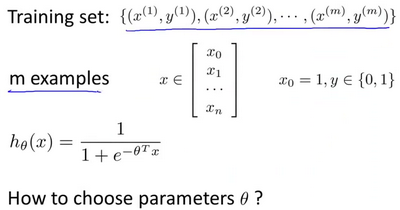

对于线性回归模型，我们定义的代价函数是所有模型误差的平方和。理论上来说，我们也可以对逻辑回归模型沿用这个定义，但是问题在于，当我们将${h_\theta}\left( x \right)=\frac{1}{1+{e^{-\theta^{T}x}}}$带入到这样定义了的代价函数中时，我们得到的代价函数将是一个非凸函数（**non-convexfunction**）。


这意味着我们的代价函数有许多局部最小值，这将影响梯度下降算法寻找全局最小值。

线性回归的代价函数为：$J\left( \theta  \right)=\frac{1}{m}\sum\limits_{i=1}^{m}{\frac{1}{2}{{\left( {h_\theta}\left({x}^{\left( i \right)} \right)-{y}^{\left( i \right)} \right)}^{2}}}$ 。
我们重新定义逻辑回归的代价函数为：$J\left( \theta  \right)=\frac{1}{m}\sum\limits_{i=1}^{m}{{Cost}\left( {h_\theta}\left( {x}^{\left( i \right)} \right),{y}^{\left( i \right)} \right)}$，其中

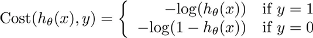

${h_\theta}\left( x \right)$与 $Cost\left( {h_\theta}\left( x \right),y \right)$之间的关系如下图所示：


这样构建的$Cost\left( {h_\theta}\left( x \right),y \right)$函数的特点是：当实际的  $y=1$ 且${h_\theta}\left( x \right)$也为 1 时误差为 0，当 $y=1$ 但${h_\theta}\left( x \right)$不为1时误差随着${h_\theta}\left( x \right)$变小而变大；当实际的 $y=0$ 且${h_\theta}\left( x \right)$也为 0 时代价为 0，当$y=0$ 但${h_\theta}\left( x \right)$不为 0时误差随着 ${h_\theta}\left( x \right)$的变大而变大。
将构建的 $Cost\left( {h_\theta}\left( x \right),y \right)$简化如下： 
$Cost\left( {h_\theta}\left( x \right),y \right)=-y\times log\left( {h_\theta}\left( x \right) \right)-(1-y)\times log\left( 1-{h_\theta}\left( x \right) \right)$
带入代价函数得到：
$J\left( \theta  \right)=\frac{1}{m}\sum\limits_{i=1}^{m}{[-{{y}^{(i)}}\log \left( {h_\theta}\left( {{x}^{(i)}} \right) \right)-\left( 1-{{y}^{(i)}} \right)\log \left( 1-{h_\theta}\left( {{x}^{(i)}} \right) \right)]}$
即：$J\left( \theta  \right)=-\frac{1}{m}\sum\limits_{i=1}^{m}{[{{y}^{(i)}}\log \left( {h_\theta}\left( {{x}^{(i)}} \right) \right)+\left( 1-{{y}^{(i)}} \right)\log \left( 1-{h_\theta}\left( {{x}^{(i)}} \right) \right)]}$

**Python**代码实现：

```python
import numpy as np
    
def cost(theta, X, y):
    
  theta = np.matrix(theta)
  X = np.matrix(X)
  y = np.matrix(y)
  first = np.multiply(-y, np.log(sigmoid(X* theta.T)))
  second = np.multiply((1 - y), np.log(1 - sigmoid(X* theta.T)))
  return np.sum(first - second) / (len(X))
```

在得到这样一个代价函数以后，我们便可以用梯度下降算法来求得能使代价函数最小的参数了。算法为：

**Repeat** {
$\theta_j := \theta_j - \alpha \frac{\partial}{\partial\theta_j} J(\theta)$
(**simultaneously update all** )
}

求导后得到：

**Repeat** {
$\theta_j := \theta_j - \alpha \frac{1}{m}\sum\limits_{i=1}^{m}{{\left( {h_\theta}\left( \mathop{x}^{\left( i \right)} \right)-\mathop{y}^{\left( i \right)} \right)}}\mathop{x}_{j}^{(i)}$ 
**(simultaneously update all** )
}

在这个视频中，我们定义了单训练样本的代价函数，凸性分析的内容是超出这门课的范围的，但是可以证明我们所选的代价值函数会给我们一个凸优化问题。代价函数$J(\theta)$会是一个凸函数，并且没有局部最优值。

推导过程：

$J\left( \theta  \right)=-\frac{1}{m}\sum\limits_{i=1}^{m}{[{{y}^{(i)}}\log \left( {h_\theta}\left( {{x}^{(i)}} \right) \right)+\left( 1-{{y}^{(i)}} \right)\log \left( 1-{h_\theta}\left( {{x}^{(i)}} \right) \right)]}$
考虑：
${h_\theta}\left( {{x}^{(i)}} \right)=\frac{1}{1+{{e}^{-{\theta^T}{{x}^{(i)}}}}}$
则：
${{y}^{(i)}}\log \left( {h_\theta}\left( {{x}^{(i)}} \right) \right)+\left( 1-{{y}^{(i)}} \right)\log \left( 1-{h_\theta}\left( {{x}^{(i)}} \right) \right)$
$={{y}^{(i)}}\log \left( \frac{1}{1+{{e}^{-{\theta^T}{{x}^{(i)}}}}} \right)+\left( 1-{{y}^{(i)}} \right)\log \left( 1-\frac{1}{1+{{e}^{-{\theta^T}{{x}^{(i)}}}}} \right)$
$=-{{y}^{(i)}}\log \left( 1+{{e}^{-{\theta^T}{{x}^{(i)}}}} \right)-\left( 1-{{y}^{(i)}} \right)\log \left( 1+{{e}^{{\theta^T}{{x}^{(i)}}}} \right)$

所以：
$\frac{\partial }{\partial {\theta_{j}}}J\left( \theta  \right)=\frac{\partial }{\partial {\theta_{j}}}[-\frac{1}{m}\sum\limits_{i=1}^{m}{[-{{y}^{(i)}}\log \left( 1+{{e}^{-{\theta^{T}}{{x}^{(i)}}}} \right)-\left( 1-{{y}^{(i)}} \right)\log \left( 1+{{e}^{{\theta^{T}}{{x}^{(i)}}}} \right)]}]$
$=-\frac{1}{m}\sum\limits_{i=1}^{m}{[-{{y}^{(i)}}\frac{-x_{j}^{(i)}{{e}^{-{\theta^{T}}{{x}^{(i)}}}}}{1+{{e}^{-{\theta^{T}}{{x}^{(i)}}}}}-\left( 1-{{y}^{(i)}} \right)\frac{x_j^{(i)}{{e}^{{\theta^T}{{x}^{(i)}}}}}{1+{{e}^{{\theta^T}{{x}^{(i)}}}}}}]$
$=-\frac{1}{m}\sum\limits_{i=1}^{m}{{y}^{(i)}}\frac{x_j^{(i)}}{1+{{e}^{{\theta^T}{{x}^{(i)}}}}}-\left( 1-{{y}^{(i)}} \right)\frac{x_j^{(i)}{{e}^{{\theta^T}{{x}^{(i)}}}}}{1+{{e}^{{\theta^T}{{x}^{(i)}}}}}]$
$=-\frac{1}{m}\sum\limits_{i=1}^{m}{\frac{{{y}^{(i)}}x_j^{(i)}-x_j^{(i)}{{e}^{{\theta^T}{{x}^{(i)}}}}+{{y}^{(i)}}x_j^{(i)}{{e}^{{\theta^T}{{x}^{(i)}}}}}{1+{{e}^{{\theta^T}{{x}^{(i)}}}}}}$
$=-\frac{1}{m}\sum\limits_{i=1}^{m}{\frac{{{y}^{(i)}}\left( 1\text{+}{{e}^{{\theta^T}{{x}^{(i)}}}} \right)-{{e}^{{\theta^T}{{x}^{(i)}}}}}{1+{{e}^{{\theta^T}{{x}^{(i)}}}}}x_j^{(i)}}$
$=-\frac{1}{m}\sum\limits_{i=1}^{m}{({{y}^{(i)}}-\frac{{{e}^{{\theta^T}{{x}^{(i)}}}}}{1+{{e}^{{\theta^T}{{x}^{(i)}}}}})x_j^{(i)}}$
$=-\frac{1}{m}\sum\limits_{i=1}^{m}{({{y}^{(i)}}-\frac{1}{1+{{e}^{-{\theta^T}{{x}^{(i)}}}}})x_j^{(i)}}$
$=-\frac{1}{m}\sum\limits_{i=1}^{m}{[{{y}^{(i)}}-{h_\theta}\left( {{x}^{(i)}} \right)]x_j^{(i)}}$
$=\frac{1}{m}\sum\limits_{i=1}^{m}{[{h_\theta}\left( {{x}^{(i)}} \right)-{{y}^{(i)}}]x_j^{(i)}}$

注：虽然得到的梯度下降算法表面上看上去与线性回归的梯度下降算法一样，但是这里的${h_\theta}\left( x \right)=g\left( {\theta^T}X \right)$与线性回归中不同，所以实际上是不一样的。另外，在运行梯度下降算法之前，进行特征缩放依旧是非常必要的。

一些梯度下降算法之外的选择：
除了梯度下降算法以外，还有一些常被用来令代价函数最小的算法，这些算法更加复杂和优越，而且通常不需要人工选择学习率，通常比梯度下降算法要更加快速。这些算法有：**共轭梯度**（**Conjugate Gradient**），**局部优化法**(**Broyden fletcher goldfarb shann,BFGS**)和**有限内存局部优化法**(**LBFGS**) ，**fminunc**是 **matlab**和**octave** 中都带的一个最小值优化函数，使用时我们需要提供代价函数和每个参数的求导，下面是 **octave** 中使用 **fminunc** 函数的代码示例：

```octave
function [jVal, gradient] = costFunction(theta)

    jVal = [...code to compute J(theta)...];
    gradient = [...code to compute derivative of J(theta)...];
    
end
    
options = optimset('GradObj', 'on', 'MaxIter', '100');
    
initialTheta = zeros(2,1);
    
[optTheta, functionVal, exitFlag] = fminunc(@costFunction, initialTheta, options);
```

在下一个视频中，我们会把单训练样本的代价函数的这些理念进一步发展，然后给出整个训练集的代价函数的定义，我们还会找到一种比我们目前用的更简单的写法，基于这些推导出的结果，我们将应用梯度下降法得到我们的逻辑回归算法。

### 6.5 简化的成本函数和梯度下降

参考视频: 6 - 5 - Simplified Cost Function and Gradient Descent (10 min).mkv

在这段视频中，我们将会找出一种稍微简单一点的方法来写代价函数，来替换我们现在用的方法。同时我们还要弄清楚如何运用梯度下降法，来拟合出逻辑回归的参数。因此，听了这节课，你就应该知道如何实现一个完整的逻辑回归算法。

这就是逻辑回归的代价函数：


这个式子可以合并成：

$Cost\left( {h_\theta}\left( x \right),y \right)=-y\times log\left( {h_\theta}\left( x \right) \right)-(1-y)\times log\left( 1-{h_\theta}\left( x \right) \right)$
即，逻辑回归的代价函数：
$Cost\left( {h_\theta}\left( x \right),y \right)=-y\times log\left( {h_\theta}\left( x \right) \right)-(1-y)\times log\left( 1-{h_\theta}\left( x \right) \right)$
$=-\frac{1}{m}\sum\limits_{i=1}^{m}{[{{y}^{(i)}}\log \left( {h_\theta}\left( {{x}^{(i)}} \right) \right)+\left( 1-{{y}^{(i)}} \right)\log \left( 1-{h_\theta}\left( {{x}^{(i)}} \right) \right)]}$
根据这个代价函数，为了拟合出参数，该怎么做呢？我们要试图找尽量让$J\left( \theta  \right)$ 取得最小值的参数$\theta $。
$\underset{\theta}{\min }J\left( \theta  \right)$ 
所以我们想要尽量减小这一项，这将我们将得到某个参数$\theta $。
如果我们给出一个新的样本，假如某个特征 $x$，我们可以用拟合训练样本的参数$\theta $，来输出对假设的预测。
另外，我们假设的输出，实际上就是这个概率值：$p(y=1|x;\theta)$，就是关于 $x$以$\theta $为参数，$y=1$ 的概率，你可以认为我们的假设就是估计 $y=1$ 的概率，所以，接下来就是弄清楚如何最大限度地最小化代价函数$J\left( \theta  \right)$，作为一个关于$\theta $的函数，这样我们才能为训练集拟合出参数$\theta $。

最小化代价函数的方法，是使用**梯度下降法**(**gradient descent**)。这是我们的代价函数：
$J\left( \theta  \right)=-\frac{1}{m}\sum\limits_{i=1}^{m}{[{{y}^{(i)}}\log \left( {h_\theta}\left( {{x}^{(i)}} \right) \right)+\left( 1-{{y}^{(i)}} \right)\log \left( 1-{h_\theta}\left( {{x}^{(i)}} \right) \right)]}$

如果我们要最小化这个关于$\theta$的函数值，这就是我们通常用的梯度下降法的模板。


我们要反复更新每个参数，用这个式子来更新，就是用它自己减去学习率 $\alpha$
乘以后面的微分项。求导后得到：


如果你计算一下的话，你会得到这个等式：
${\theta_j}:={\theta_j}-\alpha \frac{1}{m}\sum\limits_{i=1}^{m}{({h_\theta}({{x}^{(i)}})-{{y}^{(i)}}){x_{j}}^{(i)}}$
我把它写在这里，将后面这个式子，在 $i=1$  到 $m$ 上求和，其实就是预测误差乘以$x_j^{(i)}$ ，所以你把这个偏导数项$\frac{\partial }{\partial {\theta_j}}J\left( \theta  \right)$放回到原来式子这里，我们就可以将梯度下降算法写作如下形式：
${\theta_j}:={\theta_j}-\alpha \frac{1}{m}\sum\limits_{i=1}^{m}{({h_\theta}({{x}^{(i)}})-{{y}^{(i)}}){x_{j}}^{(i)}}$

所以，如果你有 $n$ 个特征，也就是说：，参数向量$\theta $包括${\theta_{0}}$ ${\theta_{1}}$ ${\theta_{2}}$ 一直到${\theta_{n}}$，那么你就需要用这个式子：

${\theta_j}:={\theta_j}-\alpha \frac{1}{m}\sum\limits_{i=1}^{m}{({h_\theta}({{x}^{(i)}})-{{y}^{(i)}}){{x}_{j}}^{(i)}}$来同时更新所有$\theta $的值。

现在，如果你把这个更新规则和我们之前用在线性回归上的进行比较的话，你会惊讶地发现，这个式子正是我们用来做线性回归梯度下降的。

那么，线性回归和逻辑回归是同一个算法吗？要回答这个问题，我们要观察逻辑回归看看发生了哪些变化。实际上，假设的定义发生了变化。

对于线性回归假设函数：

${h_\theta}\left( x \right)={\theta^T}X={\theta_{0}}{x_{0}}+{\theta_{1}}{x_{1}}+{\theta_{2}}{x_{2}}+...+{\theta_{n}}{x_{n}}$

而现在逻辑函数假设函数：

${h_\theta}\left( x \right)=\frac{1}{1+{{e}^{-{\theta^T}X}}}$

因此，即使更新参数的规则看起来基本相同，但由于假设的定义发生了变化，所以逻辑函数的梯度下降，跟线性回归的梯度下降实际上是两个完全不同的东西。

在先前的视频中，当我们在谈论线性回归的梯度下降法时，我们谈到了如何监控梯度下降法以确保其收敛，我通常也把同样的方法用在逻辑回归中，来监测梯度下降，以确保它正常收敛。

当使用梯度下降法来实现逻辑回归时，我们有这些不同的参数$\theta $，就是${\theta_{0}}$ ${\theta_{1}}$ ${\theta_{2}}$ 一直到${\theta_{n}}$，我们需要用这个表达式来更新这些参数。我们还可以使用 **for循环**来更新这些参数值，用 `for i=1 to n`，或者 `for i=1 to n+1`。当然，不用 **for循环**也是可以的，理想情况下，我们更提倡使用向量化的实现，可以把所有这些 $n$个参数同时更新。

最后还有一点，我们之前在谈线性回归时讲到的特征缩放，我们看到了特征缩放是如何提高梯度下降的收敛速度的，这个特征缩放的方法，也适用于逻辑回归。如果你的特征范围差距很大的话，那么应用特征缩放的方法，同样也可以让逻辑回归中，梯度下降收敛更快。

就是这样，现在你知道如何实现逻辑回归，这是一种非常强大，甚至可能世界上使用最广泛的一种分类算法。

### 6.6 高级优化

参考视频: 6 - 6 - Advanced Optimization (14 min).mkv

在上一个视频中，我们讨论了用梯度下降的方法最小化逻辑回归中代价函数$J\left( \theta  \right)$。在本次视频中，我会教你们一些高级优化算法和一些高级的优化概念，利用这些方法，我们就能够使通过梯度下降，进行逻辑回归的速度大大提高，而这也将使算法更加适合解决大型的机器学习问题，比如，我们有数目庞大的特征量。
现在我们换个角度来看什么是梯度下降，我们有个代价函数$J\left( \theta  \right)$，而我们想要使其最小化，那么我们需要做的是编写代码，当输入参数 $\theta$ 时，它们会计算出两样东西：$J\left( \theta  \right)$ 以及$J$ 等于 0、1直到 $n$ 时的偏导数项。

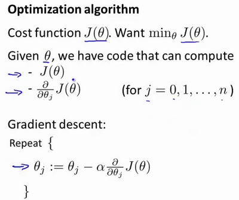

假设我们已经完成了可以实现这两件事的代码，那么梯度下降所做的就是反复执行这些更新。
另一种考虑梯度下降的思路是：我们需要写出代码来计算$J\left( \theta  \right)$ 和这些偏导数，然后把这些插入到梯度下降中，然后它就可以为我们最小化这个函数。
对于梯度下降来说，我认为从技术上讲，你实际并不需要编写代码来计算代价函数$J\left( \theta  \right)$。你只需要编写代码来计算导数项，但是，如果你希望代码还要能够监控这些$J\left( \theta  \right)$ 的收敛性，那么我们就需要自己编写代码来计算代价函数$J(\theta)$和偏导数项$\frac{\partial }{\partial {\theta_j}}J\left( \theta  \right)$。所以，在写完能够计算这两者的代码之后，我们就可以使用梯度下降。
然而梯度下降并不是我们可以使用的唯一算法，还有其他一些算法，更高级、更复杂。如果我们能用这些方法来计算代价函数$J\left( \theta  \right)$和偏导数项$\frac{\partial }{\partial {\theta_j}}J\left( \theta  \right)$两个项的话，那么这些算法就是为我们优化代价函数的不同方法，**共轭梯度法 BFGS** (**变尺度法**) 和**L-BFGS** (**限制变尺度法**) 就是其中一些更高级的优化算法，它们需要有一种方法来计算 $J\left( \theta  \right)$，以及需要一种方法计算导数项，然后使用比梯度下降更复杂的算法来最小化代价函数。这三种算法的具体细节超出了本门课程的范畴。实际上你最后通常会花费很多天，或几周时间研究这些算法，你可以专门学一门课来提高数值计算能力，不过让我来告诉你他们的一些特性：

这三种算法有许多优点：

一个是使用这其中任何一个算法，你通常不需要手动选择学习率 $\alpha$，所以对于这些算法的一种思路是，给出计算导数项和代价函数的方法，你可以认为算法有一个智能的内部循环，而且，事实上，他们确实有一个智能的内部循环，称为**线性搜索**(**line search**)算法，它可以自动尝试不同的学习速率 $\alpha$，并自动选择一个好的学习速率 $a$，因此它甚至可以为每次迭代选择不同的学习速率，那么你就不需要自己选择。这些算法实际上在做更复杂的事情，不仅仅是选择一个好的学习速率，所以它们往往最终比梯度下降收敛得快多了，不过关于它们到底做什么的详细讨论，已经超过了本门课程的范围。

实际上，我过去使用这些算法已经很长一段时间了，也许超过十年了，使用得相当频繁，而直到几年前我才真正搞清楚**共轭梯度法 BFGS** 和 **L-BFGS**的细节。

我们实际上完全有可能成功使用这些算法，并应用于许多不同的学习问题，而不需要真正理解这些算法的内环间在做什么，如果说这些算法有缺点的话，那么我想说主要缺点是它们比梯度下降法复杂多了，特别是你最好不要使用 **L-BGFS**、**BFGS**这些算法，除非你是数值计算方面的专家。实际上，我不会建议你们编写自己的代码来计算数据的平方根，或者计算逆矩阵，因为对于这些算法，我还是会建议你直接使用一个软件库，比如说，要求一个平方根，我们所能做的就是调用一些别人已经写好用来计算数字平方根的函数。幸运的是现在我们有**Octave** 和与它密切相关的 **MATLAB** 语言可以使用。

**Octave** 有一个非常理想的库用于实现这些先进的优化算法，所以，如果你直接调用它自带的库，你就能得到不错的结果。我必须指出这些算法实现得好或不好是有区别的，因此，如果你正在你的机器学习程序中使用一种不同的语言，比如如果你正在使用**C**、**C++**、**Java**等等，你可能会想尝试一些不同的库，以确保你找到一个能很好实现这些算法的库。因为在**L-BFGS**或者等高线梯度的实现上，表现得好与不太好是有差别的，因此现在让我们来说明：如何使用这些算法：


比方说，你有一个含两个参数的问题，这两个参数是${\theta_{0}}$和${\theta_{1}}$，因此，通过这个代价函数，你可以得到${\theta_{1}}$和 ${\theta_{2}}$的值，如果你将$J\left( \theta  \right)$ 最小化的话，那么它的最小值将是${\theta_{1}}=5$ ，${\theta_{2}}=5$。代价函数$J\left( \theta  \right)$的导数推出来就是这两个表达式：

$\frac{\partial }{\partial {{\theta }_{1}}}J(\theta)=2({{\theta }_{1}}-5)$

$\frac{\partial }{\partial {{\theta }_{2}}}J(\theta)=2({{\theta }_{2}}-5)$

如果我们不知道最小值，但你想要代价函数找到这个最小值，是用比如梯度下降这些算法，但最好是用比它更高级的算法，你要做的就是运行一个像这样的**Octave** 函数：

```octave
function [jVal, gradient]=costFunction(theta)
    
　　jVal=(theta(1)-5)^2+(theta(2)-5)^2;
    
　　gradient=zeros(2,1);
    
　　gradient(1)=2*(theta(1)-5);
    
　　gradient(2)=2*(theta(2)-5);
    
end
```

这样就计算出这个代价函数，函数返回的第二个值是梯度值，梯度值应该是一个2×1的向量，梯度向量的两个元素对应这里的两个偏导数项，运行这个**costFunction** 函数后，你就可以调用高级的优化函数，这个函数叫
**fminunc**，它表示**Octave** 里无约束最小化函数。调用它的方式如下：

```octave
options=optimset('GradObj','on','MaxIter',100);

initialTheta=zeros(2,1);
    
[optTheta, functionVal, exitFlag]=fminunc(@costFunction, initialTheta, options);
```

你要设置几个**options**，这个 **options** 变量作为一个数据结构可以存储你想要的**options**，所以 **GradObj** 和**On**，这里设置梯度目标参数为打开(**on**)，这意味着你现在确实要给这个算法提供一个梯度，然后设置最大迭代次数，比方说100，我们给出一个$\theta$ 的猜测初始值，它是一个2×1的向量，那么这个命令就调用**fminunc**，这个@符号表示指向我们刚刚定义的**costFunction** 函数的指针。如果你调用它，它就会使用众多高级优化算法中的一个，当然你也可以把它当成梯度下降，只不过它能自动选择学习速率$\alpha$，你不需要自己来做。然后它会尝试使用这些高级的优化算法，就像加强版的梯度下降法，为你找到最佳的${\theta}$值。

让我告诉你它在 **Octave** 里什么样：


所以我写了这个关于**theta**的 **costFunction** 函数，它计算出代价函数 **jval**以及梯度**gradient**，**gradient** 有两个元素，是代价函数对于**theta(1)** 和 **theta(2)**这两个参数的偏导数。

我希望你们从这个幻灯片中学到的主要内容是：写一个函数，它能返回代价函数值、梯度值，因此要把这个应用到逻辑回归，或者甚至线性回归中，你也可以把这些优化算法用于线性回归，你需要做的就是输入合适的代码来计算这里的这些东西。

现在你已经知道如何使用这些高级的优化算法，有了这些算法，你就可以使用一个复杂的优化库，它让算法使用起来更模糊一点。因此也许稍微有点难调试，不过由于这些算法的运行速度通常远远超过梯度下降。

所以当我有一个很大的机器学习问题时，我会选择这些高级算法，而不是梯度下降。有了这些概念，你就应该能将逻辑回归和线性回归应用于更大的问题中，这就是高级优化的概念。

在下一个视频，我想要告诉你如何修改你已经知道的逻辑回归算法，然后使它在多类别分类问题中也能正常运行。

### 6.7 多类别分类：一对多

参考视频: 6 - 7 - Multiclass Classification\_ One-vs-all (6 min).mkv

在本节视频中，我们将谈到如何使用逻辑回归 (**logistic regression**)来解决多类别分类问题，具体来说，我想通过一个叫做"一对多" (**one-vs-all**) 的分类算法。

先看这样一些例子。

第一个例子：假如说你现在需要一个学习算法能自动地将邮件归类到不同的文件夹里，或者说可以自动地加上标签，那么，你也许需要一些不同的文件夹，或者不同的标签来完成这件事，来区分开来自工作的邮件、来自朋友的邮件、来自家人的邮件或者是有关兴趣爱好的邮件，那么，我们就有了这样一个分类问题：其类别有四个，分别用$y=1$、$y=2$、$y=3$、$y=4$ 来代表。

第二个例子是有关药物诊断的，如果一个病人因为鼻塞来到你的诊所，他可能并没有生病，用 $y=1$ 这个类别来代表；或者患了感冒，用 $y=2$ 来代表；或者得了流感用$y=3$来代表。

第三个例子：如果你正在做有关天气的机器学习分类问题，那么你可能想要区分哪些天是晴天、多云、雨天、或者下雪天，对上述所有的例子，$y$ 可以取一个很小的数值，一个相对"谨慎"的数值，比如1 到3、1到4或者其它数值，以上说的都是多类分类问题，顺便一提的是，对于下标是0 1 2 3，还是 1 2 3 4 都不重要，我更喜欢将分类从 1 开始标而不是0，其实怎样标注都不会影响最后的结果。

然而对于之前的一个，二元分类问题，我们的数据看起来可能是像这样：


对于一个多类分类问题，我们的数据集或许看起来像这样：

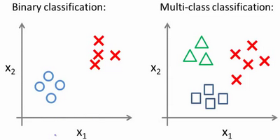

我用3种不同的符号来代表3个类别，问题就是给出3个类型的数据集，我们如何得到一个学习算法来进行分类呢？

我们现在已经知道如何进行二元分类，可以使用逻辑回归，对于直线或许你也知道，可以将数据集一分为二为正类和负类。用一对多的分类思想，我们可以将其用在多类分类问题上。

下面将介绍如何进行一对多的分类工作，有时这个方法也被称为"一对余"方法。


现在我们有一个训练集，好比上图表示的有3个类别，我们用三角形表示 $y=1$，方框表示$y=2$，叉叉表示 $y=3$。我们下面要做的就是使用一个训练集，将其分成3个二元分类问题。

我们先从用三角形代表的类别1开始，实际上我们可以创建一个，新的"伪"训练集，类型2和类型3定为负类，类型1设定为正类，我们创建一个新的训练集，如下图所示的那样，我们要拟合出一个合适的分类器。


这里的三角形是正样本，而圆形代表负样本。可以这样想，设置三角形的值为1，圆形的值为0，下面我们来训练一个标准的逻辑回归分类器，这样我们就得到一个正边界。

为了能实现这样的转变，我们将多个类中的一个类标记为正向类（$y=1$），然后将其他所有类都标记为负向类，这个模型记作$h_\theta^{\left( 1 \right)}\left( x \right)$。接着，类似地第我们选择另一个类标记为正向类（$y=2$），再将其它类都标记为负向类，将这个模型记作 $h_\theta^{\left( 2 \right)}\left( x \right)$,依此类推。
最后我们得到一系列的模型简记为： $h_\theta^{\left( i \right)}\left( x \right)=p\left( y=i|x;\theta  \right)$其中：$i=\left( 1,2,3....k \right)$ 

最后，在我们需要做预测时，我们将所有的分类机都运行一遍，然后对每一个输入变量，都选择最高可能性的输出变量。

总之，我们已经把要做的做完了，现在要做的就是训练这个逻辑回归分类器：$h_\theta^{\left( i \right)}\left( x \right)$， 其中 $i$ 对应每一个可能的 $y=i$，最后，为了做出预测，我们给出输入一个新的 $x$ 值，用这个做预测。我们要做的就是在我们三个分类器里面输入 $x$，然后我们选择一个让 $h_\theta^{\left( i \right)}\left( x \right)$ 最大的$ i$，即$\mathop{\max}\limits_i\,h_\theta^{\left( i \right)}\left( x \right)$。

你现在知道了基本的挑选分类器的方法，选择出哪一个分类器是可信度最高效果最好的，那么就可认为得到一个正确的分类，无论$i$值是多少，我们都有最高的概率值，我们预测$y$就是那个值。这就是多类别分类问题，以及一对多的方法，通过这个小方法，你现在也可以将逻辑回归分类器用在多类分类的问题上。

## 七、正则化(Regularization)

### 7.1 过拟合的问题

参考视频: 7 - 1 - The Problem of Overfitting (10 min).mkv

到现在为止，我们已经学习了几种不同的学习算法，包括线性回归和逻辑回归，它们能够有效地解决许多问题，但是当将它们应用到某些特定的机器学习应用时，会遇到过拟合(**over-fitting**)的问题，可能会导致它们效果很差。

在这段视频中，我将为你解释什么是过度拟合问题，并且在此之后接下来的几个视频中，我们将谈论一种称为正则化(**regularization**)的技术，它可以改善或者减少过度拟合问题。

如果我们有非常多的特征，我们通过学习得到的假设可能能够非常好地适应训练集（代价函数可能几乎为0），但是可能会不能推广到新的数据。

下图是一个回归问题的例子：


第一个模型是一个线性模型，欠拟合，不能很好地适应我们的训练集；第三个模型是一个四次方的模型，过于强调拟合原始数据，而丢失了算法的本质：预测新数据。我们可以看出，若给出一个新的值使之预测，它将表现的很差，是过拟合，虽然能非常好地适应我们的训练集但在新输入变量进行预测时可能会效果不好；而中间的模型似乎最合适。

分类问题中也存在这样的问题：


就以多项式理解，$x$ 的次数越高，拟合的越好，但相应的预测的能力就可能变差。

问题是，如果我们发现了过拟合问题，应该如何处理？

1. 丢弃一些不能帮助我们正确预测的特征。可以是手工选择保留哪些特征，或者使用一些模型选择的算法来帮忙（例如**PCA**）
2. 正则化。 保留所有的特征，但是减少参数的大小（**magnitude**）。

### 7.2 代价函数

参考视频: 7 - 2 - Cost Function (10 min).mkv

上面的回归问题中如果我们的模型是：
${h_\theta}\left( x \right)={\theta_{0}}+{\theta_{1}}{x_{1}}+{\theta_{2}}{x_{2}^2}+{\theta_{3}}{x_{3}^3}+{\theta_{4}}{x_{4}^4}$
我们可以从之前的事例中看出，正是那些高次项导致了过拟合的产生，所以如果我们能让这些高次项的系数接近于0的话，我们就能很好的拟合了。
所以我们要做的就是在一定程度上减小这些参数$\theta $ 的值，这就是正则化的基本方法。我们决定要减少${\theta_{3}}$和${\theta_{4}}$的大小，我们要做的便是修改代价函数，在其中${\theta_{3}}$和${\theta_{4}}$ 设置一点惩罚。这样做的话，我们在尝试最小化代价时也需要将这个惩罚纳入考虑中，并最终导致选择较小一些的${\theta_{3}}$和${\theta_{4}}$。
修改后的代价函数如下：$\underset{\theta }{\mathop{\min }}\,\frac{1}{2m}[\sum\limits_{i=1}^{m}{{{\left( {{h}_{\theta }}\left( {{x}^{(i)}} \right)-{{y}^{(i)}} \right)}^{2}}+1000\theta _{3}^{2}+10000\theta _{4}^{2}]}$

通过这样的代价函数选择出的${\theta_{3}}$和${\theta_{4}}$ 对预测结果的影响就比之前要小许多。假如我们有非常多的特征，我们并不知道其中哪些特征我们要惩罚，我们将对所有的特征进行惩罚，并且让代价函数最优化的软件来选择这些惩罚的程度。这样的结果是得到了一个较为简单的能防止过拟合问题的假设：$J\left( \theta  \right)=\frac{1}{2m}[\sum\limits_{i=1}^{m}{{{({h_\theta}({{x}^{(i)}})-{{y}^{(i)}})}^{2}}+\lambda \sum\limits_{j=1}^{n}{\theta_{j}^{2}}]}$

其中$\lambda $又称为正则化参数（**Regularization Parameter**）。 注：根据惯例，我们不对${\theta_{0}}$ 进行惩罚。经过正则化处理的模型与原模型的可能对比如下图所示：


如果选择的正则化参数$\lambda$ 过大，则会把所有的参数都最小化了，导致模型变成 ${h_\theta}\left( x \right)={\theta_{0}}$，也就是上图中红色直线所示的情况，造成欠拟合。
那为什么增加的一项$\lambda =\sum\limits_{j=1}^{n}{\theta_j^{2}}$ 可以使$\theta $的值减小呢？
因为如果我们令 $\lambda$ 的值很大的话，为了使**Cost Function** 尽可能的小，所有的 $\theta $ 的值（不包括${\theta_{0}}$）都会在一定程度上减小。
但若$\lambda$ 的值太大了，那么$\theta $（不包括${\theta_{0}}$）都会趋近于0，这样我们所得到的只能是一条平行于$x$轴的直线。
所以对于正则化，我们要取一个合理的 $\lambda$ 的值，这样才能更好的应用正则化。
回顾一下代价函数，为了使用正则化，让我们把这些概念应用到到线性回归和逻辑回归中去，那么我们就可以让他们避免过度拟合了。

### 7.3 正则化线性回归

参考视频: 7 - 3 - Regularized Linear Regression (11 min).mkv

对于线性回归的求解，我们之前推导了两种学习算法：一种基于梯度下降，一种基于正规方程。

正则化线性回归的代价函数为：

$J\left( \theta  \right)=\frac{1}{2m}\sum\limits_{i=1}^{m}{[({{({h_\theta}({{x}^{(i)}})-{{y}^{(i)}})}^{2}}+\lambda \sum\limits_{j=1}^{n}{\theta _{j}^{2}})]}$

如果我们要使用梯度下降法令这个代价函数最小化，因为我们未对$\theta_0$进行正则化，所以梯度下降算法将分两种情形：

$Repeat$  $until$  $convergence${

​                                                   ${\theta_0}:={\theta_0}-a\frac{1}{m}\sum\limits_{i=1}^{m}{(({h_\theta}({{x}^{(i)}})-{{y}^{(i)}})x_{0}^{(i)}})$ 

​                                                   ${\theta_j}:={\theta_j}-a[\frac{1}{m}\sum\limits_{i=1}^{m}{(({h_\theta}({{x}^{(i)}})-{{y}^{(i)}})x_{j}^{\left( i \right)}}+\frac{\lambda }{m}{\theta_j}]$ 

​                                                             $for$ $j=1,2,...n$

​                                                   }


对上面的算法中$ j=1,2,...,n$ 时的更新式子进行调整可得：

${\theta_j}:={\theta_j}(1-a\frac{\lambda }{m})-a\frac{1}{m}\sum\limits_{i=1}^{m}{({h_\theta}({{x}^{(i)}})-{{y}^{(i)}})x_{j}^{\left( i \right)}}$ 
可以看出，正则化线性回归的梯度下降算法的变化在于，每次都在原有算法更新规则的基础上令$\theta $值减少了一个额外的值。

我们同样也可以利用正规方程来求解正则化线性回归模型，方法如下所示：


图中的矩阵尺寸为 $(n+1)*(n+1)$。

### 7.4 正则化的逻辑回归模型

参考视频: 7 - 4 - Regularized Logistic Regression (9 min).mkv

针对逻辑回归问题，我们在之前的课程已经学习过两种优化算法：我们首先学习了使用梯度下降法来优化代价函数$J\left( \theta  \right)$，接下来学习了更高级的优化算法，这些高级优化算法需要你自己设计代价函数$J\left( \theta  \right)$。


自己计算导数同样对于逻辑回归，我们也给代价函数增加一个正则化的表达式，得到代价函数：

$J\left( \theta  \right)=\frac{1}{m}\sum\limits_{i=1}^{m}{[-{{y}^{(i)}}\log \left( {h_\theta}\left( {{x}^{(i)}} \right) \right)-\left( 1-{{y}^{(i)}} \right)\log \left( 1-{h_\theta}\left( {{x}^{(i)}} \right) \right)]}+\frac{\lambda }{2m}\sum\limits_{j=1}^{n}{\theta _{j}^{2}}$

**Python**代码：

```python
import numpy as np

def costReg(theta, X, y, learningRate):
    theta = np.matrix(theta)
    X = np.matrix(X)
    y = np.matrix(y)
    first = np.multiply(-y, np.log(sigmoid(X*theta.T)))
    second = np.multiply((1 - y), np.log(1 - sigmoid(X*theta.T)))
    reg = (learningRate / (2 * len(X))* np.sum(np.power(theta[:,1:theta.shape[1]],2))
    return np.sum(first - second) / (len(X)) + reg
```

要最小化该代价函数，通过求导，得出梯度下降算法为：

$Repeat$  $until$  $convergence${

​                                                   ${\theta_0}:={\theta_0}-a\frac{1}{m}\sum\limits_{i=1}^{m}{(({h_\theta}({{x}^{(i)}})-{{y}^{(i)}})x_{0}^{(i)}})$

​                                                  ${\theta_j}:={\theta_j}-a[\frac{1}{m}\sum\limits_{i=1}^{m}{({h_\theta}({{x}^{(i)}})-{{y}^{(i)}})x_{j}^{\left( i \right)}}+\frac{\lambda }{m}{\theta_j}]$

​                                                 $for$ $j=1,2,...n$

​                                                 }

注：看上去同线性回归一样，但是知道 ${h_\theta}\left( x \right)=g\left( {\theta^T}X \right)$，所以与线性回归不同。
**Octave** 中，我们依旧可以用 `fminuc` 函数来求解代价函数最小化的参数，值得注意的是参数${\theta_{0}}$的更新规则与其他情况不同。
注意：

1. 虽然正则化的逻辑回归中的梯度下降和正则化的线性回归中的表达式看起来一样，但由于两者的${h_\theta}\left( x \right)$不同所以还是有很大差别。
2. ${\theta_{0}}$不参与其中的任何一个正则化。

目前大家对机器学习算法可能还只是略懂，但是一旦你精通了线性回归、高级优化算法和正则化技术，坦率地说，你对机器学习的理解可能已经比许多工程师深入了。现在，你已经有了丰富的机器学习知识，目测比那些硅谷工程师还厉害，或者用机器学习算法来做产品。

接下来的课程中，我们将学习一个非常强大的非线性分类器，无论是线性回归问题，还是逻辑回归问题，都可以构造多项式来解决。你将逐渐发现还有更强大的非线性分类器，可以用来解决多项式回归问题。我们接下来将将学会，比现在解决问题的方法强大N倍的学习算法。


# 第4周

[TOC]

## 第八、神经网络：表述(Neural Networks: Representation)

### 8.1 非线性假设

参考视频: 8 - 1 - Non-linear Hypotheses (10 min).mkv

我们之前学的，无论是线性回归还是逻辑回归都有这样一个缺点，即：当特征太多时，计算的负荷会非常大。

下面是一个例子：


当我们使用$x_1$, $x_2$ 的多次项式进行预测时，我们可以应用的很好。
之前我们已经看到过，使用非线性的多项式项，能够帮助我们建立更好的分类模型。假设我们有非常多的特征，例如大于100个变量，我们希望用这100个特征来构建一个非线性的多项式模型，结果将是数量非常惊人的特征组合，即便我们只采用两两特征的组合$(x_1x_2+x_1x_3+x_1x_4+...+x_2x_3+x_2x_4+...+x_{99}x_{100})$，我们也会有接近5000个组合而成的特征。这对于一般的逻辑回归来说需要计算的特征太多了。

假设我们希望训练一个模型来识别视觉对象（例如识别一张图片上是否是一辆汽车），我们怎样才能这么做呢？一种方法是我们利用很多汽车的图片和很多非汽车的图片，然后利用这些图片上一个个像素的值（饱和度或亮度）来作为特征。

假如我们只选用灰度图片，每个像素则只有一个值（而非 **RGB**值），我们可以选取图片上的两个不同位置上的两个像素，然后训练一个逻辑回归算法利用这两个像素的值来判断图片上是否是汽车：


假使我们采用的都是50x50像素的小图片，并且我们将所有的像素视为特征，则会有 2500个特征，如果我们要进一步将两两特征组合构成一个多项式模型，则会有约${{2500}^{2}}/2$个（接近3百万个）特征。普通的逻辑回归模型，不能有效地处理这么多的特征，这时候我们需要神经网络。

### 8.2 神经元和大脑

参考视频: 8 - 2 - Neurons and the Brain (8 min).mkv

神经网络是一种很古老的算法，它最初产生的目的是制造能模拟大脑的机器。

在这门课中，我将向你们介绍神经网络。因为它能很好地解决不同的机器学习问题。而不只因为它们在逻辑上行得通，在这段视频中，我想告诉你们一些神经网络的背景知识，由此我们能知道可以用它们来做什么。不管是将其应用到现代的机器学习问题上，还是应用到那些你可能会感兴趣的问题中。也许，这一伟大的人工智能梦想在未来能制造出真正的智能机器。另外，我们还将讲解神经网络是怎么涉及这些问题的神经网络产生的原因是人们想尝试设计出模仿大脑的算法，从某种意义上说如果我们想要建立学习系统，那为什么不去模仿我们所认识的最神奇的学习机器——人类的大脑呢？

神经网络逐渐兴起于二十世纪八九十年代，应用得非常广泛。但由于各种原因，在90年代的后期应用减少了。但是最近，神经网络又东山再起了。其中一个原因是：神经网络是计算量有些偏大的算法。然而大概由于近些年计算机的运行速度变快，才足以真正运行起大规模的神经网络。正是由于这个原因和其他一些我们后面会讨论到的技术因素，如今的神经网络对于许多应用来说是最先进的技术。当你想模拟大脑时，是指想制造出与人类大脑作用效果相同的机器。大脑可以学会去以看而不是听的方式处理图像，学会处理我们的触觉。

我们能学习数学，学着做微积分，而且大脑能处理各种不同的令人惊奇的事情。似乎如果你想要模仿它，你得写很多不同的软件来模拟所有这些五花八门的奇妙的事情。不过能不能假设大脑做所有这些，不同事情的方法，不需要用上千个不同的程序去实现。相反的，大脑处理的方法，只需要一个单一的学习算法就可以了？尽管这只是一个假设，不过让我和你分享，一些这方面的证据。


大脑的这一部分这一小片红色区域是你的听觉皮层，你现在正在理解我的话，这靠的是耳朵。耳朵接收到声音信号，并把声音信号传递给你的听觉皮层，正因如此，你才能明白我的话。

神经系统科学家做了下面这个有趣的实验，把耳朵到听觉皮层的神经切断。在这种情况下，将其重新接到一个动物的大脑上，这样从眼睛到视神经的信号最终将传到听觉皮层。如果这样做了。那么结果表明听觉皮层将会学会“看”。这里的“看”代表了我们所知道的每层含义。所以，如果你对动物这样做，那么动物就可以完成视觉辨别任务，它们可以看图像，并根据图像做出适当的决定。它们正是通过脑组织中的这个部分完成的。下面再举另一个例子，这块红色的脑组织是你的躯体感觉皮层，这是你用来处理触觉的，如果你做一个和刚才类似的重接实验，那么躯体感觉皮层也能学会“看”。这个实验和其它一些类似的实验，被称为神经重接实验，从这个意义上说，如果人体有同一块脑组织可以处理光、声或触觉信号，那么也许存在一种学习算法，可以同时处理视觉、听觉和触觉，而不是需要运行上千个不同的程序，或者上千个不同的算法来做这些大脑所完成的成千上万的美好事情。也许我们需要做的就是找出一些近似的或实际的大脑学习算法，然后实现它大脑通过自学掌握如何处理这些不同类型的数据。在很大的程度上，可以猜想如果我们把几乎任何一种传感器接入到大脑的几乎任何一个部位的话，大脑就会学会处理它。

下面再举几个例子：


这张图是用舌头学会“看”的一个例子。它的原理是：这实际上是一个名为**BrainPort**的系统，它现在正在**FDA**
(美国食品和药物管理局)的临床试验阶段，它能帮助失明人士看见事物。它的原理是，你在前额上带一个灰度摄像头，面朝前，它就能获取你面前事物的低分辨率的灰度图像。你连一根线到舌头上安装的电极阵列上，那么每个像素都被映射到你舌头的某个位置上，可能电压值高的点对应一个暗像素电压值低的点。对应于亮像素，即使依靠它现在的功能，使用这种系统就能让你我在几十分钟里就学会用我们的舌头“看”东西。


这是第二个例子，关于人体回声定位或者说人体声纳。你有两种方法可以实现：你可以弹响指，或者咂舌头。不过现在有失明人士，确实在学校里接受这样的培训，并学会解读从环境反弹回来的声波模式—这就是声纳。如果你搜索**YouTube**之后，就会发现有些视频讲述了一个令人称奇的孩子，他因为癌症眼球惨遭移除，虽然失去了眼球，但是通过打响指，他可以四处走动而不撞到任何东西，他能滑滑板，他可以将篮球投入篮框中。注意这是一个没有眼球的孩子。


第三个例子是触觉皮带，如果你把它戴在腰上，蜂鸣器会响，而且总是朝向北时发出嗡嗡声。它可以使人拥有方向感，用类似于鸟类感知方向的方式。

还有一些离奇的例子：


如果你在青蛙身上插入第三只眼，青蛙也能学会使用那只眼睛。因此，这将会非常令人惊奇。如果你能把几乎任何传感器接入到大脑中，大脑的学习算法就能找出学习数据的方法，并处理这些数据。从某种意义上来说，如果我们能找出大脑的学习算法，然后在计算机上执行大脑学习算法或与之相似的算法，也许这将是我们向人工智能迈进做出的最好的尝试。人工智能的梦想就是：有一天能制造出真正的智能机器。

神经网络可能为我们打开一扇进入遥远的人工智能梦的窗户，但我在这节课中讲授神经网络的原因，主要是对于现代机器学习应用。它是最有效的技术方法。因此在接下来的一些课程中，我们将开始深入到神经网络的技术细节。

### 8.3 模型表示1

参考视频: 8 - 3 - Model Representation I (12 min).mkv

为了构建神经网络模型，我们需要首先思考大脑中的神经网络是怎样的？每一个神经元都可以被认为是一个处理单元/神经核（**processing unit**/**Nucleus**），它含有许多输入/树突（**input**/**Dendrite**），并且有一个输出/轴突（**output**/**Axon**）。神经网络是大量神经元相互链接并通过电脉冲来交流的一个网络。

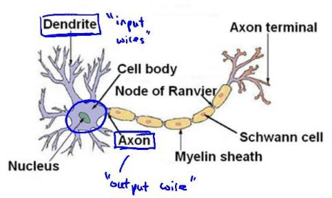

下面是一组神经元的示意图，神经元利用微弱的电流进行沟通。这些弱电流也称作动作电位，其实就是一些微弱的电流。所以如果神经元想要传递一个消息，它就会就通过它的轴突，发送一段微弱电流给其他神经元，这就是轴突。

这里是一条连接到输入神经，或者连接另一个神经元树突的神经，接下来这个神经元接收这条消息，做一些计算，它有可能会反过来将在轴突上的自己的消息传给其他神经元。这就是所有人类思考的模型：我们的神经元把自己的收到的消息进行计算，并向其他神经元传递消息。这也是我们的感觉和肌肉运转的原理。如果你想活动一块肌肉，就会触发一个神经元给你的肌肉发送脉冲，并引起你的肌肉收缩。如果一些感官：比如说眼睛想要给大脑传递一个消息，那么它就像这样发送电脉冲给大脑的。


神经网络模型建立在很多神经元之上，每一个神经元又是一个个学习模型。这些神经元（也叫激活单元，**activation unit**）采纳一些特征作为输出，并且根据本身的模型提供一个输出。下图是一个以逻辑回归模型作为自身学习模型的神经元示例，在神经网络中，参数又可被成为权重（**weight**）。


我们设计出了类似于神经元的神经网络，效果如下：


其中$x_1$, $x_2$, $x_3$是输入单元（**input units**），我们将原始数据输入给它们。
$a_1$, $a_2$, $a_3$是中间单元，它们负责将数据进行处理，然后呈递到下一层。
最后是输出单元，它负责计算${h_\theta}\left( x \right)$。

神经网络模型是许多逻辑单元按照不同层级组织起来的网络，每一层的输出变量都是下一层的输入变量。下图为一个3层的神经网络，第一层成为输入层（**Input Layer**），最后一层称为输出层（**Output Layer**），中间一层成为隐藏层（**Hidden Layers**）。我们为每一层都增加一个偏差单位（**bias unit**）：

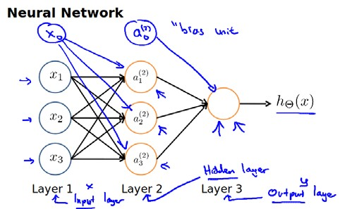

下面引入一些标记法来帮助描述模型：
$a_{i}^{\left( j \right)}$ 代表第$j$ 层的第 $i$ 个激活单元。${{\theta }^{\left( j \right)}}$代表从第 $j$ 层映射到第$ j+1$ 层时的权重的矩阵，例如${{\theta }^{\left( 1 \right)}}$代表从第一层映射到第二层的权重的矩阵。其尺寸为：以第 $j+1$层的激活单元数量为行数，以第 $j$ 层的激活单元数加一为列数的矩阵。例如：上图所示的神经网络中${{\theta }^{\left( 1 \right)}}$的尺寸为 3*4。

对于上图所示的模型，激活单元和输出分别表达为：

$a_{1}^{(2)}=g(\Theta _{10}^{(1)}{{x}_{0}}+\Theta _{11}^{(1)}{{x}_{1}}+\Theta _{12}^{(1)}{{x}_{2}}+\Theta _{13}^{(1)}{{x}_{3}})$
$a_{2}^{(2)}=g(\Theta _{20}^{(1)}{{x}_{0}}+\Theta _{21}^{(1)}{{x}_{1}}+\Theta _{22}^{(1)}{{x}_{2}}+\Theta _{23}^{(1)}{{x}_{3}})$
$a_{3}^{(2)}=g(\Theta _{30}^{(1)}{{x}_{0}}+\Theta _{31}^{(1)}{{x}_{1}}+\Theta _{32}^{(1)}{{x}_{2}}+\Theta _{33}^{(1)}{{x}_{3}})$
${{h}_{\Theta }}(x)=g(\Theta _{10}^{(2)}a_{0}^{(2)}+\Theta _{11}^{(2)}a_{1}^{(2)}+\Theta _{12}^{(2)}a_{2}^{(2)}+\Theta _{13}^{(2)}a_{3}^{(2)})$

上面进行的讨论中只是将特征矩阵中的一行（一个训练实例）喂给了神经网络，我们需要将整个训练集都喂给我们的神经网络算法来学习模型。

我们可以知道：每一个$a$都是由上一层所有的$x$和每一个$x$所对应的决定的。

（我们把这样从左到右的算法称为前向传播算法( **FORWARD PROPAGATION** )）

把$x$, $\theta$, $a$ 分别用矩阵表示：


我们可以得到$\theta \cdot X=a$ 。

### 8.4 模型表示2

参考视频: 8 - 4 - Model Representation II (12 min).mkv

( **FORWARD PROPAGATION** )
相对于使用循环来编码，利用向量化的方法会使得计算更为简便。以上面的神经网络为例，试着计算第二层的值：


我们令 ${{z}^{\left( 2 \right)}}={{\theta }^{\left( 1 \right)}}x$，则 ${{a}^{\left( 2 \right)}}=g({{z}^{\left( 2 \right)}})$ ，计算后添加 $a_{0}^{\left( 2 \right)}=1$。 计算输出的值为：


我们令 ${{z}^{\left( 3 \right)}}={{\theta }^{\left( 2 \right)}}{{a}^{\left( 2 \right)}}$，则 $h_\theta(x)={{a}^{\left( 3 \right)}}=g({{z}^{\left( 3 \right)}})$。
这只是针对训练集中一个训练实例所进行的计算。如果我们要对整个训练集进行计算，我们需要将训练集特征矩阵进行转置，使得同一个实例的特征都在同一列里。即：
${{z}^{\left( 2 \right)}}={{\Theta }^{\left( 1 \right)}}\times {{X}^{T}} $

 ${{a}^{\left( 2 \right)}}=g({{z}^{\left( 2 \right)}})$

为了更好了了解**Neuron Networks**的工作原理，我们先把左半部分遮住：


右半部分其实就是以$a_0, a_1, a_2, a_3$, 按照**Logistic Regression**的方式输出$h_\theta(x)$：


其实神经网络就像是**logistic regression**，只不过我们把**logistic regression**中的输入向量$\left[ x_1\sim {x_3} \right]$ 变成了中间层的$\left[ a_1^{(2)}\sim a_3^{(2)} \right]$, 即:  $h_\theta(x)=g\left( \Theta_0^{\left( 2 \right)}a_0^{\left( 2 \right)}+\Theta_1^{\left( 2 \right)}a_1^{\left( 2 \right)}+\Theta_{2}^{\left( 2 \right)}a_{2}^{\left( 2 \right)}+\Theta_{3}^{\left( 2 \right)}a_{3}^{\left( 2 \right)} \right)$ 
我们可以把$a_0, a_1, a_2, a_3$看成更为高级的特征值，也就是$x_0, x_1, x_2, x_3$的进化体，并且它们是由 $x$与$\theta$决定的，因为是梯度下降的，所以$a$是变化的，并且变得越来越厉害，所以这些更高级的特征值远比仅仅将 $x$次方厉害，也能更好的预测新数据。
这就是神经网络相比于逻辑回归和线性回归的优势。

### 8.5 特征和直观理解1

参考视频: 8 - 5 - Examples and Intuitions I (7 min).mkv

从本质上讲，神经网络能够通过学习得出其自身的一系列特征。在普通的逻辑回归中，我们被限制为使用数据中的原始特征$x_1,x_2,...,{{x}_{n}}$，我们虽然可以使用一些二项式项来组合这些特征，但是我们仍然受到这些原始特征的限制。在神经网络中，原始特征只是输入层，在我们上面三层的神经网络例子中，第三层也就是输出层做出的预测利用的是第二层的特征，而非输入层中的原始特征，我们可以认为第二层中的特征是神经网络通过学习后自己得出的一系列用于预测输出变量的新特征。

神经网络中，单层神经元（无中间层）的计算可用来表示逻辑运算，比如逻辑与(**AND**)、逻辑或(**OR**)。

举例说明：逻辑与(**AND**)；下图中左半部分是神经网络的设计与**output**层表达式，右边上部分是**sigmod**函数，下半部分是真值表。

我们可以用这样的一个神经网络表示**AND** 函数：


其中$\theta_0 = -30, \theta_1 = 20, \theta_2 = 20$
我们的输出函数$h_\theta(x)$即为：$h_\Theta(x)=g\left( -30+20x_1+20x_2 \right)$

我们知道$g(x)$的图像是：


所以我们有：$h_\Theta(x) \approx \text{x}_1 \text{AND} \, \text{x}_2$

所以我们的：$h_\Theta(x) $

这就是**AND**函数。

接下来再介绍一个**OR**函数：


**OR**与**AND**整体一样，区别只在于的取值不同。

### 8.6 样本和直观理解II

参考视频: 8 - 6 - Examples and Intuitions II (10 min).mkv

二元逻辑运算符（**BINARY LOGICAL OPERATORS**）当输入特征为布尔值（0或1）时，我们可以用一个单一的激活层可以作为二元逻辑运算符，为了表示不同的运算符，我们只需要选择不同的权重即可。

下图的神经元（三个权重分别为-30，20，20）可以被视为作用同于逻辑与（**AND**）：


下图的神经元（三个权重分别为-10，20，20）可以被视为作用等同于逻辑或（**OR**）：


下图的神经元（两个权重分别为 10，-20）可以被视为作用等同于逻辑非（**NOT**）：

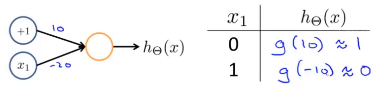

我们可以利用神经元来组合成更为复杂的神经网络以实现更复杂的运算。例如我们要实现**XNOR** 功能（输入的两个值必须一样，均为1或均为0），即 $\text{XNOR}=( \text{x}_1\, \text{AND}\, \text{x}_2 )\, \text{OR} \left( \left( \text{NOT}\, \text{x}_1 \right) \text{AND} \left( \text{NOT}\, \text{x}_2 \right) \right)$
首先构造一个能表达$\left( \text{NOT}\, \text{x}_1 \right) \text{AND} \left( \text{NOT}\, \text{x}_2 \right)$部分的神经元：


然后将表示 **AND** 的神经元和表示$\left( \text{NOT}\, \text{x}_1 \right) \text{AND} \left( \text{NOT}\, \text{x}_2 \right)$的神经元以及表示 OR 的神经元进行组合：


我们就得到了一个能实现 $\text{XNOR}$ 运算符功能的神经网络。

按这种方法我们可以逐渐构造出越来越复杂的函数，也能得到更加厉害的特征值。

这就是神经网络的厉害之处。

### 8.7 多类分类

参考视频: 8 - 7 - Multiclass Classification (4 min).mkv

当我们有不止两种分类时（也就是$y=1,2,3….$），比如以下这种情况，该怎么办？如果我们要训练一个神经网络算法来识别路人、汽车、摩托车和卡车，在输出层我们应该有4个值。例如，第一个值为1或0用于预测是否是行人，第二个值用于判断是否为汽车。

输入向量$x$有三个维度，两个中间层，输出层4个神经元分别用来表示4类，也就是每一个数据在输出层都会出现${{\left[ a\text{ }b\text{ }c\text{ }d \right]}^{T}}$，且$a,b,c,d$中仅有一个为1，表示当前类。下面是该神经网络的可能结构示例：


神经网络算法的输出结果为四种可能情形之一：


# 第5周

[TOC]

## 九、神经网络的学习(Neural Networks: Learning)

### 9.1 代价函数

参考视频: 9 - 1 - Cost Function (7 min).mkv

首先引入一些便于稍后讨论的新标记方法：

假设神经网络的训练样本有$m$个，每个包含一组输入$x$和一组输出信号$y$，$L$表示神经网络层数，$S_I$表示每层的**neuron**个数($S_l$表示输出层神经元个数)，$S_L$代表最后一层中处理单元的个数。

将神经网络的分类定义为两种情况：二类分类和多类分类，

二类分类：$S_L=0, y=0\, or\, 1$表示哪一类；

$K$类分类：$S_L=k, y_i = 1$表示分到第$i$类；$(k>2)$


我们回顾逻辑回归问题中我们的代价函数为：

$  J\left(\theta \right)=-\frac{1}{m}\left[\sum_\limits{i=1}^{m}{y}^{(i)}\log{h_\theta({x}^{(i)})}+\left(1-{y}^{(i)}\right)log\left(1-h_\theta\left({x}^{(i)}\right)\right)\right]+\frac{\lambda}{2m}\sum_\limits{j=1}^{n}{\theta_j}^{2}  $

在逻辑回归中，我们只有一个输出变量，又称标量（**scalar**），也只有一个因变量$y$，但是在神经网络中，我们可以有很多输出变量，我们的$h_\theta(x)$是一个维度为$K$的向量，并且我们训练集中的因变量也是同样维度的一个向量，因此我们的代价函数会比逻辑回归更加复杂一些，为：$\newcommand{\subk}[1]{ #1_k }$
$$h_\theta\left(x\right)\in \mathbb{R}^{K}$$ $${\left({h_\theta}\left(x\right)\right)}_{i}={i}^{th} \text{output}$$

$J(\Theta) = -\frac{1}{m} \left[ \sum\limits_{i=1}^{m} \sum\limits_{k=1}^{k} {y_k}^{(i)} \log \subk{(h_\Theta(x^{(i)}))} + \left( 1 - y_k^{(i)} \right) \log \left( 1- \subk{\left( h_\Theta \left( x^{(i)} \right) \right)} \right) \right] + \frac{\lambda}{2m} \sum\limits_{l=1}^{L-1} \sum\limits_{i=1}^{s_l} \sum\limits_{j=1}^{s_{l+1}} \left( \Theta_{ji}^{(l)} \right)^2$

这个看起来复杂很多的代价函数背后的思想还是一样的，我们希望通过代价函数来观察算法预测的结果与真实情况的误差有多大，唯一不同的是，对于每一行特征，我们都会给出$K$个预测，基本上我们可以利用循环，对每一行特征都预测$K$个不同结果，然后在利用循环在$K$个预测中选择可能性最高的一个，将其与$y$中的实际数据进行比较。

正则化的那一项只是排除了每一层$\theta_0$后，每一层的$\theta$ 矩阵的和。最里层的循环$j$循环所有的行（由$s_{l+1}$  层的激活单元数决定），循环$i$则循环所有的列，由该层（$s_l$层）的激活单元数所决定。即：$h_\theta(x)$与真实值之间的距离为每个样本-每个类输出的加和，对参数进行**regularization**的**bias**项处理所有参数的平方和。

### 9.2 反向传播算法

参考视频: 9 - 2 - Backpropagation Algorithm (12 min).mkv

之前我们在计算神经网络预测结果的时候我们采用了一种正向传播方法，我们从第一层开始正向一层一层进行计算，直到最后一层的$h_{\theta}\left(x\right)$。

现在，为了计算代价函数的偏导数$\frac{\partial}{\partial\Theta^{(l)}_{ij}}J\left(\Theta\right)$，我们需要采用一种反向传播算法，也就是首先计算最后一层的误差，然后再一层一层反向求出各层的误差，直到倒数第二层。
以一个例子来说明反向传播算法。

假设我们的训练集只有一个样本$\left({x}^{(1)},{y}^{(1)}\right)$，我们的神经网络是一个四层的神经网络，其中$K=4，S_{L}=4，L=4$：

前向传播算法：


下面的公式推导过程见：<https://blog.csdn.net/qq_29762941/article/details/80343185>

我们从最后一层的误差开始计算，误差是激活单元的预测（${a^{(4)}}$）与实际值（$y^k$）之间的误差，（$k=1:k$）。
我们用$\delta$来表示误差，则：$\delta^{(4)}=a^{(4)}-y$
我们利用这个误差值来计算前一层的误差：$\delta^{(3)}=\left({\Theta^{(3)}}\right)^{T}\delta^{(4)}\ast g'\left(z^{(3)}\right)$
其中 $g'(z^{(3)})$是 $S$ 形函数的导数，$g'(z^{(3)})=a^{(3)}\ast(1-a^{(3)})$。而$(θ^{(3)})^{T}\delta^{(4)}$则是权重导致的误差的和。下一步是继续计算第二层的误差：
$ \delta^{(2)}=(\Theta^{(2)})^{T}\delta^{(3)}\ast g'(z^{(2)})$
因为第一层是输入变量，不存在误差。我们有了所有的误差的表达式后，便可以计算代价函数的偏导数了，假设$λ=0$，即我们不做任何正则化处理时有：
$\frac{\partial}{\partial\Theta_{ij}^{(l)}}J(\Theta)=a_{j}^{(l)} \delta_{i}^{l+1}$

重要的是清楚地知道上面式子中上下标的含义：

$l$ 代表目前所计算的是第几层。

$j$ 代表目前计算层中的激活单元的下标，也将是下一层的第$j$个输入变量的下标。

$i$ 代表下一层中误差单元的下标，是受到权重矩阵中第$i$行影响的下一层中的误差单元的下标。

如果我们考虑正则化处理，并且我们的训练集是一个特征矩阵而非向量。在上面的特殊情况中，我们需要计算每一层的误差单元来计算代价函数的偏导数。在更为一般的情况中，我们同样需要计算每一层的误差单元，但是我们需要为整个训练集计算误差单元，此时的误差单元也是一个矩阵，我们用$\Delta^{(l)}_{ij}$来表示这个误差矩阵。第 $l$  层的第 $i$ 个激活单元受到第 $j$ 个参数影响而导致的误差。

我们的算法表示为：


即首先用正向传播方法计算出每一层的激活单元，利用训练集的结果与神经网络预测的结果求出最后一层的误差，然后利用该误差运用反向传播法计算出直至第二层的所有误差。

在求出了$\Delta_{ij}^{(l)}$之后，我们便可以计算代价函数的偏导数了，计算方法如下：
$ D_{ij}^{(l)} :=\frac{1}{m}\Delta_{ij}^{(l)}+\lambda\Theta_{ij}^{(l)}$              ${if}\; j \neq  0$

$ D_{ij}^{(l)} :=\frac{1}{m}\Delta_{ij}^{(l)}$                             ${if}\; j = 0$

在**Octave** 中，如果我们要使用 `fminuc`这样的优化算法来求解求出权重矩阵，我们需要将矩阵首先展开成为向量，在利用算法求出最优解后再重新转换回矩阵。

假设我们有三个权重矩阵，Theta1，Theta2 和 Theta3，尺寸分别为 10\*11，10\*11 和1*11，
下面的代码可以实现这样的转换：

```
thetaVec = [Theta1(:) ; Theta2(:) ; Theta3(:)]

...optimization using functions like fminuc...

Theta1 = reshape(thetaVec(1:110, 10, 11);

Theta2 = reshape(thetaVec(111:220, 10, 11);

Theta1 = reshape(thetaVec(221:231, 1, 11);
```


### 9.3 反向传播算法的直观理解

参考视频: 9 - 3 - Backpropagation Intuition (13 min).mkv

在上一段视频中，我们介绍了反向传播算法，对很多人来说，当第一次看到这种算法时，第一印象通常是，这个算法需要那么多繁杂的步骤，简直是太复杂了，实在不知道这些步骤，到底应该如何合在一起使用。就好像一个黑箱，里面充满了复杂的步骤。如果你对反向传播算法也有这种感受的话，这其实是正常的，相比于线性回归算法和逻辑回归算法而言，从数学的角度上讲，反向传播算法似乎并不简洁，对于反向传播这种算法，其实我已经使用了很多年了，但即便如此，即使是现在，我也经常感觉自己对反向传播算法的理解并不是十分深入，对于反向传播算法究竟是如何执行的，并没有一个很直观的理解。做过编程练习的同学应该可以感受到这些练习或多或少能帮助你，将这些复杂的步骤梳理了一遍，巩固了反向传播算法具体是如何实现的，这样你才能自己掌握这种算法。

在这段视频中，我想更加深入地讨论一下反向传播算法的这些复杂的步骤，并且希望给你一个更加全面直观的感受，理解这些步骤究竟是在做什么，也希望通过这段视频，你能理解，它至少还是一个合理的算法。但可能你即使看了这段视频，你还是觉得反向传播依然很复杂，依然像一个黑箱，太多复杂的步骤，依然感到有点神奇，这也是没关系的。即使是我接触反向传播这么多年了，有时候仍然觉得这是一个难以理解的算法，但还是希望这段视频能有些许帮助，为了更好地理解反向传播算法，我们再来仔细研究一下前向传播的原理：

前向传播算法：


反向传播算法做的是：


**感悟**：上图中的 $\delta^{(l)}_{j}="error" \ of cost \  for \ a^{(l)}_{j} \ (unit \ j \ in \ layer \ l)$ 理解如下：

$\delta^{(l)}_{j}$ 相当于是第 $l$ 层的第 $j$ 单元中得到的激活项的“误差”，即”正确“的 $a^{(l)}_{j}$ 与计算得到的 $a^{(l)}_{j}$ 的差。

而 $a^{(l)}_{j}=g(z^{(l)})$ ，（g为sigmoid函数）。我们可以想象 $\delta^{(l)}_{j}$ 为函数求导时迈出的那一丁点微分，所以更准确的说 $\delta^{(l)}_{j}=\frac{\partial}{\partial z^{(l)}_{j}}cost(i)$

### 9.4 实现注意：展开参数

参考视频: 9 - 4 - Implementation Note\_ Unrolling Parameters (8 min).mkv

在上一段视频中，我们谈到了怎样使用反向传播算法计算代价函数的导数。在这段视频中，我想快速地向你介绍一个细节的实现过程，怎样把你的参数从矩阵展开成向量，以便我们在高级最优化步骤中的使用需要。


### 9.5 梯度检验

参考视频: 9 - 5 - Gradient Checking (12 min).mkv

当我们对一个较为复杂的模型（例如神经网络）使用梯度下降算法时，可能会存在一些不容易察觉的错误，意味着，虽然代价看上去在不断减小，但最终的结果可能并不是最优解。

为了避免这样的问题，我们采取一种叫做梯度的数值检验（**Numerical Gradient Checking**）方法。这种方法的思想是通过估计梯度值来检验我们计算的导数值是否真的是我们要求的。

对梯度的估计采用的方法是在代价函数上沿着切线的方向选择离两个非常近的点然后计算两个点的平均值用以估计梯度。即对于某个特定的 $\theta$，我们计算出在 $\theta$-$\varepsilon $ 处和 $\theta$+$\varepsilon $ 的代价值（$\varepsilon $是一个非常小的值，通常选取 0.001），然后求两个代价的平均，用以估计在 $\theta$ 处的代价值。


**Octave** 中代码如下：

`gradApprox = (J(theta + eps) – J(theta - eps)) / (2*eps)`

当$\theta$是一个向量时，我们则需要对偏导数进行检验。因为代价函数的偏导数检验只针对一个参数的改变进行检验，下面是一个只针对$\theta_1$进行检验的示例：
$$ \frac{\partial}{\partial\theta_1}=\frac{J\left(\theta_1+\varepsilon_1,\theta_2,\theta_3...\theta_n \right)-J \left( \theta_1-\varepsilon_1,\theta_2,\theta_3...\theta_n \right)}{2\varepsilon} $$

最后我们还需要对通过反向传播方法计算出的偏导数进行检验。

根据上面的算法，计算出的偏导数存储在矩阵 $D_{ij}^{(l)}$ 中。检验时，我们要将该矩阵展开成为向量，同时我们也将 $\theta$ 矩阵展开为向量，我们针对每一个 $\theta$ 都计算一个近似的梯度值，将这些值存储于一个近似梯度矩阵中，最终将得出的这个矩阵同 $D_{ij}^{(l)}$ 进行比较。


### 9.6 随机初始化

参考视频: 9 - 6 - Random Initialization (7 min).mkv

任何优化算法都需要一些初始的参数。到目前为止我们都是初始所有参数为0，这样的初始方法对于逻辑回归来说是可行的，但是对于神经网络来说是不可行的。如果我们令所有的初始参数都为0，这将意味着我们第二层的所有激活单元都会有相同的值。同理，如果我们初始所有的参数都为一个非0的数，结果也是一样的。

我们通常初始参数为正负ε之间的随机值，假设我们要随机初始一个尺寸为10×11的参数矩阵，代码如下：

`Theta1 = rand(10, 11) * (2*eps) – eps`

### 9.7 综合起来

参考视频: 9 - 7 - Putting It Together (14 min).mkv

小结一下使用神经网络时的步骤：

网络结构：第一件要做的事是选择网络结构，即决定选择多少层以及决定每层分别有多少个单元。

第一层的单元数即我们训练集的特征数量。

最后一层的单元数是我们训练集的结果的类的数量。

如果隐藏层数大于1，确保每个隐藏层的单元个数相同，通常情况下隐藏层单元的个数越多越好。

我们真正要决定的是隐藏层的层数和每个中间层的单元数。

训练神经网络：

1. 参数的随机初始化
2. 利用正向传播方法计算所有的$h_{\theta}(x)$
3. 编写计算代价函数 $J$ 的代码
4. 利用反向传播方法计算所有偏导数
5. 利用数值检验方法检验这些偏导数
6. 使用优化算法来最小化代价函数

### 9.8 自主驾驶

参考视频: 9 - 8 - Autonomous Driving (7 min).mkv

在这段视频中，我想向你介绍一个具有历史意义的神经网络学习的重要例子。那就是使用神经网络来实现自动驾驶，也就是说使汽车通过学习来自己驾驶。接下来我将演示的这段视频是我从 Dean Pomerleau那里拿到的，他是我的同事，任职于美国东海岸的卡耐基梅隆大学。在这部分视频中，你就会明白可视化技术到底是什么？在看这段视频之前，我会告诉你可视化技术是什么。

在下面也就是左下方，就是汽车所看到的前方的路况图像。


在图中你依稀能看出一条道路，朝左延伸了一点，又向右了一点，然后上面的这幅图，你可以看到一条水平的菜单栏显示的是驾驶操作人选择的方向。就是这里的这条白亮的区段显示的就是人类驾驶者选择的方向。比如：最左边的区段，对应的操作就是向左急转，而最右端则对应向右急转的操作。因此，稍微靠左的区段，也就是中心稍微向左一点的位置，则表示在这一点上人类驾驶者的操作是慢慢的向左拐。

这幅图的第二部分对应的就是学习算法选出的行驶方向。并且，类似的，这一条白亮的区段显示的就是神经网络在这里选择的行驶方向，是稍微的左转，并且实际上在神经网络开始学习之前，你会看到网络的输出是一条灰色的区段，就像这样的一条灰色区段覆盖着整个区域这些均称的灰色区域，显示出神经网络已经随机初始化了，并且初始化时，我们并不知道汽车如何行驶，或者说我们并不知道所选行驶方向。只有在学习算法运行了足够长的时间之后，才会有这条白色的区段出现在整条灰色区域之中。显示出一个具体的行驶方向这就表示神经网络算法，在这时候已经选出了一个明确的行驶方向，不像刚开始的时候，输出一段模糊的浅灰色区域，而是输出一条白亮的区段，表示已经选出了明确的行驶方向。


**ALVINN** (**Autonomous Land Vehicle In a Neural Network**)是一个基于神经网络的智能系统，通过观察人类的驾驶来学习驾驶，**ALVINN**能够控制**NavLab**，装在一辆改装版军用悍马，这辆悍马装载了传感器、计算机和驱动器用来进行自动驾驶的导航试验。实现**ALVINN**功能的第一步，是对它进行训练，也就是训练一个人驾驶汽车。


然后让**ALVINN**观看，**ALVINN**每两秒将前方的路况图生成一张数字化图片，并且记录驾驶者的驾驶方向，得到的训练集图片被压缩为30x32像素，并且作为输入提供给**ALVINN**的三层神经网络，通过使用反向传播学习算法，**ALVINN**会训练得到一个与人类驾驶员操纵方向基本相近的结果。一开始，我们的网络选择出的方向是随机的，大约经过两分钟的训练后，我们的神经网络便能够准确地模拟人类驾驶者的驾驶方向，对其他道路类型，也重复进行这个训练过程，当网络被训练完成后，操作者就可按下运行按钮，车辆便开始行驶了。


每秒钟**ALVINN**生成12次数字化图片，并且将图像传送给神经网络进行训练，多个神经网络同时工作，每一个网络都生成一个行驶方向，以及一个预测自信度的参数，预测自信度最高的那个神经网络得到的行驶方向。比如这里，在这条单行道上训练出的网络将被最终用于控制车辆方向，车辆前方突然出现了一个交叉十字路口，当车辆到达这个十字路口时，我们单行道网络对应的自信度骤减，当它穿过这个十字路口时，前方的双车道将进入其视线，双车道网络的自信度便开始上升，当它的自信度上升时，双车道的网络，将被选择来控制行驶方向，车辆将被安全地引导进入双车道路。

这就是基于神经网络的自动驾驶技术。当然，我们还有很多更加先进的试验来实现自动驾驶技术。在美国，欧洲等一些国家和地区，他们提供了一些比这个方法更加稳定的驾驶控制技术。但我认为，使用这样一个简单的基于反向传播的神经网络，训练出如此强大的自动驾驶汽车，的确是一次令人惊讶的成就。

# 第6周

[TOC]

## 十、应用机器学习的建议(Advice for Applying Machine Learning)

### 10.1 决定下一步做什么

参考视频: 10 - 1 - Deciding What to Try Next (6 min).mkv

到目前为止，我们已经介绍了许多不同的学习算法，如果你一直跟着这些视频的进度学习，你会发现自己已经不知不觉地成为一个了解许多先进机器学习技术的专家了。
	
然而，在懂机器学习的人当中依然存在着很大的差距，一部分人确实掌握了怎样高效有力地运用这些学习算法。而另一些人他们可能对我马上要讲的东西，就不是那么熟悉了。他们可能没有完全理解怎样运用这些算法。因此总是把时间浪费在毫无意义的尝试上。我想做的是确保你在设计机器学习的系统时，你能够明白怎样选择一条最合适、最正确的道路。因此，在这节视频和之后的几段视频中，我将向你介绍一些实用的建议和指导，帮助你明白怎样进行选择。具体来讲，我将重点关注的问题是假如你在开发一个机器学习系统，或者想试着改进一个机器学习系统的性能，你应如何决定接下来应该选择哪条道路？为了解释这一问题，我想仍然使用预测房价的学习例子，假如你已经完成了正则化线性回归，也就是最小化代价函数$J$的值，假如，在你得到你的学习参数以后，如果你要将你的假设函数放到一组新的房屋样本上进行测试，假如说你发现在预测房价时产生了巨大的误差，现在你的问题是要想改进这个算法，接下来应该怎么办？
	
实际上你可以想出很多种方法来改进这个算法的性能，其中一种办法是使用更多的训练样本。具体来讲，也许你能想到通过电话调查或上门调查来获取更多的不同的房屋出售数据。遗憾的是，我看到好多人花费了好多时间想收集更多的训练样本。他们总认为，要是我有两倍甚至十倍数量的训练数据，那就一定会解决问题的是吧？但有时候获得更多的训练数据实际上并没有作用。在接下来的几段视频中，我们将解释原因。
	
我们也将知道怎样避免把过多的时间浪费在收集更多的训练数据上，这实际上是于事无补的。另一个方法，你也许能想到的是尝试选用更少的特征集。因此如果你有一系列特征比如$x_1,x_2,x_3$等等。也许有很多特征，也许你可以花一点时间从这些特征中仔细挑选一小部分来防止过拟合。或者也许你需要用更多的特征，也许目前的特征集，对你来讲并不是很有帮助。你希望从获取更多特征的角度来收集更多的数据，同样地，你可以把这个问题扩展为一个很大的项目，比如使用电话调查来得到更多的房屋案例，或者再进行土地测量来获得更多有关，这块土地的信息等等，因此这是一个复杂的问题。同样的道理，我们非常希望在花费大量时间完成这些工作之前，我们就能知道其效果如何。我们也可以尝试增加多项式特征的方法，比如$x_1$的平方，$x_2$的平方，$x_1,x_2$的乘积，我们可以花很多时间来考虑这一方法，我们也可以考虑其他方法减小或增大正则化参数$\lambda$的值。我们列出的这个单子，上面的很多方法都可以扩展开来扩展成一个六个月或更长时间的项目。遗憾的是，大多数人用来选择这些方法的标准是凭感觉的，也就是说，大多数人的选择方法是随便从这些方法中选择一种，比如他们会说“噢，我们来多找点数据吧”，然后花上六个月的时间收集了一大堆数据，然后也许另一个人说：“好吧，让我们来从这些房子的数据中多找点特征吧”。我很遗憾不止一次地看到很多人花了至少六个月时间来完成他们随便选择的一种方法，而在六个月或者更长时间后，他们很遗憾地发现自己选择的是一条不归路。幸运的是，有一系列简单的方法能让你事半功倍，排除掉单子上的至少一半的方法，留下那些确实有前途的方法，同时也有一种很简单的方法，只要你使用，就能很轻松地排除掉很多选择，从而为你节省大量不必要花费的时间。最终达到改进机器学习系统性能的目的假设我们需要用一个线性回归模型来预测房价，当我们运用训练好了的模型来预测未知数据的时候发现有较大的误差，我们下一步可以做什么？

1. 获得更多的训练样本——通常是有效的，但代价较大，下面的方法也可能有效，可考虑先采用下面的几种方法。
2. 尝试减少特征的数量
3. 尝试获得更多的特征
4. 尝试增加多项式特征
5. 尝试减少正则化程度$\lambda$
6. 尝试增加正则化程度$\lambda$

我们不应该随机选择上面的某种方法来改进我们的算法，而是运用一些机器学习诊断法来帮助我们知道上面哪些方法对我们的算法是有效的。

在接下来的两段视频中，我首先介绍怎样评估机器学习算法的性能，然后在之后的几段视频中，我将开始讨论这些方法，它们也被称为"机器学习诊断法"。“诊断法”的意思是：这是一种测试法，你通过执行这种测试，能够深入了解某种算法到底是否有用。这通常也能够告诉你，要想改进一种算法的效果，什么样的尝试，才是有意义的。在这一系列的视频中我们将介绍具体的诊断法，但我要提前说明一点的是，这些诊断法的执行和实现，是需要花些时间的，有时候确实需要花很多时间来理解和实现，但这样做的确是把时间用在了刀刃上，因为这些方法让你在开发学习算法时，节省了几个月的时间，因此，在接下来几节课中，我将先来介绍如何评价你的学习算法。在此之后，我将介绍一些诊断法，希望能让你更清楚。在接下来的尝试中，如何选择更有意义的方法。

### 10.2 评估一个假设

参考视频: 10 - 2 - Evaluating a Hypothesis (8 min).mkv

在本节视频中我想介绍一下怎样用你学过的算法来评估假设函数。在之后的课程中，我们将以此为基础来讨论如何避免过拟合和欠拟合的问题。

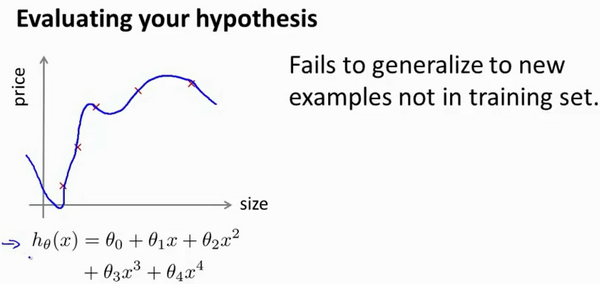

当我们确定学习算法的参数的时候，我们考虑的是选择参量来使训练误差最小化，有人认为得到一个非常小的训练误差一定是一件好事，但我们已经知道，仅仅是因为这个假设具有很小的训练误差，并不能说明它就一定是一个好的假设函数。而且我们也学习了过拟合假设函数的例子，所以这推广到新的训练集上是不适用的。
	
那么，你该如何判断一个假设函数是过拟合的呢？对于这个简单的例子，我们可以对假设函数$h(x)$进行画图，然后观察图形趋势，但对于特征变量不止一个的这种一般情况，还有像有很多特征变量的问题，想要通过画出假设函数来进行观察，就会变得很难甚至是不可能实现。
	
因此，我们需要另一种方法来评估我们的假设函数过拟合检验。
	
为了检验算法是否过拟合，我们将数据分成训练集和测试集，通常用70%的数据作为训练集，用剩下30%的数据作为测试集。很重要的一点是训练集和测试集均要含有各种类型的数据，通常我们要对数据进行“洗牌”，然后再分成训练集和测试集。


测试集评估在通过训练集让我们的模型学习得出其参数后，对测试集运用该模型，我们有两种方式计算误差：

1. 对于线性回归模型，我们利用测试集数据计算代价函数$J$
2. 对于逻辑回归模型，我们除了可以利用测试数据集来计算代价函数外：

$$ J_{test}{(\theta)} = -\frac{1}{{m}_{test}}\sum_\limits{i=1}^{m_{test}}\log{h_{\theta}(x^{(i)}_{test})}+(1-{y^{(i)}_{test}})\log{h_{\theta}(x^{(i)}_{test})}$$

误分类的比率，对于每一个测试集样本，计算：


然后对计算结果求平均。

### 10.3 模型选择和交叉验证集

参考视频: 10 - 3 - Model Selection and Train_Validation_Test Sets (12 min).mkv

假设我们要在10个不同次数的二项式模型之间进行选择：


显然越高次数的多项式模型越能够适应我们的训练数据集，但是适应训练数据集并不代表着能推广至一般情况，我们应该选择一个更能适应一般情况的模型。我们需要使用交叉验证集来帮助选择模型。
	
即：使用60%的数据作为训练集，使用 20%的数据作为交叉验证集，使用20%的数据作为测试集


模型选择的方法为：

1. 使用训练集训练出10个模型

2. 用10个模型分别对交叉验证集计算得出交叉验证误差（代价函数的值）

3. 选取代价函数值最小的模型

4. 用步骤3中选出的模型对测试集计算得出推广误差（代价函数的值）

   ***Train/validation/test error***

   **Training error:**

$J_{train}(\theta) = \frac{1}{2m}\sum_\limits{i=1}^{m}(h_{\theta}(x^{(i)})-y^{(i)})^2$

**Cross Validation error:**

$J_{cv}(\theta) = \frac{1}{2m_{cv}}\sum_\limits{i=1}^{m}(h_{\theta}(x^{(i)}_{cv})-y^{(i)}_{cv})^2$

**Test error:**

$J_{test}(\theta)=\frac{1}{2m_{test}}\sum_\limits{i=1}^{m_{test}}(h_{\theta}(x^{(i)}_{cv})-y^{(i)}_{cv})^2$

### 10.4 诊断偏差和方差

参考视频: 10 - 4 - Diagnosing Bias vs. Variance (8 min).mkv

当你运行一个学习算法时，如果这个算法的表现不理想，那么多半是出现两种情况：要么是偏差比较大，要么是方差比较大。换句话说，出现的情况要么是欠拟合，要么是过拟合问题。那么这两种情况，哪个和偏差有关，哪个和方差有关，或者是不是和两个都有关？搞清楚这一点非常重要，因为能判断出现的情况是这两种情况中的哪一种。其实是一个很有效的指示器，指引着可以改进算法的最有效的方法和途径。在这段视频中，我想更深入地探讨一下有关偏差和方差的问题，希望你能对它们有一个更深入的理解，并且也能弄清楚怎样评价一个学习算法，能够判断一个算法是偏差还是方差有问题，因为这个问题对于弄清如何改进学习算法的效果非常重要，高偏差和高方差的问题基本上来说是欠拟合和过拟合的问题。


我们通常会通过将训练集和交叉验证集的代价函数误差与多项式的次数绘制在同一张图表上来帮助分析：


**Bias/variance**

**Training error:**				               $J_{train}(\theta) = \frac{1}{2m}\sum_\limits{i=1}^{m}(h_{\theta}(x^{(i)})-y^{(i)})^2$

**Cross Validation error:**				$J_{cv}(\theta) = \frac{1}{2m_{cv}}\sum_\limits{i=1}^{m}(h_{\theta}(x^{(i)}_{cv})-y^{(i)}_{cv})^2$


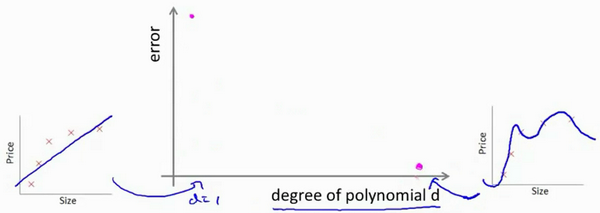

对于训练集，当 $d$ 较小时，模型拟合程度更低，误差较大；随着 $d$ 的增长，拟合程度提高，误差减小。
	
对于交叉验证集，当 $d$ 较小时，模型拟合程度低，误差较大；但是随着 $d$ 的增长，误差呈现先减小后增大的趋势，转折点是我们的模型开始过拟合训练数据集的时候。
	
如果我们的交叉验证集误差较大，我们如何判断是方差还是偏差呢？根据上面的图表，我们知道:


训练集误差和交叉验证集误差近似时：偏差/欠拟合
	
交叉验证集误差远大于训练集误差时：方差/过拟合

### 10.5 正则化和偏差/方差

参考视频: 10 - 5 - Regularization and Bias_Variance (11 min).mkv

在我们在训练模型的过程中，一般会使用一些正则化方法来防止过拟合。但是我们可能会正则化的程度太高或太小了，即我们在选择λ的值时也需要思考与刚才选择多项式模型次数类似的问题。


我们选择一系列的想要测试的 $\lambda$ 值，通常是 0-10之间的呈现2倍关系的值（如：$0,0.01,0.02,0.04,0.08,0.15,0.32,0.64,1.28,2.56,5.12,10$共12个）。 我们同样把数据分为训练集、交叉验证集和测试集。


选择$\lambda$的方法为：

1. 使用训练集训练出12个不同程度正则化的模型
2. 用12个模型分别对交叉验证集计算的出交叉验证误差
3. 选择得出交叉验证误差**最小**的模型
4. 运用步骤3中选出模型对测试集计算得出推广误差，我们也可以同时将训练集和交叉验证集模型的代价函数误差与λ的值绘制在一张图表上：


• 当 $\lambda$ 较小时，训练集误差较小（过拟合）而交叉验证集误差较大
	
• 随着 $\lambda$ 的增加，训练集误差不断增加（欠拟合），而交叉验证集误差则是先减小后增加

### 10.6 学习曲线

参考视频: 10 - 6 - Learning Curves (12 min).mkv

学习曲线就是一种很好的工具，我经常使用学习曲线来判断某一个学习算法是否处于偏差、方差问题。学习曲线是学习算法的一个很好的**合理检验**（**sanity check**）。学习曲线是将训练集误差和交叉验证集误差作为训练集样本数量（$m$）的函数绘制的图表。
	
即，如果我们有100行数据，我们从1行数据开始，逐渐学习更多行的数据。思想是：当训练较少行数据的时候，训练的模型将能够非常完美地适应较少的训练数据，但是训练出来的模型却不能很好地适应交叉验证集数据或测试集数据。


如何利用学习曲线识别高偏差/欠拟合：作为例子，我们尝试用一条直线来适应下面的数据，可以看出，无论训练集有多么大误差都不会有太大改观：


也就是说在高偏差/欠拟合的情况下，增加数据到训练集不一定能有帮助。
	
如何利用学习曲线识别高方差/过拟合：假设我们使用一个非常高次的多项式模型，并且正则化非常小，可以看出，当交叉验证集误差远大于训练集误差时，往训练集增加更多数据可以提高模型的效果。


也就是说在高方差/过拟合的情况下，增加更多数据到训练集可能可以提高算法效果。

### 10.7 决定下一步做什么

参考视频: 10 - 7 - Deciding What to Do Next Revisited (7 min).mkv

我们已经介绍了怎样评价一个学习算法，我们讨论了模型选择问题，偏差和方差的问题。那么这些诊断法则怎样帮助我们判断，哪些方法可能有助于改进学习算法的效果，而哪些可能是徒劳的呢？
	
让我们再次回到最开始的例子，在那里寻找答案，这就是我们之前的例子。回顾 1.1 中提出的六种可选的下一步，让我们来看一看我们在什么情况下应该怎样选择：

1. 获得更多的训练样本——解决高方差
2. 尝试减少特征的数量——解决高方差
3. 尝试获得更多的特征——解决高偏差
4. 尝试增加多项式特征——解决高偏差
5. 尝试减少正则化程度λ——解决高偏差
6. 尝试增加正则化程度λ——解决高方差

神经网络的方差和偏差：


使用较小的神经网络，类似于参数较少的情况，容易导致高偏差和欠拟合，但计算代价较小使用较大的神经网络，类似于参数较多的情况，容易导致高方差和过拟合，虽然计算代价比较大，但是可以通过正则化手段来调整而更加适应数据。
	
通常选择较大的神经网络并采用正则化处理会比采用较小的神经网络效果要好。
	
对于神经网络中的隐藏层的层数的选择，通常从一层开始逐渐增加层数，为了更好地作选择，可以把数据分为训练集、交叉验证集和测试集，针对不同隐藏层层数的神经网络训练神经网络，
然后选择交叉验证集代价最小的神经网络。

好的，以上就是我们介绍的偏差和方差问题，以及诊断该问题的学习曲线方法。在改进学习算法的表现时，你可以充分运用以上这些内容来判断哪些途径可能是有帮助的。而哪些方法可能是无意义的。如果你理解了以上几节视频中介绍的内容，并且懂得如何运用。那么你已经可以使用机器学习方法有效的解决实际问题了。你也能像硅谷的大部分机器学习从业者一样，他们每天的工作就是使用这些学习算法来解决众多实际问题。我希望这几节中提到的一些技巧，关于方差、偏差，以及学习曲线为代表的诊断法能够真正帮助你更有效率地应用机器学习，让它们高效地工作。

## 十一、机器学习系统的设计(Machine Learning System Design)

### 11.1 首先要做什么

参考视频: 11 - 1 - Prioritizing What to Work On (10 min).mkv

在接下来的视频中，我将谈到机器学习系统的设计。这些视频将谈及在设计复杂的机器学习系统时，你将遇到的主要问题。同时我们会试着给出一些关于如何巧妙构建一个复杂的机器学习系统的建议。下面的课程的的数学性可能不是那么强，但是我认为我们将要讲到的这些东西是非常有用的，可能在构建大型的机器学习系统时，节省大量的时间。
	
本周以一个垃圾邮件分类器算法为例进行讨论。
	
为了解决这样一个问题，我们首先要做的决定是如何选择并表达特征向量$x$。我们可以选择一个由100个最常出现在垃圾邮件中的词所构成的列表，根据这些词是否有在邮件中出现，来获得我们的特征向量（出现为1，不出现为0），尺寸为100×1。

为了构建这个分类器算法，我们可以做很多事，例如：

1. 收集更多的数据，让我们有更多的垃圾邮件和非垃圾邮件的样本
2. 基于邮件的路由信息开发一系列复杂的特征
3. 基于邮件的正文信息开发一系列复杂的特征，包括考虑截词的处理
4. 为探测刻意的拼写错误（把**watch** 写成**w4tch**）开发复杂的算法

在上面这些选项中，非常难决定应该在哪一项上花费时间和精力，作出明智的选择，比随着感觉走要更好。当我们使用机器学习时，总是可以“头脑风暴”一下，想出一堆方法来试试。实际上，当你需要通过头脑风暴来想出不同方法来尝试去提高精度的时候，你可能已经超越了很多人了。大部分人并不尝试着列出可能的方法，他们做的只是某天早上醒来，因为某些原因有了一个突发奇想："让我们来试试用**Honey Pot**项目收集大量的数据吧。"
    
我们将在随后的课程中讲误差分析，我会告诉你怎样用一个更加系统性的方法，从一堆不同的方法中，选取合适的那一个。因此，你更有可能选择一个真正的好方法，能让你花上几天几周，甚至是几个月去进行深入的研究。

### 11.2 误差分析

参考视频: 11 - 2 - Error Analysis (13 min).mkv

在本次课程中，我们将会讲到误差分析（**Error Analysis**）的概念。这会帮助你更系统地做出决定。如果你准备研究机器学习的东西，或者构造机器学习应用程序，最好的实践方法不是建立一个非常复杂的系统，拥有多么复杂的变量；而是构建一个简单的算法，这样你可以很快地实现它。
	
每当我研究机器学习的问题时，我最多只会花一天的时间，就是字面意义上的24小时，来试图很快的把结果搞出来，即便效果不好。坦白的说，就是根本没有用复杂的系统，但是只是很快的得到的结果。即便运行得不完美，但是也把它运行一遍，最后通过交叉验证来检验数据。一旦做完，你可以画出学习曲线，通过画出学习曲线，以及检验误差，来找出你的算法是否有高偏差和高方差的问题，或者别的问题。在这样分析之后，再来决定用更多的数据训练，或者加入更多的特征变量是否有用。这么做的原因是：这在你刚接触机器学习问题时是一个很好的方法，你并不能提前知道你是否需要复杂的特征变量，或者你是否需要更多的数据，还是别的什么。提前知道你应该做什么，是非常难的，因为你缺少证据，缺少学习曲线。因此，你很难知道你应该把时间花在什么地方来提高算法的表现。但是当你实践一个非常简单即便不完美的方法时，你可以通过画出学习曲线来做出进一步的选择。你可以用这种方式来避免一种电脑编程里的过早优化问题，这种理念是：我们必须用证据来领导我们的决策，怎样分配自己的时间来优化算法，而不是仅仅凭直觉，凭直觉得出的东西一般总是错误的。除了画出学习曲线之外，一件非常有用的事是误差分析，我的意思是说：当我们在构造垃圾邮件分类器时，我会看一看我的交叉验证数据集，然后亲自看一看哪些邮件被算法错误地分类。因此，通过这些被算法错误分类的垃圾邮件与非垃圾邮件，你可以发现某些系统性的规律：什么类型的邮件总是被错误分类。经常地这样做之后，这个过程能启发你构造新的特征变量，或者告诉你：现在这个系统的短处，然后启发你如何去提高它。
	
构建一个学习算法的推荐方法为：
	

1. 从一个简单的能快速实现的算法开始，实现该算法并用交叉验证集数据测试这个算法

2.绘制学习曲线，决定是增加更多数据，或者添加更多特征，还是其他选择
	
3.进行误差分析：人工检查交叉验证集中我们算法中产生预测误差的样本，看看这些样本是否有某种系统化的趋势

以我们的垃圾邮件过滤器为例，误差分析要做的既是检验交叉验证集中我们的算法产生错误预测的所有邮件，看：是否能将这些邮件按照类分组。例如医药品垃圾邮件，仿冒品垃圾邮件或者密码窃取邮件等。然后看分类器对哪一组邮件的预测误差最大，并着手优化。
	
思考怎样能改进分类器。例如，发现是否缺少某些特征，记下这些特征出现的次数。
	
例如记录下错误拼写出现了多少次，异常的邮件路由情况出现了多少次等等，然后从出现次数最多的情况开始着手优化。
	
误差分析并不总能帮助我们判断应该采取怎样的行动。有时我们需要尝试不同的模型，然后进行比较，在模型比较时，用数值来判断哪一个模型更好更有效，通常我们是看交叉验证集的误差。
	
在我们的垃圾邮件分类器例子中，对于“我们是否应该将**discount/discounts/discounted/discounting**处理成同一个词？”如果这样做可以改善我们算法，我们会采用一些截词软件。误差分析不能帮助我们做出这类判断，我们只能尝试采用和不采用截词软件这两种不同方案，然后根据数值检验的结果来判断哪一种更好。
	
因此，当你在构造学习算法的时候，你总是会去尝试很多新的想法，实现出很多版本的学习算法，如果每一次你实践新想法的时候，你都要手动地检测这些例子，去看看是表现差还是表现好，那么这很难让你做出决定。到底是否使用词干提取，是否区分大小写。但是通过一个量化的数值评估，你可以看看这个数字，误差是变大还是变小了。你可以通过它更快地实践你的新想法，它基本上非常直观地告诉你：你的想法是提高了算法表现，还是让它变得更坏，这会大大提高你实践算法时的速度。所以我强烈推荐在交叉验证集上来实施误差分析，而不是在测试集上。但是，还是有一些人会在测试集上来做误差分析。即使这从数学上讲是不合适的。所以我还是推荐你在交叉验证向量上来做误差分析。
	
总结一下，当你在研究一个新的机器学习问题时，我总是推荐你实现一个较为简单快速、即便不是那么完美的算法。我几乎从未见过人们这样做。大家经常干的事情是：花费大量的时间在构造算法上，构造他们以为的简单的方法。因此，不要担心你的算法太简单，或者太不完美，而是尽可能快地实现你的算法。当你有了初始的实现之后，它会变成一个非常有力的工具，来帮助你决定下一步的做法。因为我们可以先看看算法造成的错误，通过误差分析，来看看他犯了什么错，然后来决定优化的方式。另一件事是：假设你有了一个快速而不完美的算法实现，又有一个数值的评估数据，这会帮助你尝试新的想法，快速地发现你尝试的这些想法是否能够提高算法的表现，从而你会更快地做出决定，在算法中放弃什么，吸收什么误差分析可以帮助我们系统化地选择该做什么。

### 11.3 类偏斜的误差度量

参考视频: 11 - 3 - Error Metrics for Skewed Classes (12 min).mkv

在前面的课程中，我提到了误差分析，以及设定误差度量值的重要性。那就是，设定某个实数来评估你的学习算法，并衡量它的表现，有了算法的评估和误差度量值。有一件重要的事情要注意，就是使用一个合适的误差度量值，这有时会对于你的学习算法造成非常微妙的影响，这件重要的事情就是偏斜类（skewed classes）的问题。类偏斜情况表现为我们的训练集中有非常多的同一种类的样本，只有很少或没有其他类的样本。
	
例如我们希望用算法来预测癌症是否是恶性的，在我们的训练集中，只有0.5%的实例是恶性肿瘤。假设我们编写一个非学习而来的算法，在所有情况下都预测肿瘤是良性的，那么误差只有0.5%。然而我们通过训练而得到的神经网络算法却有1%的误差。这时，误差的大小是不能视为评判算法效果的依据的。
	
**查准率**（**Precision**）和**查全率**（**Recall**） 我们将算法预测的结果分成四种情况：
	

1. **正确肯定**（**True Positive,TP**）：预测为真，实际为真

2.**正确否定**（**True Negative,TN**）：预测为假，实际为假
	
3.**错误肯定**（**False Positive,FP**）：预测为真，实际为假
	
4.**错误否定**（**False Negative,FN**）：预测为假，实际为真

则：查准率=**TP/(TP+FP)**。例，在所有我们预测有恶性肿瘤的病人中，实际上有恶性肿瘤的病人的百分比，越高越好。
	
查全率=**TP/(TP+FN)**。例，在所有实际上有恶性肿瘤的病人中，成功预测有恶性肿瘤的病人的百分比，越高越好。
	
这样，对于我们刚才那个总是预测病人肿瘤为良性的算法，其查全率是0。

|            |              | **预测值**   |             |
| ---------- | ------------ | ------------ | ----------- |
|            |              | **Positive** | **Negtive** |
| **实际值** | **Positive** | **TP**       | **FN**      |
|            | **Negtive**  | **FP**       | **TN**      |

### 11.4 查准率和查全率之间的权衡

参考视频: 11 - 4 - Trading Off Precision and Recall (14 min).mkv

在之前的课程中，我们谈到查准率和召回率，作为遇到偏斜类问题的评估度量值。在很多应用中，我们希望能够保证查准率和召回率的相对平衡。
	
在这节课中，我将告诉你应该怎么做，同时也向你展示一些查准率和召回率作为算法评估度量值的更有效的方式。继续沿用刚才预测肿瘤性质的例子。假使，我们的算法输出的结果在0-1 之间，我们使用阀值0.5 来预测真和假。


查准率**(Precision)=TP/(TP+FP)**
例，在所有我们预测有恶性肿瘤的病人中，实际上有恶性肿瘤的病人的百分比，越高越好。

查全率**(Recall)=TP/(TP+FN)**例，在所有实际上有恶性肿瘤的病人中，成功预测有恶性肿瘤的病人的百分比，越高越好。
	
如果我们希望只在非常确信的情况下预测为真（肿瘤为恶性），即我们希望更高的查准率，我们可以使用比0.5更大的阀值，如0.7，0.9。这样做我们会减少错误预测病人为恶性肿瘤的情况，同时却会增加未能成功预测肿瘤为恶性的情况。
	
如果我们希望提高查全率，尽可能地让所有有可能是恶性肿瘤的病人都得到进一步地检查、诊断，我们可以使用比0.5更小的阀值，如0.3。
	
我们可以将不同阀值情况下，查全率与查准率的关系绘制成图表，曲线的形状根据数据的不同而不同：


我们希望有一个帮助我们选择这个阀值的方法。一种方法是计算**F1 值**（**F1 Score**），其计算公式为：

${{F}_{1}}Score:2\frac{PR}{P+R}$

我们选择使得**F1**值最高的阀值。

### 11.5 机器学习的数据

参考视频: 11 - 5 - Data For Machine Learning (11 min).mkv

在之前的视频中，我们讨论了评价指标。在这个视频中，我要稍微转换一下，讨论一下机器学习系统设计中另一个重要的方面，这往往涉及到用来训练的数据有多少。在之前的一些视频中，我曾告诫大家不要盲目地开始，而是花大量的时间来收集大量的数据，因为数据有时是唯一能实际起到作用的。但事实证明，在一定条件下，我会在这个视频里讲到这些条件是什么。得到大量的数据并在某种类型的学习算法中进行训练，可以是一种有效的方法来获得一个具有良好性能的学习算法。而这种情况往往出现在这些条件对于你的问题都成立。
并且你能够得到大量数据的情况下。这可以是一个很好的方式来获得非常高性能的学习算法。因此，在这段视频中，让我们一起讨论一下这个问题。

很多很多年前，我认识的两位研究人员**Michele Banko** 和**Eric Brill**进行了一项有趣的研究，他们尝试通过机器学习算法来区分常见的易混淆的单词，他们尝试了许多种不同的算法，并发现数据量非常大时，这些不同类型的算法效果都很好。


比如，在这样的句子中：早餐我吃了__个鸡蛋(**to**,**two**,**too**)，在这个例子中，“早餐我吃了2个鸡蛋”，这是一个易混淆的单词的例子。于是他们把诸如这样的机器学习问题，当做一类监督学习问题，并尝试将其分类，什么样的词，在一个英文句子特定的位置，才是合适的。他们用了几种不同的学习算法，这些算法都是在他们2001年进行研究的时候，都已经被公认是比较领先的。因此他们使用了一个方差，用于逻辑回归上的一个方差，被称作"感知器"(**perceptron**)。他们也采取了一些过去常用，但是现在比较少用的算法，比如 **Winnow**算法，很类似于回归问题，但在一些方面又有所不同，过去用得比较多，但现在用得不太多。还有一种基于内存的学习算法，现在也用得比较少了，但是我稍后会讨论一点，而且他们用了一个朴素算法。这些具体算法的细节不那么重要，我们下面希望探讨，什么时候我们会希望获得更多数据，而非修改算法。他们所做的就是改变了训练数据集的大小，并尝试将这些学习算法用于不同大小的训练数据集中，这就是他们得到的结果。


这些趋势非常明显，首先大部分算法，都具有相似的性能，其次，随着训练数据集的增大，在横轴上代表以百万为单位的训练集大小，从0.1个百万到1000百万，也就是到了10亿规模的训练集的样本，这些算法的性能也都对应地增强了。
	
事实上，如果你选择任意一个算法，可能是选择了一个"劣等的"算法，如果你给这个劣等算法更多的数据，那么从这些例子中看起来的话，它看上去很有可能会其他算法更好，甚至会比"优等算法"更好。由于这项原始的研究非常具有影响力，因此已经有一系列许多不同的研究显示了类似的结果。这些结果表明，许多不同的学习算法有时倾向于表现出非常相似的表现，这还取决于一些细节，但是真正能提高性能的，是你能够给一个算法大量的训练数据。像这样的结果，引起了一种在机器学习中的普遍共识："取得成功的人不是拥有最好算法的人，而是拥有最多数据的人"。
	
那么这种说法在什么时候是真，什么时候是假呢？因为如果我们有一个学习算法，并且如果这种说法是真的，那么得到大量的数据通常是保证我们具有一个高性能算法的最佳方式，而不是去争辩应该用什么样的算法。
	
假如有这样一些假设，在这些假设下有大量我们认为有用的训练集，我们假设在我们的机器学习问题中，特征值$x$包含了足够的信息，这些信息可以帮助我们用来准确地预测$y$，例如，如果我们采用了一些容易混淆的词，如：**two**、**to**、**too**，假如说它能够描述$x$，捕捉到需要填写的空白处周围的词语，那么特征捕捉到之后，我们就希望有对于“早饭我吃了__鸡蛋”，那么这就有大量的信息来告诉我中间我需要填的词是“两个”(**two**)，而不是单词 **to** 或**too**，因此特征捕捉，哪怕是周围词语中的一个词，就能够给我足够的信息来确定出标签 $y$是什么。换句话说，从这三组易混淆的词中，我应该选什么词来填空。
	
那么让我们来看一看，大量的数据是有帮助的情况。假设特征值有足够的信息来预测$y$值，假设我们使用一种需要大量参数的学习算法，比如有很多特征的逻辑回归或线性回归，或者用带有许多隐藏单元的神经网络，那又是另外一种带有很多参数的学习算法，这些都是非常强大的学习算法，它们有很多参数，这些参数可以拟合非常复杂的函数，因此我要调用这些，我将把这些算法想象成低偏差算法，因为我们能够拟合非常复杂的函数，而且因为我们有非常强大的学习算法，这些学习算法能够拟合非常复杂的函数。很有可能，如果我们用这些数据运行这些算法，这种算法能很好地拟合训练集，因此，训练误差就会很低了。
	
现在假设我们使用了非常非常大的训练集，在这种情况下，尽管我们希望有很多参数，但是如果训练集比参数的数量还大，甚至是更多，那么这些算法就不太可能会过度拟合。也就是说训练误差有希望接近测试误差。
	
另一种考虑这个问题的角度是为了有一个高性能的学习算法，我们希望它不要有高的偏差和方差。
	
因此偏差问题，我么将通过确保有一个具有很多参数的学习算法来解决，以便我们能够得到一个较低偏差的算法，并且通过用非常大的训练集来保证。


我们在此没有方差问题，我们的算法将没有方差，并且通过将这两个值放在一起，我们最终可以得到一个低误差和低方差的学习算法。这使得我们能够很好地测试测试数据集。从根本上来说，这是一个关键的假设：特征值有足够的信息量，且我们有一类很好的函数，这是为什么能保证低误差的关键所在。它有大量的训练数据集，这能保证得到更多的方差值，因此这给我们提出了一些可能的条件，如果你有大量的数据，而且你训练了一种带有很多参数的学习算法，那么这将会是一个很好的方式，来提供一个高性能的学习算法。
	
我觉得关键的测试：首先，一个人类专家看到了特征值 $x$，能很有信心的预测出$y$值吗？因为这可以证明 $ y$ 可以根据特征值$x$被准确地预测出来。其次，我们实际上能得到一组庞大的训练集，并且在这个训练集中训练一个有很多参数的学习算法吗？如果你不能做到这两者，那么更多时候，你会得到一个性能很好的学习算法。


# 第7周

[TOC]

## 十二、支持向量机(Support Vector Machines)

### 12.1 优化目标

参考视频: 12 - 1 - Optimization Objective (15 min).mkv

到目前为止,你已经见过一系列不同的学习算法。在监督学习中，许多学习算法的性能都非常类似，因此，重要的不是你该选择使用学习算法**A**还是学习算法**B**，而更重要的是，应用这些算法时，所创建的大量数据在应用这些算法时，表现情况通常依赖于你的水平。比如：你为学习算法所设计的特征量的选择，以及如何选择正则化参数，诸如此类的事。还有一个更加强大的算法广泛的应用于工业界和学术界，它被称为支持向量机(**Support Vector Machine**)。与逻辑回归和神经网络相比，支持向量机，或者简称**SVM**，在学习复杂的非线性方程时提供了一种更为清晰，更加强大的方式。因此，在接下来的视频中，我会探讨这一算法。在稍后的课程中，我也会对监督学习算法进行简要的总结。当然，仅仅是作简要描述。但对于支持向量机，鉴于该算法的强大和受欢迎度，在本课中，我会花许多时间来讲解它。它也是我们所介绍的最后一个监督学习算法。

正如我们之前开发的学习算法，我们从优化目标开始。那么，我们开始学习这个算法。为了描述支持向量机，事实上，我将会从逻辑回归开始展示我们如何一点一点修改来得到本质上的支持向量机。


那么，在逻辑回归中我们已经熟悉了这里的假设函数形式，和右边的S型激励函数。然而，为了解释一些数学知识.我将用$z$ 表示$\theta^Tx$。

现在考虑下我们想要逻辑回归做什么：如果有一个 $y=1$的样本，我的意思是不管是在训练集中或是在测试集中，又或者在交叉验证集中，总之是 $y=1$，现在我们希望${{h}_{\theta }}\left( x \right)$ 趋近1。因为我们想要正确地将此样本分类，这就意味着当 ${{h}_{\theta }}\left( x \right)$趋近于1时，$\theta^Tx$ 应当远大于0，这里的$>>$意思是远远大于0。这是因为由于 $z$ 表示 $\theta^Tx$，当 $z$远大于0时，即到了该图的右边，你不难发现此时逻辑回归的输出将趋近于1。相反地，如果我们有另一个样本，即$y=0$。我们希望假设函数的输出值将趋近于0，这对应于$\theta^Tx$，或者就是 $z$ 会远小于0，因为对应的假设函数的输出值趋近0。


如果你进一步观察逻辑回归的代价函数，你会发现每个样本 $(x,y)$都会为总代价函数，增加这里的一项，因此，对于总代价函数通常会有对所有的训练样本求和，并且这里还有一个$1/m$项，但是，在逻辑回归中，这里的这一项就是表示一个训练样本所对应的表达式。现在，如果我将完整定义的假设函数代入这里。那么，我们就会得到每一个训练样本都影响这一项。

现在，先忽略 $1/m$ 这一项，但是这一项是影响整个总代价函数中的这一项的。

现在，一起来考虑两种情况：

一种是$y$等于1的情况；另一种是 $y$ 等于0的情况。

在第一种情况中，假设 $y=1$ ，此时在目标函数中只需有第一项起作用，因为$y=1$时，$(1-y)$项将等于0。因此，当在 $y=1$ 的样本中时，即在 $(x, y) $中 ，我们得到 $y=1$ $-\log(1-\frac{1}{1+e^{-z}})$这样一项，这里同上一张幻灯片一致。

我用 $z$ 表示$\theta^Tx$，即： $z= \theta^Tx$。当然，在代价函数中，$y$ 前面有负号。我们只是这样表示，如果 $y=1$ 代价函数中，这一项也等于1。这样做是为了简化此处的表达式。如果画出关于$z$ 的函数，你会看到左下角的这条曲线，我们同样可以看到，当$z$ 增大时，也就是相当于$\theta^Tx$增大时，$z$ 对应的值会变的非常小。对整个代价函数而言，影响也非常小。这也就解释了，为什么逻辑回归在观察到正样本$y=1$时，试图将$\theta^Tx$设置得非常大。因为，在代价函数中的这一项会变的非常小。

现在开始建立支持向量机，我们从这里开始：

我们会从这个代价函数开始，也就是$-\log(1-\frac{1}{1+e^{-z}})$一点一点修改，让我取这里的$z=1$ 点，我先画出将要用的代价函数。


新的代价函数将会水平的从这里到右边(图外)，然后我再画一条同逻辑回归非常相似的直线，但是，在这里是一条直线，也就是我用紫红色画的曲线，就是这条紫红色的曲线。那么，到了这里已经非常接近逻辑回归中使用的代价函数了。只是这里是由两条线段组成，即位于右边的水平部分和位于左边的直线部分，先别过多的考虑左边直线部分的斜率，这并不是很重要。但是，这里我们将使用的新的代价函数，是在$y=1$的前提下的。你也许能想到，这应该能做同逻辑回归中类似的事情，但事实上，在之后的优化问题中，这会变得更坚定，并且为支持向量机，带来计算上的优势。例如，更容易计算股票交易的问题等等。

目前，我们只是讨论了$y=1$的情况，另外一种情况是当$y=0$时，此时如果你仔细观察代价函数只留下了第二项，因为第一项被消除了。如果当$y=0$时，那么这一项也就是0了。所以上述表达式只留下了第二项。因此，这个样本的代价或是代价函数的贡献。将会由这一项表示。并且，如果你将这一项作为$z$的函数，那么，这里就会得到横轴$z$。现在，你完成了支持向量机中的部分内容，同样地，我们要替代这一条蓝色的线，用相似的方法。


如果我们用一个新的代价函数来代替，即这条从0点开始的水平直线，然后是一条斜线，像上图。那么，现在让我给这两个方程命名，左边的函数，我称之为${\cos}t_1{(z)}$，同时，右边函数我称它为${\cos}t_0{(z)}$。这里的下标是指在代价函数中，对应的 $y=1$ 和 $y=0$ 的情况，拥有了这些定义后，现在，我们就开始构建支持向量机。


这是我们在逻辑回归中使用代价函数$J(\theta)$。也许这个方程看起来不是非常熟悉。这是因为之前有个负号在方程外面，但是，这里我所做的是，将负号移到了表达式的里面，这样做使得方程看起来有些不同。对于支持向量机而言，实质上我们要将这替换为${\cos}t_1{(z)}$，也就是${\cos}t_1{(\theta^Tx)}$，同样地，我也将这一项替换为${\cos}t_0{(z)}$，也就是代价${\cos}t_0{(\theta^Tx)}$。这里的代价函数${\cos}t_1$，就是之前所提到的那条线。此外，代价函数${\cos}t_0$，也是上面所介绍过的那条线。因此，对于支持向量机，我们得到了这里的最小化问题，即:

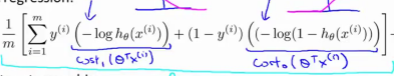

然后，再加上正则化参数。现在，按照支持向量机的惯例，事实上，我们的书写会稍微有些不同，代价函数的参数表示也会稍微有些不同。

首先，我们要除去$1/m$这一项，当然，这仅仅是由于人们使用支持向量机时，对比于逻辑回归而言，不同的习惯所致，但这里我所说的意思是：你知道，我将要做的是仅仅除去$1/m$这一项，但是，这也会得出同样的 ${{\theta }}$ 最优值，好的，因为$1/m$ 仅是个常量，因此，你知道在这个最小化问题中，无论前面是否有$1/m$ 这一项，最终我所得到的最优值${{\theta }}$都是一样的。这里我的意思是，先给你举一个样本，假定有一最小化问题：即要求当$(u-5)^2+1$取得最小值时的$u$值，这时最小值为：当$u=5$时取得最小值。

现在，如果我们想要将这个目标函数乘上常数10，这里我的最小化问题就变成了：求使得$10×(u-5)^2+10$最小的值$u$，然而，使得这里最小的$u$值仍为5。因此将一些常数乘以你的最小化项，这并不会改变最小化该方程时得到$u$值。因此，这里我所做的是删去常量$m$。也相同的，我将目标函数乘上一个常量$m$，并不会改变取得最小值时的${{\theta }}$值。

第二点概念上的变化，我们只是指在使用支持向量机时，一些如下的标准惯例，而不是逻辑回归。因此，对于逻辑回归，在目标函数中，我们有两项：第一个是训练样本的代价，第二个是我们的正则化项，我们不得不去用这一项来平衡。这就相当于我们想要最小化$A$加上正则化参数$\lambda$，然后乘以其他项$B$对吧？这里的$A$表示这里的第一项，同时我用**B**表示第二项，但不包括$\lambda$，我们不是优化这里的$A+\lambda\times B$。我们所做的是通过设置不同正则参数$\lambda$达到优化目的。这样，我们就能够权衡对应的项，是使得训练样本拟合的更好。即最小化$A$。还是保证正则参数足够小，也即是对于**B**项而言，但对于支持向量机，按照惯例，我们将使用一个不同的参数替换这里使用的$\lambda$来权衡这两项。你知道，就是第一项和第二项我们依照惯例使用一个不同的参数称为$C$，同时改为优化目标，$C×A+B$。
因此，在逻辑回归中，如果给定$\lambda$，一个非常大的值，意味着给予$B$更大的权重。而这里，就对应于将$C$ 设定为非常小的值，那么，相应的将会给$B$比给$A$更大的权重。因此，这只是一种不同的方式来控制这种权衡或者一种不同的方法，即用参数来决定是更关心第一项的优化，还是更关心第二项的优化。当然你也可以把这里的参数$C$ 考虑成$1/\lambda$，同 $1/\lambda$所扮演的角色相同，并且这两个方程或这两个表达式并不相同，因为$C=1/\lambda$，但是也并不全是这样，如果当$C=1/\lambda$时，这两个优化目标应当得到相同的值，相同的最优值 ${{\theta }}$。因此，就用它们来代替。那么，我现在删掉这里的$\lambda$，并且用常数$C$来代替。因此，这就得到了在支持向量机中我们的整个优化目标函数。然后最小化这个目标函数，得到**SVM** 学习到的参数$C$。


最后有别于逻辑回归输出的概率。在这里，我们的代价函数，当最小化代价函数，获得参数${{\theta }}$时，支持向量机所做的是它来直接预测$y$的值等于1，还是等于0。因此，这个假设函数会预测1。当$\theta^Tx$大于或者等于0时，或者等于0时，所以学习参数${{\theta }}$就是支持向量机假设函数的形式。那么，这就是支持向量机数学上的定义。

在接下来的视频中，让我们再回去从直观的角度看看优化目标，实际上是在做什么，以及SVM的假设函数将会学习什么，同时也会谈谈如何做些许修改，学习更加复杂、非线性的函数。

### 12.2 大边界的直观理解

参考视频: 12 - 2 - Large Margin Intuition (11 min).mkv

人们有时将支持向量机看作是大间距分类器。在这一部分，我将介绍其中的含义，这有助于我们直观理解**SVM**模型的假设是什么样的。


这是我的支持向量机模型的代价函数，在左边这里我画出了关于$z$的代价函数${\cos}t_1{(z)}$，此函数用于正样本，而在右边这里我画出了关于$z$的代价函数${\cos}t_0{(z)}$，横轴表示$z$，现在让我们考虑一下，最小化这些代价函数的必要条件是什么。如果你有一个正样本，$y=1$，则只有在$z>=1$时，代价函数${\cos}t_1{(z)}$才等于0。

换句话说，如果你有一个正样本，我们会希望$\theta^Tx>=1$，反之，如果$y=0$，我们观察一下，函数${\cos}t_0{(z)}$，它只有在$z<=-1$的区间里函数值为0。这是支持向量机的一个有趣性质。事实上，如果你有一个正样本$y=1$，则其实我们仅仅要求$\theta^Tx$大于等于0，就能将该样本恰当分出，这是因为如果$\theta^Tx$\>0大的话，我们的模型代价函数值为0，类似地，如果你有一个负样本，则仅需要$\theta^Tx$\<=0就会将负例正确分离，但是，支持向量机的要求更高，不仅仅要能正确分开输入的样本，即不仅仅要求$\theta^Tx$\>0，我们需要的是比0值大很多，比如大于等于1，我也想这个比0小很多，比如我希望它小于等于-1，这就相当于在支持向量机中嵌入了一个额外的安全因子，或者说安全的间距因子。

当然，逻辑回归做了类似的事情。但是让我们看一下，在支持向量机中，这个因子会导致什么结果。具体而言，我接下来会考虑一个特例。我们将这个常数$C$设置成一个非常大的值。比如我们假设$C$的值为100000或者其它非常大的数，然后来观察支持向量机会给出什么结果？


如果 $C$非常大，则最小化代价函数的时候，我们将会很希望找到一个使第一项为0的最优解。因此，让我们尝试在代价项的第一项为0的情形下理解该优化问题。比如我们可以把$C$设置成了非常大的常数，这将给我们一些关于支持向量机模型的直观感受。

$\min_\limits{\theta}C\sum_\limits{i=1}^{m}\left[y^{(i)}{\cos}t_{1}\left(\theta^{T}x^{(i)}\right)+\left(1-y^{(i)}\right){\cos}t\left(\theta^{T}x^{(i)}\right)\right]+\frac{1}{2}\sum_\limits{i=1}^{n}\theta^{2}_{j}$

我们已经看到输入一个训练样本标签为$y=1$，你想令第一项为0，你需要做的是找到一个${{\theta }}$，使得$\theta^Tx>=1$，类似地，对于一个训练样本，标签为$y=0$，为了使${\cos}t_0{(z)}$ 函数的值为0，我们需要$\theta^Tx<=-1$。因此，现在考虑我们的优化问题。选择参数，使得第一项等于0，就会导致下面的优化问题，因为我们将选择参数使第一项为0，因此这个函数的第一项为0，因此是$C$乘以0加上二分之一乘以第二项。这里第一项是$C$乘以0，因此可以将其删去，因为我知道它是0。

这将遵从以下的约束：$\theta^Tx^{(i)}>=1$，如果 $y^{(i)}$是等于1 的，$\theta^Tx^{(i)}<=-1$，如果样本$i$是一个负样本，这样当你求解这个优化问题的时候，当你最小化这个关于变量${{\theta }}$的函数的时候，你会得到一个非常有趣的决策边界。

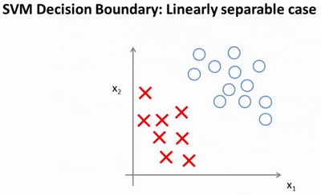

具体而言，如果你考察这样一个数据集，其中有正样本，也有负样本，可以看到这个数据集是线性可分的。我的意思是，存在一条直线把正负样本分开。当然有多条不同的直线，可以把正样本和负样本完全分开。

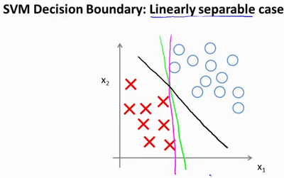

比如，这就是一个决策边界可以把正样本和负样本分开。但是多多少少这个看起来并不是非常自然是么?

或者我们可以画一条更差的决策界，这是另一条决策边界，可以将正样本和负样本分开，但仅仅是勉强分开，这些决策边界看起来都不是特别好的选择，支持向量机将会选择这个黑色的决策边界，相较于之前我用粉色或者绿色画的决策界。这条黑色的看起来好得多，黑线看起来是更稳健的决策界。在分离正样本和负样本上它显得的更好。数学上来讲，这是什么意思呢？这条黑线有更大的距离，这个距离叫做间距(**margin**)。


当画出这两条额外的蓝线，我们看到黑色的决策界和训练样本之间有更大的最短距离。然而粉线和蓝线离训练样本就非常近，在分离样本的时候就会比黑线表现差。因此，这个距离叫做支持向量机的间距，而这是支持向量机具有鲁棒性的原因，因为它努力用一个最大间距来分离样本。因此支持向量机有时被称为**大间距分类器**，而这其实是求解上一页幻灯片上优化问题的结果。

我知道你也许想知道求解上一页幻灯片中的优化问题为什么会产生这个结果？它是如何产生这个大间距分类器的呢？我知道我还没有解释这一点。

我将会从直观上略述为什么这个优化问题会产生大间距分类器。总之这个图示有助于你理解支持向量机模型的做法，即努力将正样本和负样本用最大的间距分开。


在本节课中关于大间距分类器，我想讲最后一点：我们将这个大间距分类器中的正则化因子常数$C$设置的非常大，我记得我将其设置为了100000，因此对这样的一个数据集，也许我们将选择这样的决策界，从而最大间距地分离开正样本和负样本。那么在让代价函数最小化的过程中，我们希望找出在$y=1$和$y=0$两种情况下都使得代价函数中左边的这一项尽量为零的参数。如果我们找到了这样的参数，则我们的最小化问题便转变成：


事实上，支持向量机现在要比这个大间距分类器所体现得更成熟，尤其是当你使用大间距分类器的时候，你的学习算法会受异常点(outlier) 的影响。比如我们加入一个额外的正样本。


在这里，如果你加了这个样本，为了将样本用最大间距分开，也许我最终会得到一条类似这样的决策界，对么？就是这条粉色的线，仅仅基于一个异常值，仅仅基于一个样本，就将我的决策界从这条黑线变到这条粉线，这实在是不明智的。而如果正则化参数$C$，设置的非常大，这事实上正是支持向量机将会做的。它将决策界，从黑线变到了粉线，但是如果$C$ 设置的小一点，**如果你将C设置的不要太大，则你最终会得到这条黑线，**当然数据如果不是线性可分的，如果你在这里有一些正样本或者你在这里有一些负样本，则支持向量机也会将它们恰当分开。因此，大间距分类器的描述，仅仅是从直观上给出了正则化参数$C$非常大的情形，同时，要提醒你$C$的作用类似于$1/\lambda$，$\lambda$是我们之前使用过的正则化参数。这只是$C$非常大的情形，或者等价地 $\lambda$ 非常小的情形。你最终会得到类似粉线这样的决策界，但是实际上应用支持向量机的时候，**当$C$不是非常非常大的时候，它可以忽略掉一些异常点的影响，得到更好的决策界。**甚至当你的数据不是线性可分的时候，支持向量机也可以给出好的结果。

回顾 $C=1/\lambda$，因此：

$C$ 较大时，相当于 $\lambda$ 较小，可能会导致过拟合，高方差。

$C$ 较小时，相当于$\lambda$较大，可能会导致低拟合，高偏差。

我们稍后会介绍支持向量机的偏差和方差，希望在那时候关于如何处理参数的这种平衡会变得更加清晰。我希望，这节课给出了一些关于为什么支持向量机被看做大间距分类器的直观理解。它用最大间距将样本区分开，尽管从技术上讲，这只有当参数$C$是非常大的时候是真的，但是它对于理解支持向量机是有益的。

本节课中我们略去了一步，那就是我们在幻灯片中给出的优化问题。为什么会是这样的？它是如何得出大间距分类器的？我在本节中没有讲解，在下一节课中，我将略述这些问题背后的数学原理，来解释这个优化问题是如何得到一个大间距分类器的。

### 12.3 大边界分类背后的数学（选修）

参考视频: 12 - 3 - Mathematics Behind Large Margin Classification (Optional) (20 min).mkv

在本节课中，我将介绍一些大间隔分类背后的数学原理。本节为选修部分，你完全可以跳过它，但是听听这节课可能让你对支持向量机中的优化问题，以及如何得到大间距分类器，产生更好的直观理解。


首先，让我来给大家复习一下关于向量内积的知识。假设我有两个向量，$u$和$v$，我将它们写在这里。两个都是二维向量，我们看一下，$u^T v$的结果。$u^T v$也叫做向量$u$和$v$之间的内积。由于是二维向量，我可以将它们画在这个图上。我们说，这就是向量$u$即在横轴上，取值为某个${{u}_{1}}$，而在纵轴上，高度是某个${{u}_{2}}$作为$u$的第二个分量。现在，很容易计算的一个量就是向量$u$的范数。$\left\| u \right\|$表示$u$的范数，即$u$的长度，即向量$u$的欧几里得长度。根据毕达哥拉斯定理，$\left\| u \right\|=\sqrt{u_{1}^{2}+u_{2}^{2}}$，这是向量$u$的长度，它是一个实数。现在你知道了这个的长度是多少了。我刚刚画的这个向量的长度就知道了。

现在让我们回头来看向量$v$ ，因为我们想计算内积。$v$是另一个向量，它的两个分量${{v}_{1}}$和${{v}_{2}}$是已知的。向量$v$可以画在这里，现在让我们来看看如何计算$u$和$v$之间的内积。这就是具体做法，我们将向量$v$投影到向量$u$上，我们做一个直角投影，或者说一个90度投影将其投影到$u$上，接下来我度量这条红线的长度。我称这条红线的长度为$p$，因此$p$就是长度，或者说是向量$v$投影到向量$u$上的量，我将它写下来，$p$是$v$投影到向量$u$上的长度，因此可以将${{u}^{T}}v=p\centerdot \left\| u \right\|$，或者说$u$的长度。这是计算内积的一种方法。如果你从几何上画出$p$的值，同时画出$u$的范数，你也会同样地计算出内积，答案是一样的。另一个计算公式是：$u^T v$就是$\left[ {{u}_{1}}\text{ }{{u}_{2}} \right]$ 这个一行两列的矩阵乘以$v$。因此可以得到${{u}_{1}}\times {{v}_{1}}+{{u}_{2}}\times {{v}_{2}}$。根据线性代数的知识，这两个公式会给出同样的结果。顺便说一句，$u^Tv=v^Tu$。因此如果你将$u$和$v$交换位置，将$u$投影到$v$上，而不是将$v$投影到$u$上，然后做同样地计算，只是把$u$和$v$的位置交换一下，你事实上可以得到同样的结果。申明一点，在这个等式中$u$的范数是一个实数，$p$也是一个实数，因此$u^T v$就是两个实数正常相乘。

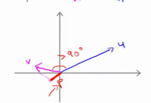

最后一点，需要注意的就是$p$值，$p$事实上是有符号的，即它可能是正值，也可能是负值。我的意思是说，如果$u$是一个类似这样的向量，$v$是一个类似这样的向量，$u$和$v$之间的夹角大于90度，则如果将$v$投影到$u$上，会得到这样的一个投影，这是$p$的长度，在这个情形下我们仍然有${{u}^{T}}v$是等于$p$乘以$u$的范数。唯一一点不同的是$p$在这里是负的。在内积计算中，如果$u$和$v$之间的夹角小于90度，那么那条红线的长度$p$是正值。然而如果这个夹角大于90度，则$p$将会是负的。就是这个小线段的长度是负的。如果它们之间的夹角大于90度，两个向量之间的内积也是负的。这就是关于向量内积的知识。我们接下来将会使用这些关于向量内积的性质试图来理解支持向量机中的目标函数。

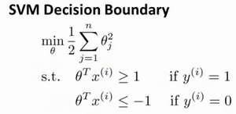

这就是我们先前给出的支持向量机模型中的目标函数。为了讲解方便，我做一点简化，仅仅是为了让目标函数更容易被分析。


我接下来忽略掉截距，令${{\theta }_{0}}=0$，这样更容易画示意图。我将特征数$n$置为2，因此我们仅有两个特征${{x}_{1}},{{x}_{2}}$，现在我们来看一下目标函数，支持向量机的优化目标函数。当我们仅有两个特征，即$n=2$时，这个式子可以写作：$\frac{1}{2}\left({\theta_1^2+\theta_2^2}\right)=\frac{1}{2}\left(\sqrt{\theta_1^2+\theta_2^2}\right)^2$，我们只有两个参数${{\theta }_{1}},{{\theta }_{2}}$。你可能注意到括号里面的这一项是向量${{\theta }}$的范数，或者说是向量${{\theta }}$的长度。我的意思是如果我们将向量${{\theta }}$写出来，那么我刚刚画红线的这一项就是向量${{\theta }}$的长度或范数。这里我们用的是之前学过的向量范数的定义，事实上这就等于向量${{\theta }}$的长度。

当然你可以将其写作${{\theta }_{0}}\text{,}{{\theta }_{1}},{{\theta }_{2}}$，如果${{\theta }_{0}}=0$，那就是${{\theta }_{1}},{{\theta }_{2}}$的长度。在这里我将忽略${{\theta }_{0}}$，这样来写$\theta$的范数，它仅仅和${{\theta }_{1}},{{\theta }_{2}}$有关。但是，数学上不管你是否包含，其实并没有差别，因此在我们接下来的推导中去掉${{\theta }_{0}}$不会有影响这意味着我们的目标函数是等于$\frac{1}{2}\left\| \theta \right\|^2$。因此支持向量机做的全部事情，就是**极小化参数向量**${{\theta }}$**范数的平方，或者说长度的平方**。

现在我将要看看这些项：$\theta^{T}x$更深入地理解它们的含义。给定参数向量$\theta $给定一个样本$x$，这等于什么呢?在前一页幻灯片上，我们画出了在不同情形下，$u^Tv$的示意图，我们将会使用这些概念，$\theta $和$x^{(i)}$就类似于$u$和$v$ 。


让我们看一下示意图：我们考察一个单一的训练样本，我有一个正样本在这里，用一个叉来表示这个样本$x^{(i)}$，意思是在水平轴上取值为$x_1^{(i)}$，在竖直轴上取值为$x_2^{(i)}$。这就是我画出的训练样本。尽管我没有将其真的看做向量。它事实上就是一个始于原点，终点位置在这个训练样本点的向量。现在，我们有一个参数向量我会将它也画成向量。我将$θ_1$画在横轴这里，将$θ_2$ 画在纵轴这里，那么内积$θ^T x^{(i)}$ 将会是什么呢？

使用我们之前的方法，我们计算的方式就是我将训练样本投影到参数向量${{\theta }}$，然后我来看一看这个线段的长度，我将它画成红色。我将它称为$p^{(i)}$用来表示这是第 $i$个训练样本在参数向量${{\theta }}$上的投影。根据我们之前幻灯片的内容，我们知道的是$θ^Tx^{(i)}$将会等于$p$ 乘以向量 $θ$ 的长度或范数。这就等于$\theta_1\cdot{x_1^{(i)}}+\theta_2\cdot{x_2^{(i)}}$。这两种方式是等价的，都可以用来计算$θ$和$x^{(i)}$之间的内积。

这告诉了我们什么呢？这里表达的意思是：这个$θ^Tx^{(i)}>=1$  或者$θ^Tx^{(i)}<-1$的,约束是可以被$p^{(i)}\cdot{x}>=1$这个约束所代替的。因为$θ^Tx^{(i)}=p^{(i)}\cdot{\left\| \theta \right\|}$ ，将其写入我们的优化目标。我们将会得到没有了约束，$θ^Tx^{(i)}$而变成了$p^{(i)}\cdot{\left\| \theta \right\|}$。


需要提醒一点，我们之前曾讲过这个优化目标函数可以被写成等于$\frac{1}{2}\left\| \theta \right\|^2$。

现在让我们考虑下面这里的训练样本。现在，继续使用之前的简化，即${{\theta }_{0}}=0$，我们来看一下支持向量机会选择什么样的决策界。这是一种选择，我们假设支持向量机会选择这个决策边界。这不是一个非常好的选择，因为它的间距很小。这个决策界离训练样本的距离很近。我们来看一下为什么支持向量机不会选择它。

对于这样选择的参数${{\theta }}$，可以看到参数向量${{\theta }}$事实上是和决策界是90度正交的，因此这个绿色的决策界对应着一个参数向量${{\theta }}$这个方向,顺便提一句${{\theta }_{0}}=0$的简化仅仅意味着决策界必须通过原点$(0,0)$。现在让我们看一下这对于优化目标函数意味着什么。


比如这个样本，我们假设它是我的第一个样本$x^{(1)}$，如果我考察这个样本到参数${{\theta }}$的投影，投影是这个短的红线段，就等于$p^{(1)}$，它非常短。类似地，这个样本如果它恰好是$x^{(2)}$，我的第二个训练样本，则它到${{\theta }}$的投影在这里。我将它画成粉色，这个短的粉色线段是$p^{(2)}$，即第二个样本到我的参数向量${{\theta }}$的投影。因此，这个投影非常短。$p^{(2)}$事实上是一个负值，$p^{(2)}$是在相反的方向，这个向量和参数向量${{\theta }}$的夹角大于90度，$p^{(2)}$的值小于0。

我们会发现这些$p^{(i)}$将会是非常小的数，因此当我们考察优化目标函数的时候，对于正样本而言，我们需要$p^{(i)}\cdot{\left\| \theta \right\|}>=1$,但是如果 $p^{(i)}$在这里非常小,那就意味着我们需要${{\theta }}$的范数非常大.因为如果 $p^{(1)}$ 很小,而我们希望$p^{(1)}\cdot{\left\| \theta \right\|}>=1$,令其实现的唯一的办法就是这两个数较大。如果 $p^{(1)}$ 小，我们就希望${{\theta }}$的范数大。类似地，对于负样本而言我们需要$p^{(2)}\cdot{\left\|\theta \right\|}<=-1$。我们已经在这个样本中看到$p^{(2)}$会是一个非常小的数，因此唯一的办法就是${{\theta }}$的范数变大。但是我们的目标函数是希望找到一个参数${{\theta }}$，它的范数是小的。因此，这看起来不像是一个好的参数向量${{\theta }}$的选择。


相反的，来看一个不同的决策边界。比如说，支持向量机选择了这个决策界，现在状况会有很大不同。如果这是决策界，这就是相对应的参数${{\theta }}$的方向，因此，在这个决策界之下，垂直线是决策界。使用线性代数的知识，可以说明，这个绿色的决策界有一个垂直于它的向量${{\theta }}$。现在如果你考察你的数据在横轴$x$上的投影，比如这个我之前提到的样本，我的样本$x^{(1)}$，当我将它投影到横轴$x$上，或说投影到${{\theta }}$上，就会得到这样$p^{(1)}$。它的长度是$p^{(1)}$，另一个样本，那个样本是$x^{(2)}$。我做同样的投影，我会发现，$p^{(2)}$的长度是负值。你会注意到现在$p^{(1)}$ 和$p^{(2)}$这些投影长度是长多了。如果我们仍然要满足这些约束，$P^{(i)}\cdot{\left\| \theta \right\|}$\>1，则因为$p^{(1)}$变大了，${{\theta }}$的范数就可以变小了。因此这意味着通过选择右边的决策界，而不是左边的那个，支持向量机可以使参数${{\theta }}$的范数变小很多。因此，如果我们想令${{\theta }}$的范数变小，从而令${{\theta }}$范数的平方变小，就能让支持向量机选择右边的决策界。这就是支持向量机如何能有效地产生大间距分类的原因。

看这条绿线，这个绿色的决策界。我们希望正样本和负样本投影到$\theta$的值大。要做到这一点的唯一方式就是选择这条绿线做决策界。这是大间距决策界来区分开正样本和负样本这个间距的值。这个间距的值就是$p^{(1)},p^{(2)},p^{(3)}$等等的值。通过让间距变大，即通过这些$p^{(1)},p^{(2)},p^{(3)}$等等的值，支持向量机最终可以找到一个较小的${{\theta }}$范数。这正是支持向量机中最小化目标函数的目的。

以上就是为什么支持向量机最终会找到大间距分类器的原因。因为它试图极大化这些$p^{(i)}$的范数，它们是训练样本到决策边界的距离。最后一点，我们的推导自始至终使用了这个简化假设，就是参数$θ_0=0$。

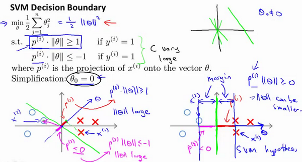

就像我之前提到的。这个的作用是：$θ_0=0$的意思是我们让决策界通过原点。如果你令$θ_0$不是0的话，含义就是你希望决策界不通过原点。我将不会做全部的推导。实际上，支持向量机产生大间距分类器的结论，会被证明同样成立，证明方式是非常类似的，是我们刚刚做的证明的推广。

之前视频中说过，即便$θ_0$不等于0，支持向量机要做的事情都是优化这个目标函数对应着$C$值非常大的情况，但是可以说明的是，即便$θ_0$不等于0，支持向量机仍然会找到正样本和负样本之间的大间距分隔。

总之，我们解释了为什么支持向量机是一个大间距分类器。在下一节我们，将开始讨论如何利用支持向量机的原理，应用它们建立一个复杂的非线性分类器。

### 12.4 核函数1

参考视频: 12 - 4 - Kernels I (16 min).mkv

回顾我们之前讨论过可以使用高级数的多项式模型来解决无法用直线进行分隔的分类问题：


为了获得上图所示的判定边界，我们的模型可能是${{\theta }_{0}}+{{\theta }_{1}}{{x}_{1}}+{{\theta }_{2}}{{x}_{2}}+{{\theta }_{3}}{{x}_{1}}{{x}_{2}}+{{\theta }_{4}}x_{1}^{2}+{{\theta }_{5}}x_{2}^{2}+\cdots $的形式。

我们可以用一系列的新的特征$f$来替换模型中的每一项。例如令：
${{f}_{1}}={{x}_{1}},{{f}_{2}}={{x}_{2}},{{f}_{3}}={{x}_{1}}{{x}_{2}},{{f}_{4}}=x_{1}^{2},{{f}_{5}}=x_{2}^{2}$

...得到$h_θ(x)={{\theta }_{1}}f_1+{{\theta }_{2}}f_2+...+{{\theta }_{n}}f_n$。然而，除了对原有的特征进行组合以外，有没有更好的方法来构造$f_1,f_2,f_3$？我们可以利用核函数来计算出新的特征。

给定一个训练样本$x$，我们利用$x$的各个特征与我们预先选定的**地标**(**landmarks**)$l^{(1)},l^{(2)},l^{(3)}$的近似程度来选取新的特征$f_1,f_2,f_3$。


例如：${{f}_{1}}=similarity(x,{{l}^{(1)}})=e(-\frac{{{\left\| x-{{l}^{(1)}} \right\|}^{2}}}{2{{\sigma }^{2}}})$

其中：${{\left\| x-{{l}^{(1)}} \right\|}^{2}}=\sum{_{j=1}^{n}}{{({{x}_{j}}-l_{j}^{(1)})}^{2}}$，为实例$x$中所有特征与地标$l^{(1)}$之间的距离的和。上例中的$similarity(x,{{l}^{(1)}})$就是核函数，具体而言，这里是一个**高斯核函数**(**Gaussian Kernel**)。 **注：这个函数与正态分布没什么实际上的关系，只是看上去像而已。**

这些地标的作用是什么？如果一个训练样本$x$与地标$l$之间的距离近似于0，则新特征 $f$近似于$e^{-0}=1$，如果训练样本$x$与地标$l$之间距离较远，则$f$近似于$e^{-(一个较大的数)}=0$。

假设我们的训练样本含有两个特征[$x_{1}$ $x{_2}$]，给定地标$l^{(1)}$与不同的$\sigma$值，见下图：


图中水平面的坐标为 $x_{1}$，$x_{2}$而垂直坐标轴代表$f$。可以看出，只有当$x$与$l^{(1)}$重合时$f$才具有最大值。随着$x$的改变$f$值改变的速率受到$\sigma^2$的控制。

在下图中，当样本处于洋红色的点位置处，因为其离$l^{(1)}$更近，但是离$l^{(2)}$和$l^{(3)}$较远，因此$f_1$接近1，而$f_2$,$f_3$接近0。因此$h_θ(x)=θ_0+θ_1f_1+θ_2f_2+θ_1f_3>0$，因此预测$y=1$。同理可以求出，对于离$l^{(2)}$较近的绿色点，也预测$y=1$，但是对于蓝绿色的点，因为其离三个地标都较远，预测$y=0$。


这样，图中红色的封闭曲线所表示的范围，便是我们依据一个单一的训练样本和我们选取的地标所得出的判定边界，在预测时，我们采用的特征不是训练样本本身的特征，而是通过核函数计算出的新特征$f_1,f_2,f_3$。

### 12.5 核函数2

参考视频: 12 - 5 - Kernels II (16 min).mkv

在上一节视频里，我们讨论了核函数这个想法，以及怎样利用它去实现支持向量机的一些新特性。在这一节视频中，我将补充一些缺失的细节，并简单的介绍一下怎么在实际中使用应用这些想法。

如何选择地标？

我们通常是根据训练集的数量选择地标的数量，即如果训练集中有$m$个样本，则我们选取$m$个地标，并且令:$l^{(1)}=x^{(1)},l^{(2)}=x^{(2)},.....,l^{(m)}=x^{(m)}$。这样做的好处在于：现在我们得到的新特征是建立在原有特征与训练集中所有其他特征之间距离的基础之上的，即：


下面我们将核函数运用到支持向量机中，修改我们的支持向量机假设为：

• 给定$x$，计算新特征$f$，当$θ^Tf>=0$ 时，预测 $y=1$，否则反之。 

相应地修改代价函数为：$\sum{_{j=1}^{n=m}}\theta _{j}^{2}={{\theta}^{T}}\theta $，

$min C\sum\limits_{i=1}^{m}{[{{y}^{(i)}}cos {{t}_{1}}}( {{\theta }^{T}}{{f}^{(i)}})+(1-{{y}^{(i)}})cos {{t}_{0}}( {{\theta }^{T}}{{f}^{(i)}})]+\frac{1}{2}\sum\limits_{j=1}^{n=m}{\theta _{j}^{2}}$
在具体实施过程中，我们还需要对最后的正则化项进行些微调整，在计算$\sum{_{j=1}^{n=m}}\theta _{j}^{2}={{\theta}^{T}}\theta $时，我们用$θ^TMθ$代替$θ^Tθ$，其中$M$是根据我们选择的核函数而不同的一个矩阵。这样做的原因是为了简化计算。

理论上讲，我们也可以在逻辑回归中使用核函数，但是上面使用 $M$来简化计算的方法不适用与逻辑回归，因此计算将非常耗费时间。

在此，我们不介绍最小化支持向量机的代价函数的方法，你可以使用现有的软件包（如**liblinear**,**libsvm**等）。在使用这些软件包最小化我们的代价函数之前，我们通常需要编写核函数，并且如果我们使用高斯核函数，那么在使用之前进行特征缩放是非常必要的。

另外，支持向量机也可以不使用核函数，不使用核函数又称为**线性核函数**(**linear kernel**)，当我们不采用非常复杂的函数，或者我们的训练集特征非常多而样本非常少的时候，可以采用这种不带核函数的支持向量机。

下面是支持向量机的两个参数$C$和$\sigma$的影响：

$C=1/\lambda$

$C$ 较大时，相当于$\lambda$较小，可能会导致过拟合，高方差；

$C$ 较小时，相当于$\lambda$较大，可能会导致低拟合，高偏差；

$\sigma$较大时，可能会导致低方差，高偏差；

$\sigma$较小时，可能会导致低偏差，高方差。

如果你看了本周的编程作业，你就能亲自实现这些想法，并亲眼看到这些效果。这就是利用核函数的支持向量机算法，希望这些关于偏差和方差的讨论，能给你一些对于算法结果预期的直观印象。

### 12.6 使用支持向量机

参考视频: 12 - 6 - Using An SVM (21 min).mkv

目前为止，我们已经讨论了**SVM**比较抽象的层面，在这个视频中我将要讨论到为了运行或者运用**SVM**。你实际上所需要的一些东西：支持向量机算法，提出了一个特别优化的问题。但是就如在之前的视频中我简单提到的，我真的不建议你自己写软件来求解参数${{\theta }}$，因此由于今天我们中的很少人，或者其实没有人考虑过自己写代码来转换矩阵，或求一个数的平方根等我们只是知道如何去调用库函数来实现这些功能。同样的，用以解决**SVM**最优化问题的软件很复杂，且已经有研究者做了很多年数值优化了。因此你提出好的软件库和好的软件包来做这样一些事儿。然后强烈建议使用高优化软件库中的一个，而不是尝试自己落实一些数据。有许多好的软件库，我正好用得最多的两个是**liblinear**和**libsvm**，但是真的有很多软件库可以用来做这件事儿。你可以连接许多你可能会用来编写学习算法的主要编程语言。

在高斯核函数之外我们还有其他一些选择，如：

多项式核函数（**Polynomial Kerne**l）

字符串核函数（**String kernel**）

卡方核函数（ **chi-square kernel**）

直方图交集核函数（**histogram intersection kernel**）

等等...

这些核函数的目标也都是根据训练集和地标之间的距离来构建新特征，这些核函数需要满足Mercer's定理，才能被支持向量机的优化软件正确处理。

多类分类问题

假设我们利用之前介绍的一对多方法来解决一个多类分类问题。如果一共有$k$个类，则我们需要$k$个模型，以及$k$个参数向量${{\theta }}$。我们同样也可以训练$k$个支持向量机来解决多类分类问题。但是大多数支持向量机软件包都有内置的多类分类功能，我们只要直接使用即可。

尽管你不去写你自己的**SVM**的优化软件，但是你也需要做几件事：

1、是提出参数$C$的选择。我们在之前的视频中讨论过误差/方差在这方面的性质。

2、你也需要选择内核参数或你想要使用的相似函数，其中一个选择是：我们选择不需要任何内核参数，没有内核参数的理念，也叫线性核函数。因此，如果有人说他使用了线性核的**SVM**（支持向量机），这就意味这他使用了不带有核函数的**SVM**（支持向量机）。

从逻辑回归模型，我们得到了支持向量机模型，在两者之间，我们应该如何选择呢？

**下面是一些普遍使用的准则：**

$n$为特征数，$m$为训练样本数。

(1)如果相较于$m$而言，$n$要大许多，即训练集数据量不够支持我们训练一个复杂的非线性模型，我们选用逻辑回归模型或者不带核函数的支持向量机。

(2)如果$n$较小，而且$m$大小中等，例如$n$在 1-1000 之间，而$m$在10-10000之间，使用高斯核函数的支持向量机。

(3)如果$n$较小，而$m$较大，例如$n$在1-1000之间，而$m$大于50000，则使用支持向量机会非常慢，解决方案是创造、增加更多的特征，然后使用逻辑回归或不带核函数的支持向量机。

值得一提的是，神经网络在以上三种情况下都可能会有较好的表现，但是训练神经网络可能非常慢，选择支持向量机的原因主要在于它的代价函数是凸函数，不存在局部最小值。

今天的**SVM**包会工作得很好，但是它们仍然会有一些慢。当你有非常非常大的训练集，且用高斯核函数是在这种情况下，我经常会做的是尝试手动地创建，拥有更多的特征变量，然后用逻辑回归或者不带核函数的支持向量机。如果你看到这个幻灯片，看到了逻辑回归，或者不带核函数的支持向量机。在这个两个地方，我把它们放在一起是有原因的。原因是：逻辑回归和不带核函数的支持向量机它们都是非常相似的算法，不管是逻辑回归还是不带核函数的**SVM**，通常都会做相似的事情，并给出相似的结果。但是根据你实现的情况，其中一个可能会比另一个更加有效。但是在其中一个算法应用的地方，逻辑回归或不带核函数的**SVM**另一个也很有可能很有效。但是随着**SVM**的复杂度增加，当你使用不同的内核函数来学习复杂的非线性函数时，这个体系，你知道的，当你有多达1万（10,000）的样本时，也可能是5万（50,000），你的特征变量的数量这是相当大的。那是一个非常常见的体系，也许在这个体系里，不带核函数的支持向量机就会表现得相当突出。你可以做比这困难得多需要逻辑回归的事情。

最后，神经网络使用于什么时候呢？ 对于所有的这些问题，对于所有的这些不同体系一个设计得很好的神经网络也很有可能会非常有效。有一个缺点是，或者说是有时可能不会使用神经网络的原因是：对于许多这样的问题，神经网络训练起来可能会特别慢，但是如果你有一个非常好的**SVM**实现包，它可能会运行得比较快比神经网络快很多，尽管我们在此之前没有展示，但是事实证明，**SVM**具有的优化问题，是一种凸优化问题。因此，好的**SVM**优化软件包总是会找到全局最小值，或者接近它的值。对于**SVM**你不需要担心局部最优。在实际应用中，局部最优不是神经网络所需要解决的一个重大问题，所以这是你在使用**SVM**的时候不需要太去担心的一个问题。根据你的问题，神经网络可能会比**SVM**慢，尤其是在这样一个体系中，至于这里给出的参考，看上去有些模糊，如果你在考虑一些问题，这些参考会有一些模糊，但是我仍然不能完全确定，我是该用这个算法还是改用那个算法，这个没有太大关系，当我遇到机器学习问题的时候，有时它确实不清楚这是否是最好的算法，但是就如在之前的视频中看到的算法确实很重要。但是通常更加重要的是：你有多少数据，你有多熟练是否擅长做误差分析和排除学习算法，指出如何设定新的特征变量和找出其他能决定你学习算法的变量等方面，通常这些方面会比你使用逻辑回归还是**SVM**这方面更加重要。但是，已经说过了，**SVM**仍然被广泛认为是一种最强大的学习算法，这是一个体系，包含了什么时候一个有效的方法去学习复杂的非线性函数。因此，实际上与逻辑回归、神经网络、**SVM**一起使用这些方法来提高学习算法，我认为你会很好地建立很有技术的状态。（编者注：当时**GPU**计算比较慢，神经网络还不流行。）

机器学习系统对于一个宽泛的应用领域来说，这是另一个在你军械库里非常强大的工具，你可以把它应用到很多地方，如硅谷、在工业、学术等领域建立许多高性能的机器学习系统。

# 第8周

[TOC]

## 十三、聚类(Clustering)

### 13.1 无监督学习：简介

参考视频: 13 - 1 - Unsupervised Learning\_ Introduction (3 min).mkv

在这个视频中，我将开始介绍聚类算法。这将是一个激动人心的时刻，因为这是我们学习的第一个非监督学习算法。我们将要让计算机学习无标签数据，而不是此前的标签数据。

那么，什么是非监督学习呢？在课程的一开始，我曾简单的介绍过非监督学习，然而，我们还是有必要将其与监督学习做一下比较。

在一个典型的监督学习中，我们有一个有标签的训练集，我们的目标是找到能够区分正样本和负样本的决策边界，在这里的监督学习中，我们有一系列标签，我们需要据此拟合一个假设函数。与此不同的是，在非监督学习中，我们的数据没有附带任何标签，我们拿到的数据就是这样的：


在这里我们有一系列点，却没有标签。因此，我们的训练集可以写成只有$x^{(1)}$,$x^{(2)}$…..一直到$x^{(m)}$。我们没有任何标签$y$。因此，图上画的这些点没有标签信息。也就是说，在非监督学习中，我们需要将一系列无标签的训练数据，输入到一个算法中，然后我们告诉这个算法，快去为我们找找这个数据的内在结构给定数据。我们可能需要某种算法帮助我们寻找一种结构。图上的数据看起来可以分成两个分开的点集（称为簇），一个能够找到我圈出的这些点集的算法，就被称为聚类算法。


这将是我们介绍的第一个非监督学习算法。当然，此后我们还将提到其他类型的非监督学习算法，它们可以为我们找到其他类型的结构或者其他的一些模式，而不只是簇。

我们将先介绍聚类算法。此后，我们将陆续介绍其他算法。那么聚类算法一般用来做什么呢？

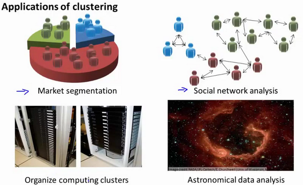

在这门课程的早些时候，我曾经列举过一些应用：比如市场分割。也许你在数据库中存储了许多客户的信息，而你希望将他们分成不同的客户群，这样你可以对不同类型的客户分别销售产品或者分别提供更适合的服务。社交网络分析：事实上有许多研究人员正在研究这样一些内容，他们关注一群人，关注社交网络，例如**Facebook**，**Google+**，或者是其他的一些信息，比如说：你经常跟哪些人联系，而这些人又经常给哪些人发邮件，由此找到关系密切的人群。因此，这可能需要另一个聚类算法，你希望用它发现社交网络中关系密切的朋友。我有一个朋友正在研究这个问题，他希望使用聚类算法来更好的组织计算机集群，或者更好的管理数据中心。因为如果你知道数据中心中，那些计算机经常协作工作。那么，你可以重新分配资源，重新布局网络。由此优化数据中心，优化数据通信。

最后，我实际上还在研究如何利用聚类算法了解星系的形成。然后用这个知识，了解一些天文学上的细节问题。好的，这就是聚类算法。这将是我们介绍的第一个非监督学习算法。在下一个视频中，我们将开始介绍一个具体的聚类算法。

### 13.2 K-均值算法

参考视频: 13 - 2 - K-Means Algorithm (13 min).mkv

**K-均值**是最普及的聚类算法，算法接受一个未标记的数据集，然后将数据聚类成不同的组。

**K-均值**是一个迭代算法，假设我们想要将数据聚类成n个组，其方法为:

首先选择$K$个随机的点，称为**聚类中心**（**cluster centroids**）；

对于数据集中的每一个数据，按照距离$K$个中心点的距离，将其与距离最近的中心点关联起来，与同一个中心点关联的所有点聚成一类。

计算每一个组的平均值，将该组所关联的中心点移动到平均值的位置。

重复步骤2-4直至中心点不再变化。

下面是一个聚类示例：


迭代 1 次


迭代 3 次


迭代 10 次

用$μ^1$,$μ^2$,...,$μ^k$ 来表示聚类中心，用$c^{(1)}$,$c^{(2)}$,...,$c^{(m)}$来存储与第$i$个实例数据最近的聚类中心的索引，**K-均值**算法的伪代码如下：

```
Repeat {

for i = 1 to m

c(i) := index (form 1 to K) of cluster centroid closest to x(i)

for k = 1 to K

μk := average (mean) of points assigned to cluster k

}
```

算法分为两个步骤，第一个**for**循环是赋值步骤，即：对于每一个样例$i$，计算其应该属于的类。第二个**for**循环是聚类中心的移动，即：对于每一个类$K$，重新计算该类的质心。

**K-均值**算法也可以很便利地用于将数据分为许多不同组，即使在没有非常明显区分的组群的情况下也可以。下图所示的数据集包含身高和体重两项特征构成的，利用**K-均值**算法将数据分为三类，用于帮助确定将要生产的T-恤衫的三种尺寸。


### 13.3 优化目标

参考视频: 13 - 3 - Optimization Objective (7 min).mkv

K-均值最小化问题，是要最小化所有的数据点与其所关联的聚类中心点之间的距离之和，因此
K-均值的代价函数（又称**畸变函数** **Distortion function**）为：

$$J(c^{(1)},...,c^{(m)},μ_1,...,μ_K)=\dfrac {1}{m}\sum^{m}_{i=1}\left\| X^{\left( i\right) }-\mu_{c^{(i)}}\right\| ^{2}$$

其中${{\mu }_{{{c}^{(i)}}}}$代表与${{x}^{(i)}}$最近的聚类中心点。
我们的的优化目标便是找出使得代价函数最小的 $c^{(1)}$,$c^{(2)}$,...,$c^{(m)}$和$μ^1$,$μ^2$,...,$μ^k$：


回顾刚才给出的:
**K-均值**迭代算法，我们知道，第一个循环是用于减小$c^{(i)}$引起的代价，而第二个循环则是用于减小${{\mu }_{i}}$引起的代价。迭代的过程一定会是每一次迭代都在减小代价函数，不然便是出现了错误。

### 13.4 随机初始化

参考视频: 13 - 4 - Random Initialization (8 min).mkv

在运行K-均值算法的之前，我们首先要随机初始化所有的聚类中心点，下面介绍怎样做：

1. 我们应该选择$K<m$，即聚类中心点的个数要小于所有训练集实例的数量
2. 随机选择$K$个训练实例，然后令$K$个聚类中心分别与这$K$个训练实例相等

**K-均值**的一个问题在于，它有可能会停留在一个局部最小值处，而这取决于初始化的情况。


为了解决这个问题，我们通常需要多次运行**K-均值**算法，每一次都重新进行随机初始化，最后再比较多次运行**K-均值**的结果，选择代价函数最小的结果。这种方法在$K$较小的时候（2--10）还是可行的，但是如果$K$较大，这么做也可能不会有明显地改善。

### 13.5 选择聚类数

参考视频: 13 - 5 - Choosing the Number of Clusters (8 min).mkv

没有所谓最好的选择聚类数的方法，通常是需要根据不同的问题，人工进行选择的。选择的时候思考我们运用**K-均值**算法聚类的动机是什么，然后选择能最好服务于该目的标聚类数。

当人们在讨论，选择聚类数目的方法时，有一个可能会谈及的方法叫作“肘部法则”。关于“肘部法则”，我们所需要做的是改变$K$值，也就是聚类类别数目的总数。我们用一个聚类来运行**K均值**聚类方法。这就意味着，所有的数据都会分到一个聚类里，然后计算成本函数或者计算畸变函数$J$。$K$代表聚类数字。


我们可能会得到一条类似于这样的曲线。像一个人的肘部。这就是“肘部法则”所做的，让我们来看这样一个图，看起来就好像有一个很清楚的肘在那儿。好像人的手臂，如果你伸出你的胳膊，那么这就是你的肩关节、肘关节、手。这就是“肘部法则”。你会发现这种模式，它的畸变值会迅速下降，从1到2，从2到3之后，你会在3的时候达到一个肘点。在此之后，畸变值就下降的非常慢，看起来就像使用3个聚类来进行聚类是正确的，这是因为那个点是曲线的肘点，畸变值下降得很快，$K=3$之后就下降得很慢，那么我们就选$K=3$。当你应用“肘部法则”的时候，如果你得到了一个像上面这样的图，那么这将是一种用来选择聚类个数的合理方法。

例如，我们的 T-恤制造例子中，我们要将用户按照身材聚类，我们可以分成3个尺寸:$S,M,L$，也可以分成5个尺寸$XS,S,M,L,XL$，这样的选择是建立在回答“聚类后我们制造的T-恤是否能较好地适合我们的客户”这个问题的基础上作出的。

**聚类参考资料：**

1.相似度/距离计算方法总结

(1). 闵可夫斯基距离**Minkowski**/（其中欧式距离：$p=2$) 

$dist(X,Y)={{\left( {{\sum\limits_{i=1}^{n}{\left| {{x}_{i}}-{{y}_{i}} \right|}}^{p}} \right)}^{\frac{1}{p}}}$

(2). 杰卡德相似系数(**Jaccard**)：

$J(A,B)=\frac{\left| A\cap B \right|}{\left|A\cup B \right|}$

(3). 余弦相似度(**cosine similarity**)：

$n$维向量$x$和$y$的夹角记做$\theta$，根据余弦定理，其余弦值为：

$cos (\theta )=\frac{{{x}^{T}}y}{\left|x \right|\cdot \left| y \right|}=\frac{\sum\limits_{i=1}^{n}{{{x}_{i}}{{y}_{i}}}}{\sqrt{\sum\limits_{i=1}^{n}{{{x}_{i}}^{2}}}\sqrt{\sum\limits_{i=1}^{n}{{{y}_{i}}^{2}}}}$
(4). Pearson皮尔逊相关系数：
${{\rho }_{XY}}=\frac{\operatorname{cov}(X,Y)}{{{\sigma }_{X}}{{\sigma }_{Y}}}=\frac{E[(X-{{\mu }_{X}})(Y-{{\mu }_{Y}})]}{{{\sigma }_{X}}{{\sigma }_{Y}}}=\frac{\sum\limits_{i=1}^{n}{(x-{{\mu }_{X}})(y-{{\mu }_{Y}})}}{\sqrt{\sum\limits_{i=1}^{n}{{{(x-{{\mu }_{X}})}^{2}}}}\sqrt{\sum\limits_{i=1}^{n}{{{(y-{{\mu }_{Y}})}^{2}}}}}$

Pearson相关系数即将$x$、$y$坐标向量各自平移到原点后的夹角余弦。

2.聚类的衡量指标

(1). 均一性：$p$

类似于精确率，一个簇中只包含一个类别的样本，则满足均一性。其实也可以认为就是正确率(每个 聚簇中正确分类的样本数占该聚簇总样本数的比例和)

(2). 完整性：$r$

类似于召回率，同类别样本被归类到相同簇中，则满足完整性;每个聚簇中正确分类的样本数占该 
类型的总样本数比例的和

(3). **V-measure**:

均一性和完整性的加权平均 

$V = \frac{(1+\beta^2)*pr}{\beta^2*p+r}$

(4). 轮廓系数

样本$i$的轮廓系数：$s(i)$

簇内不相似度:计算样本$i$到同簇其它样本的平均距离为$a(i)$，应尽可能小。

簇间不相似度:计算样本$i$到其它簇$C_j$的所有样本的平均距离$b_{ij}$，应尽可能大。

轮廓系数：$s(i)$值越接近1表示样本$i$聚类越合理，越接近-1，表示样本$i$应该分类到 另外的簇中，近似为0，表示样本$i$应该在边界上;所有样本的$s(i)$的均值被成为聚类结果的轮廓系数。 

$s(i) = \frac{b(i)-a(i)}{max\{a(i),b(i)\}}$

(5). **ARI**

数据集$S$共有$N$个元素，  两个聚类结果分别是：

$X=\{{{X}_{1}},{{X}_{2}},...,{{X}_{r}}\},Y=\{{{Y}_{1}},{{Y}_{2}},...,{{Y}_{s}}\}$

$X$和$Y$的元素个数为：

$a=\{{{a}_{1}},{{a}_{2}},...,{{a}_{r}}\},b=\{{{b}_{1}},{{b}_{2}},...,{{b}_{s}}\}$


记：${{n}_{ij}}=\left| {{X}_{i}}\cap {{Y}_{i}} \right|$

$ARI=\frac{\sum\limits_{i,j}{C_{{{n}_{ij}}}^{2}}-\left[ \left( \sum\limits_{i}{C_{{{a}_{i}}}^{2}} \right)\cdot \left( \sum\limits_{i}{C_{{{b}_{i}}}^{2}} \right) \right]/C_{n}^{2}}{\frac{1}{2}\left[ \left( \sum\limits_{i}{C_{{{a}_{i}}}^{2}} \right)+\left( \sum\limits_{i}{C_{{{b}_{i}}}^{2}} \right) \right]-\left[ \left( \sum\limits_{i}{C_{{{a}_{i}}}^{2}} \right)\cdot \left( \sum\limits_{i}{C_{{{b}_{i}}}^{2}} \right) \right]/C_{n}^{2}}$


## 十四、降维(Dimensionality Reduction)

### 14.1 动机一：数据压缩

参考视频: 14 - 1 - Motivation I\_ Data Compression (10 min).mkv

这个视频，我想开始谈论第二种类型的无监督学习问题，称为降维。有几个不同的的原因使你可能想要做降维。一是数据压缩，后面我们会看了一些视频后，数据压缩不仅允许我们压缩数据，因而使用较少的计算机内存或磁盘空间，但它也让我们加快我们的学习算法。

但首先，让我们谈论降维是什么。作为一种生动的例子，我们收集的数据集，有许多，许多特征，我绘制两个在这里。

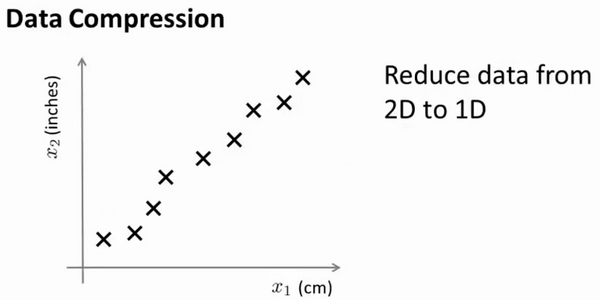

假设我们未知两个的特征：$x_1$:长度：用厘米表示；$x_2$：是用英寸表示同一物体的长度。

所以，这给了我们高度冗余表示，也许不是两个分开的特征$x_1$和$x_2$，这两个基本的长度度量，也许我们想要做的是减少数据到一维，只有一个数测量这个长度。这个例子似乎有点做作，这里厘米英寸的例子实际上不是那么不切实际的，两者并没有什么不同。

将数据从二维降至一维：
假使我们要采用两种不同的仪器来测量一些东西的尺寸，其中一个仪器测量结果的单位是英寸，另一个仪器测量的结果是厘米，我们希望将测量的结果作为我们机器学习的特征。现在的问题的是，两种仪器对同一个东西测量的结果不完全相等（由于误差、精度等），而将两者都作为特征有些重复，因而，我们希望将这个二维的数据降至一维。

从这件事情我看到的东西发生在工业上的事。如果你有几百个或成千上万的特征，它是它这往往容易失去你需要的特征。有时可能有几个不同的工程团队，也许一个工程队给你二百个特征，第二工程队给你另外三百个的特征，第三工程队给你五百个特征，一千多个特征都在一起，它实际上会变得非常困难，去跟踪你知道的那些特征，你从那些工程队得到的。其实不想有高度冗余的特征一样。


多年我一直在研究直升飞机自动驾驶。诸如此类。如果你想测量——如果你想做，你知道，做一个调查或做这些不同飞行员的测试——你可能有一个特征：$x_1$，这也许是他们的技能（直升机飞行员），也许$x_2$可能是飞行员的爱好。这是表示他们是否喜欢飞行，也许这两个特征将高度相关。你真正关心的可能是这条红线的方向，不同的特征，决定飞行员的能力。

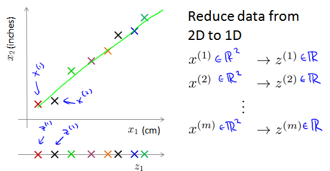

将数据从三维降至二维：
这个例子中我们要将一个三维的特征向量降至一个二维的特征向量。过程是与上面类似的，我们将三维向量投射到一个二维的平面上，强迫使得所有的数据都在同一个平面上，降至二维的特征向量。


这样的处理过程可以被用于把任何维度的数据降到任何想要的维度，例如将1000维的特征降至100维。

正如我们所看到的，最后，这将使我们能够使我们的一些学习算法运行也较晚，但我们会在以后的视频提到它。

### 14.2 动机二：数据可视化

参考视频: 14 - 2 - Motivation II\_ Visualization (6 min).mkv

在许多及其学习问题中，如果我们能将数据可视化，我们便能寻找到一个更好的解决方案，降维可以帮助我们。


假使我们有有关于许多不同国家的数据，每一个特征向量都有50个特征（如**GDP**，人均**GDP**，平均寿命等）。如果要将这个50维的数据可视化是不可能的。使用降维的方法将其降至2维，我们便可以将其可视化了。


这样做的问题在于，降维的算法只负责减少维数，新产生的特征的意义就必须由我们自己去发现了。

### 14.3 主成分分析问题

参考视频: 14 - 3 - Principal Component Analysis Problem Formulation (9 min). mkv

主成分分析(**PCA**)是最常见的降维算法。

在**PCA**中，我们要做的是找到一个方向向量（**Vector direction**），当我们把所有的数据都投射到该向量上时，我们希望投射平均均方误差能尽可能地小。方向向量是一个经过原点的向量，而投射误差是从特征向量向该方向向量作垂线的长度。


下面给出主成分分析问题的描述：

问题是要将$n$维数据降至$k$维，目标是找到向量$u^{(1)}$,$u^{(2)}$,...,$u^{(k)}$使得总的投射误差最小。主成分分析与线性回顾的比较：

主成分分析与线性回归是两种不同的算法。主成分分析最小化的是投射误差（**Projected Error**），而线性回归尝试的是最小化预测误差。线性回归的目的是预测结果，而主成分分析不作任何预测。


上图中，左边的是线性回归的误差（垂直于横轴投影），右边则是主要成分分析的误差（垂直于红线投影）。

**PCA**将$n$个特征降维到$k$个，可以用来进行数据压缩，如果100维的向量最后可以用10维来表示，那么压缩率为90%。同样图像处理领域的**KL变换**使用**PCA**做图像压缩。但**PCA** 要保证降维后，还要保证数据的特性损失最小。

**PCA**技术的一大好处是对数据进行降维的处理。我们可以对新求出的“主元”向量的重要性进行排序，根据需要取前面最重要的部分，将后面的维数省去，可以达到降维从而简化模型或是对数据进行压缩的效果。同时最大程度的保持了原有数据的信息。

**PCA**技术的一个很大的优点是，它是完全无参数限制的。在**PCA**的计算过程中完全不需要人为的设定参数或是根据任何经验模型对计算进行干预，最后的结果只与数据相关，与用户是独立的。

但是，这一点同时也可以看作是缺点。如果用户对观测对象有一定的先验知识，掌握了数据的一些特征，却无法通过参数化等方法对处理过程进行干预，可能会得不到预期的效果，效率也不高。

### 14.4 主成分分析算法

参考视频: 14 - 4 - Principal Component Analysis Algorithm (15 min).mkv

**PCA** 减少$n$维到$k$维：

第一步是均值归一化。我们需要计算出所有特征的均值，然后令 $x_j= x_j-μ_j$。如果特征是在不同的数量级上，我们还需要将其除以标准差 $σ^2$。

第二步是计算**协方差矩阵**（**covariance matrix**）$Σ$：
$\sum=\dfrac {1}{m}\sum^{n}_{i=1}\left( x^{(i)}\right) \left( x^{(i)}\right) ^{T}$

第三步是计算协方差矩阵$Σ$的**特征向量**（**eigenvectors**）:

在 **Octave** 里我们可以利用**奇异值分解**（**singular value decomposition**）来求解，`[U, S, V]= svd(sigma)`。


$$Sigma=\dfrac {1}{m}\sum^{n}_{i=1}\left( x^{(i)}\right) \left( x^{(i)}\right) ^{T}$$


对于一个 $n×n$维度的矩阵，上式中的$U$是一个具有与数据之间最小投射误差的方向向量构成的矩阵。如果我们希望将数据从$n$维降至$k$维，我们只需要从$U$中选取前$k$个向量，获得一个$n×k$维度的矩阵，我们用$U_{reduce}$表示，然后通过如下计算获得要求的新特征向量$z^{(i)}$:
$$z^{(i)}=U^{T}_{reduce}*x^{(i)}$$

其中$x$是$n×1$维的，因此结果为$k×1$维度。注，我们不对方差特征进行处理。

### 14.5 选择主成分的数量

参考视频: 14 - 5 - Choosing The Number Of Principal Components (13 min).mkv

主要成分分析是减少投射的平均均方误差：

训练集的方差为：$\dfrac {1}{m}\sum^{m}_{i=1}\left\| x^{\left( i\right) }\right\| ^{2}$

我们希望在平均均方误差与训练集方差的比例尽可能小的情况下选择尽可能小的$k$值。

如果我们希望这个比例小于1%，就意味着原本数据的偏差有99%都保留下来了，如果我们选择保留95%的偏差，便能非常显著地降低模型中特征的维度了。

我们可以先令$k=1$，然后进行主要成分分析，获得$U_{reduce}$和$z$，然后计算比例是否小于1%。如果不是的话再令$k=2$，如此类推，直到找到可以使得比例小于1%的最小$k$ 值（原因是各个特征之间通常情况存在某种相关性）。

还有一些更好的方式来选择$k$，当我们在**Octave**中调用“**svd**”函数的时候，我们获得三个参数：`[U, S, V] = svd(sigma)`。


其中的$S$是一个$n×n$的矩阵，只有对角线上有值，而其它单元都是0，我们可以使用这个矩阵来计算平均均方误差与训练集方差的比例：
$$\dfrac {\dfrac {1}{m}\sum^{m}_{i=1}\left\| x^{\left( i\right) }-x^{\left( i\right) }_{approx}\right\| ^{2}}{\dfrac {1}{m}\sum^{m}_{i=1}\left\| x^{(i)}\right\| ^{2}}=1-\dfrac {\Sigma^{k}_{i=1}S_{ii}}{\Sigma^{m}_{i=1}S_{ii}}\leq 1\%$$

也就是：$$\frac {\Sigma^{k}_{i=1}s_{ii}}{\Sigma^{n}_{i=1}s_{ii}}\geq0.99$$

在压缩过数据后，我们可以采用如下方法来近似地获得原有的特征：$$x^{\left( i\right) }_{approx}=U_{reduce}z^{(i)}$$

### 14.6 重建的压缩表示

参考视频: 14 - 6 - Reconstruction from Compressed Representation (4 min).mkv

在以前的视频中，我谈论**PCA**作为压缩算法。在那里你可能需要把1000维的数据压缩100维特征，或具有三维数据压缩到一二维表示。所以，如果这是一个压缩算法，应该能回到这个压缩表示，回到你原有的高维数据的一种近似。

所以，给定的$z^{(i)}$，这可能100维，怎么回到你原来的表示$x^{(i)}$，这可能是1000维的数组？


**PCA**算法，我们可能有一个这样的样本。如图中样本$x^{(1)}$,$x^{(2)}$。我们做的是，我们把这些样本投射到图中这个一维平面。然后现在我们需要只使用一个实数，比如$z^{(1)}$，指定这些点的位置后他们被投射到这一个三维曲面。给定一个点$z^{(1)}$，我们怎么能回去这个原始的二维空间呢？$x$为2维，$z$为1维，$z=U^{T}_{reduce}x$，相反的方程为：$x_{appox}=U_{reduce}\cdot z$,$x_{appox}\approx x$。如图：


如你所知，这是一个漂亮的与原始数据相当相似。所以，这就是你从低维表示$z$回到未压缩的表示。我们得到的数据的一个之间你的原始数据 $x$，我们也把这个过程称为重建原始数据。

当我们认为试图重建从压缩表示 $x$ 的初始值。所以，给定未标记的数据集，您现在知道如何应用**PCA**，你的带高维特征$x$和映射到这的低维表示$z$。这个视频，希望你现在也知道如何采取这些低维表示$z$，映射到备份到一个近似你原有的高维数据。

现在你知道如何实施应用**PCA**，我们将要做的事是谈论一些技术在实际使用**PCA**很好，特别是，在接下来的视频中，我想谈一谈关于如何选择$k$。

### 14.7 主成分分析法的应用建议

参考视频: 14 - 7 - Advice for Applying PCA (13 min).mkv

假使我们正在针对一张 100×100像素的图片进行某个计算机视觉的机器学习，即总共有10000 个特征。

1. 第一步是运用主要成分分析将数据压缩至1000个特征
2. 然后对训练集运行学习算法
   1. 在预测时，采用之前学习而来的$U_{reduce}$将输入的特征$x$转换成特征向量$z$，然后再进行预测

注：如果我们有交叉验证集合测试集，也采用对训练集学习而来的$U_{reduce}$。

错误的主要成分分析情况：一个常见错误使用主要成分分析的情况是，将其用于减少过拟合（减少了特征的数量）。这样做非常不好，不如尝试正则化处理。原因在于主要成分分析只是近似地丢弃掉一些特征，它并不考虑任何与结果变量有关的信息，因此可能会丢失非常重要的特征。然而当我们进行正则化处理时，会考虑到结果变量，不会丢掉重要的数据。

另一个常见的错误是，默认地将主要成分分析作为学习过程中的一部分，这虽然很多时候有效果，最好还是从所有原始特征开始，只在有必要的时候（算法运行太慢或者占用太多内存）才考虑采用主要成分分析。


